\newcommand{\tmt}{\text{TMT}}
\newcommand{\tdt}{\text{TDT}}
\newcommand{\E}{\mathbb{E}}
\newcommand{\V}{\mathbb{V}}
\newcommand{\P}{\mathbb{P}}
\newcommand{\cC}{\mathcal{C}}
\newcommand{\cV}{\mathbb{C}}
\newcommand{\cT}{\mathcal{T}}
\newcommand{\cH}{\mathcal{H}}
\newcommand{\indicator}{\mathcal{I}}

# 1 Introduction

This document serves as the reproducible records for our manuscript titled "Identifying causal genetic variants in population-sampled parent-child trios". Corresponding web resources can be found in this repository (https://github.com/StoreyLab/causal-trio) and the R package `geneticTMT` (https://github.com/StoreyLab/geneticTMT).

>_"Genetics is indeed in a peculiarly favoured condition in that Providence has shielded the geneticist from many of the difficulties of a reliably controlled comparison. The different genotypes possible from the same mating have been beautifully randomized by the meiotic process. A more perfect control of conditions is scarcely possible, than that of different genotypes appearing in the same litter."_ ([Fisher 1952](https://www.nature.com/articles/hdy19521))

# 2 Concepts & Notations

## Meiosis randomization

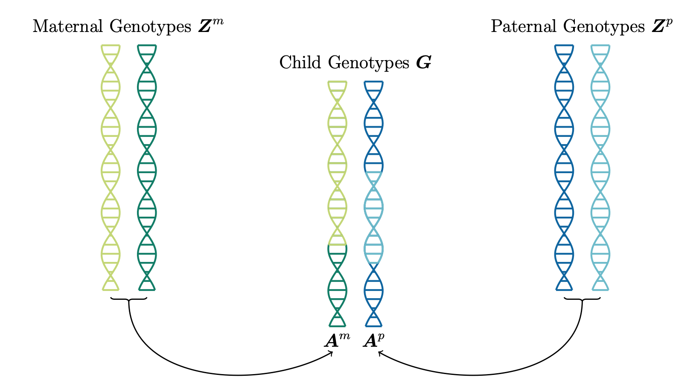


## Assignment procedure

### Figure 1: TMT

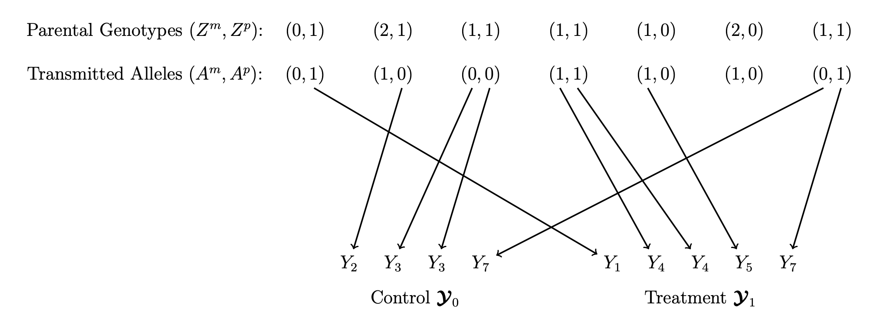

### Figure 2: TDT

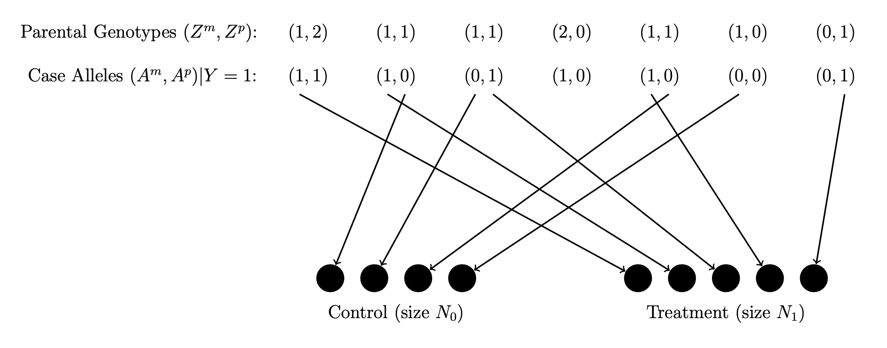


# 3 Packages

## Main package

Before the official publication, the source code of our main package can be found here (https://github.com/StoreyLab/geneticTMT/R). One can download the `.R` files inside to local and load functions into R as follows. 

```{r main_package, echo=TRUE, eval=TRUE, include=TRUE, results='hide'}
in_path_package = "../R/geneticTMT"
in_path_utility = "../R/utilities"
sapply(list.files(pattern="[.]R$", path=in_path_package, full.names=TRUE), source)
sapply(list.files(pattern="[.]R$", path=in_path_utility, full.names=TRUE), source)
```

## Other pacakges

```{r library, echo=TRUE, eval=TRUE, include=TRUE, results='hide', message=FALSE, warning=FALSE}
library(ggplot2)       # for generating plots
library(plyr)          # for highlighting categories
library(latex2exp)     # for plot text latex
library(cowplot)       # for merging plots
library(gridExtra)     # for griding plots
library(grid)          # for griding plots
library(bnpsd)         # for simulating genotype
library(reshape2)      # for transforming data format
library(knitr)         # for table output
library(parallel)      # for parallele computing
library(popkin)        # for kinship estimation
library(genio)         # for gcta input/output
library(gcatest)       # for gcatest on associations
library(lfa)           # for gcatest logistic factor
library(PRROC)         # for calculating auroc
library(showtext)      # for changing fonts
```

# 4 Trio Data Simulation

## Trio genotype

Let $\boldsymbol{Z}^m=\{Z_{ij}^m\}$ and $\boldsymbol{Z}^p=\{Z_{ij}^p\}$ the maternal and paternal genotype matrix. We use the BN-PSD model as a generative method to simulate $\boldsymbol{Z}^m$ and $\boldsymbol{Z}^p$ from an underlying admixed population whose $F_{ST}=0.2$. 

```{r parental_geno, echo=TRUE, eval=FALSE, warning=FALSE, message=FALSE}
set.seed(123)
n_ind <- 1000 # the number of trios/families/children
m_snp <- 10000 # the number of SNPs
k_pop <- 4 # the number of intermediate populations to be admixed
# simulate trio genotype ########################################################
param_list <- sim_geno_param(m=m_snp, n=n_ind, k=k_pop, Fst=0.2)
# simulate maternal genotype
geno_m <- sim_geno(p_s=param_list$p_s, q=param_list$q)
# generate paternal genotype
geno_p <- sim_geno(p_s=param_list$p_s, q=param_list$q)
# simulate maternal allele
allele_m <- sim_allele(geno_m)
# generate paternal allele
allele_p <- sim_allele(geno_p)
# generate child genotype
geno_c <- allele_m + allele_p
```

## Co-ancestry {.tabset .tabset-fade .tabset-pills}

### Visualize co-ancestry

```{r kinship_parent, eval=TRUE, echo=TRUE, warning=FALSE, message=FALSE, results='hide'}
load('./data/pop_structure/coancestry_trio.RData')

get_legend <- function(p){
  tmp <- ggplot_gtable(ggplot_build(p))
  leg <- which(sapply(tmp$grobs, function(x) x$name) == "guide-box")
  legend <- tmp$grobs[[leg]]
  legend
}

showtext_auto()
myFont1 = 'serif'

g_null <- ggplot(theta_m, aes(Var2, Var1, fill=theta)) +
  geom_tile() + 
  scale_fill_gradientn(TeX('Coancestry\n Coefficient'),
                       limits = c(0,0.5), 
                       colors = c("white","#fee0d2","#fcbba1",
                                  "#fc9272","#fb6a4a","#ef3b2c",
                                  "#cb181d","#a50f15","#67000d")) +
  ggtitle(TeX('Parent')) +
  xlab(TeX('SNP Loci')) +
  theme_bw() +
  theme(aspect.ratio=1) +
  theme(panel.grid.major = element_blank(),
        panel.grid.minor = element_blank(),
        text = element_text(family=myFont1),
        axis.title.x = element_blank(),
        axis.text.x = element_blank(), 
        axis.ticks.x = element_blank(),
        axis.title.y = element_blank(),
        axis.text.y = element_blank(), 
        axis.ticks.y = element_blank(),
        plot.title = element_text(size=16),
        legend.position = 'right',
        legend.title = element_text(color = "black", size = 12),
        legend.text = element_text(color = "black", size = 11),
        legend.key.width = unit(0.8, 'cm'))

g_leg <- get_legend(g_null)

g_m <- ggplot(theta_m, aes(Var2, Var1, fill=theta)) +
  geom_tile() + 
  scale_fill_gradientn(TeX('$Kinship$'),
                       limits = c(0,0.5), 
                       colors = c("white","#fee0d2","#fcbba1",
                                  "#fc9272","#fb6a4a","#ef3b2c",
                                  "#cb181d","#a50f15","#67000d")) +
  ggtitle(TeX("Parent")) +
  xlab(TeX('SNP Loci')) +
  theme_bw() +
  theme(aspect.ratio=1) +
  theme(panel.grid.major = element_blank(),
        panel.grid.minor = element_blank(),
        text = element_text(family=myFont1),
        axis.title.x = element_blank(),
        axis.text.x = element_blank(), 
        axis.ticks.x = element_blank(),
        axis.title.y = element_blank(),
        axis.text.y = element_blank(), 
        axis.ticks.y = element_blank(),
        plot.title = element_text(size=16),
        legend.position = 'none')

g_c <- ggplot(theta_c, aes(Var2, Var1, fill=theta)) +
  geom_tile() + 
  scale_fill_gradientn(TeX('$Kinship$'),
                       limits = c(0,0.5), 
                       colors = c("white","#fee0d2","#fcbba1",
                                  "#fc9272","#fb6a4a","#ef3b2c",
                                  "#cb181d","#a50f15","#67000d")) +
  ggtitle(TeX("Child")) +
  xlab(TeX('SNP Loci')) +
  theme_bw() +
  theme(aspect.ratio=1) +
  theme(panel.grid.major = element_blank(),
        panel.grid.minor = element_blank(),
        text = element_text(family=myFont1),
        axis.title.x = element_blank(),
        axis.text.x = element_blank(), 
        axis.ticks.x = element_blank(),
        axis.title.y = element_blank(),
        axis.text.y = element_blank(), 
        axis.ticks.y = element_blank(),
        plot.title = element_text(size=16),
        legend.position = 'none')

png(file='./manuscript/figures/figures2.png', units='in', width=10, height=5, res=350)
theme_set(theme_cowplot(font_size=12, font_family = "serif"))
plot_grid(g_m, g_c, g_leg, rel_widths = c(5,5,1), align = "hv", nrow=1)
dev.off()
showtext_auto(FALSE)
```

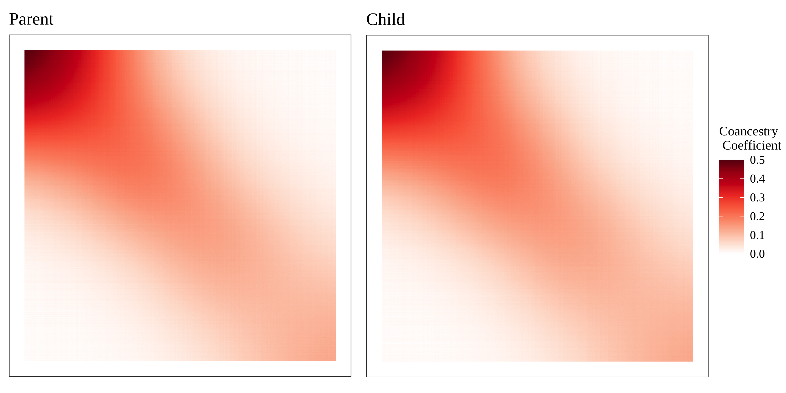


### Calculate co-ancestry

```{r trio_coancestry, eval=FALSE, echo=TRUE, warning=FALSE, message=FALSE}
n_ind <- 500
m_snp <- 100000
k_pop <- 4

set.seed(123)

path_out <- './data/pop_structure/'

# simulate trio genotype ########################################################
param_list <- sim_geno_param(m=m_snp, n=n_ind, k=k_pop, Fst=0.2)
# simulate maternal genotype
geno_m <- sim_geno(p_s=param_list$p_s, q=param_list$q)
# generate paternal genotype
geno_p <- sim_geno(p_s=param_list$p_s, q=param_list$q)
# simulate maternal allele
allele_m <- sim_allele(geno_m)
# generate paternal allele
allele_p <- sim_allele(geno_p)
# generate child genotype
geno_c <- allele_m + allele_p
# calculate kinship ############################################################
kin_m <- popkin(geno_m)
kin_c <- popkin(geno_c)
theta_m <- inbr_diag(kin_m)
theta_c <- inbr_diag(kin_c)
# melt matrices ################################################################
theta_m <- melt(theta_m[,c(n_ind:1)], value.name='theta')
theta_c <- melt(theta_c[,c(n_ind:1)], value.name='theta')
save(theta_m, theta_c, file=paste0(path_out,'coancestry_trio.RData'))
```


## Child's trait

We first generate a non-genetic factor associated with the population structure. Let $\boldsymbol{E}=\{E_j\}$ be the random non-genetic factor. We adopt the admixture proportion $\boldsymbol{q}=\{q_{ju}\}$ to simulate $E_j$ as 
$$\begin{align*}E_j &= \sum_{u=1}^K q_{ju}R_u,\quad R_u \sim \mathcal{N}(u,1) \text{ for }u \in [1:K], \quad K=4.
\end{align*}$$ Let $\cC$ be the loci indices set for all causal SNPs. We simulate the child's trait $\boldsymbol{Y}=\{Y_j\}$ as
$$\begin{align*} 
Y_j &= \iota + \sum_{i\in \cC}\Big( \alpha_0\indicator(G_{ij}=0) + \alpha_1\indicator(G_{ij}=1) + \alpha_2\indicator(G_{ij}=2) \Big)+\beta E_j+\epsilon_j.
\end{align*}$$ 

![Figure S3: Schematic of the simulation model for the child phenotype. The phenotype $Y$ is a function of 100 directly causal loci ($G_1,G_2,\cdots,G_{100}$) and a non-genetic factor $E$. The remaining loci ($G_{101},\cdots,G_{I}$) are not causal for $Y$. All non-genetic and genetic variables are probabilistically dependent according to the population structure, represented by the variable $S$. This figure is generated by LaTeX (https://github.com/StoreyLab/causal-trio/blob/main/manuscript/figures/figures3.tex).](./manuscript/figures/figures3.png)


# 5 TMT Estimands

## Population mean

Consider hundreds of loci contributing to the trait. Let $\cC$ be the index set for all 100 loci contributing to the genetic effects, we simulate three sets of $(\alpha_0,\alpha_1,\alpha_2)$: $$\begin{align*}
& \text{Set A: }\,\,\,\alpha_0=\beta\,\,\,\alpha_1=2\beta,\,\,\,\alpha_2=3\beta, \\
& \text{Set B: }\,\,\,\alpha_0=\beta\,\,\,\alpha_1=2\beta,\,\,\,\alpha_2=7\beta, \\
& \text{Set C: }\,\,\,\alpha_0=\beta\,\,\,\alpha_1=6\beta,\,\,\,\alpha_2=7\beta.
\end{align*}$$ Note that Set A is for an additive polygenic trait model where $\alpha_2-\alpha_1=\beta=\alpha_1-\alpha_0$. Set A to C deliver different values of $(\alpha_2-\alpha_1)/(\alpha_1-\alpha_0)$ to cover various types of traits. 

By definition, the true value for the population mean is: $$\mu_c = \frac{1}{2}\E[Y(1)|Z=1] + \frac{1}{2}\E[Y(0)|Z=1].$$ To derive this true value empirically, for each set $(\alpha_0,\alpha_1,\alpha_2)$ above, we first simulated the following potential outcomes: $$\begin{align*}
Y^m(0) &= \alpha_0\indicator(A^p=0) + \alpha_1\indicator(A^p=1) + \epsilon, \\
Y^m(1) &= \alpha_1\indicator(A^p=0) + \alpha_2\indicator(A^p=1) + \epsilon, \\
Y^p(0) &= \alpha_0\indicator(A^m=0) + \alpha_1\indicator(A^m=1) + \epsilon, \\
Y^p(1) &= \alpha_1\indicator(A^m=0) + \alpha_2\indicator(A^m=1) + \epsilon,
\end{align*}$$ then population mean per parental side: $$\begin{align*}
\mu_c^m &= \frac{1}{2}\E[Y^m(1)|Z^m=1,N] + \frac{1}{2}\E[Y^m(0)|Z^m=1,N], \\
\mu_c^p &= \frac{1}{2}\E[Y^p(1)|Z^p=1,N] + \frac{1}{2}\E[Y^p(0)|Z^p=1,N].
\end{align*}$$ These two values are almost equivalent to each other. We take their average as the true population mean: $$\mu_c = \frac{1}{2}\mu_c^m+\frac{1}{2}\mu_c^p.$$

Simulate parental genotype matrices once and keep them fixed. Randomly choose 100 causal loci. Among these causal loci, randomly choose one as the target causal locus. Calculate $\mu_c$ at the target locus. Repeatedly generate parental transmitted alleles at the target locus to derive $\widehat{\mu}_c$.

## True ACE

Simulate parental genotype matrices once and keep them fixed. Randomly choose 100 causal loci. Among these causal loci, randomly choose one as the target causal locus. Calculate ACE at the target locus. Repeatedly generate parental transmitted alleles at the target locus to derive $d_{\tmt},d_{\tmt}^{pc},d_{\tmt}^{nc}$.

To derive the ACE empirically, for each set $(\alpha_0,\alpha_1,\alpha_2)$ above, we first simulated the following potential outcomes: $$\begin{align*}
Y^m(0) &= \alpha_0\indicator(A^p=0) + \alpha_1\indicator(A^p=1) + \epsilon, \\
Y^m(1) &= \alpha_1\indicator(A^p=0) + \alpha_2\indicator(A^p=1) + \epsilon, \\
Y^p(0) &= \alpha_0\indicator(A^m=0) + \alpha_1\indicator(A^m=1) + \epsilon, \\
Y^p(1) &= \alpha_1\indicator(A^m=0) + \alpha_2\indicator(A^m=1) + \epsilon.
\end{align*}$$ Then we calculate conditional expectations to derive the $\delta_{\tmt}$ by: $$\begin{align*}
\delta_{\tmt} &= \frac{1}{2}\Big(\E[Y^m(1)|Z^m=1,N]-\E[Y^m(0)|Z^m=1,N]\Big) + \frac{1}{2}\Big(\E[Y^p(1)|Z^p=1,N]-\E[Y^p(0)|Z^p=1,N]\Big).
\end{align*}$$

## Unibasedness {.tabset .tabset-fade .tabset-pills}

```{r simulate_mu_gpm, echo=TRUE, eval=FALSE, warning=FALSE, message=FALSE}
k_pop <- 4
n_ind <- 5000
m_snp <- 100000
c_snp <- 100
n_fst <- 20
a <- 100
k0 <- 1
k1 <- 6
k2 <- 7

sigma_e_2 <- 1
s_seed <- 123
s_seed <- as.numeric(s_seed)
path_out <- '.'

# genome parameters  ############################################################
set.seed(s_seed)
# population structure parameters 
param_list <- sim_geno_param(m=m_snp, n=n_ind, k=k_pop, Fst=n_fst/100)
# all direct causal loci
causal_loci <- sample(seq(1,m_snp), c_snp)
p_t_causal <- param_list$p_t[causal_loci]
# direct causal locus for test 
id_causal <- causal_loci[1]
# trio genotype ################################################################
# simulate maternal genotype
geno_m <- sim_geno(p_s=param_list$p_s, q=param_list$q)
# generate paternal genotype
geno_p <- sim_geno(p_s=param_list$p_s, q=param_list$q)
# simulate maternal allele
allele_m <- sim_allele(geno_m, fix_seed=TRUE, seed_start=s_seed)
# generate paternal allele
allele_p <- sim_allele(geno_p, fix_seed=TRUE, seed_start=s_seed)
# generate child genotype
geno_c <- allele_m + allele_p
# population-stratified environmental factors ##################################
# prepare for calculating coefficient beta
gc0 <- colSums(geno_c[causal_loci,]==0)
gc1 <- colSums(geno_c[causal_loci,]==1)
gc2 <- colSums(geno_c[causal_loci,]==2)
# causal loci except the target one
gc0_notc <- colSums(geno_c[setdiff(causal_loci, id_causal),]==0)
gc1_notc <- colSums(geno_c[setdiff(causal_loci, id_causal),]==1)
gc2_notc <- colSums(geno_c[setdiff(causal_loci, id_causal),]==2)
# parental heterozygous
id_het_m <- (geno_m[id_causal,]==1)
id_het_p <- (geno_p[id_causal,]==1)
id_N <- (id_het_m | id_het_p)
# non-genetic effect tied to structure
R <- as.matrix(data.frame(R1 = rnorm(n=1, mean=1, sd=1),
                          R2 = rnorm(n=1, mean=2, sd=1),
                          R3 = rnorm(n=1, mean=3, sd=1),
                          R4 = rnorm(n=1, mean=4, sd=1)))
E <- as.vector(param_list$q %*% t(R))
# data frame for output 
ddtmt <- data.frame()
# various levels of heritability
for(h_sqr in seq(0.1,0.9,0.1)){
  set.seed(s_seed)
  # causal gene effect sizes
  sigma_a_2 <- sigma_e_2 * h_sqr / (1-h_sqr)
  beta_tmt <- sqrt(sigma_a_2/var( k0 * gc0 + k1 * gc1 + k2 * gc2 ))
  # population-stratified environmental factors ##################################
  # coefficient of environmental factor
  beta_e <- beta_tmt
  # simulate residuals with sigma_e_2 ############################################
  epsilon <- rnorm(n_ind, mean=0, sd=sqrt(sigma_e_2))
  # calculate a0 a1 and a2 #######################################################
  a0 <- k0 * beta_tmt
  a1 <- k1 * beta_tmt
  a2 <- k2 * beta_tmt
  # calculate epsilon ########################################################
  zeta <- a0 * gc0_notc + a1 * gc1_notc + a2 * gc2_notc
  gamma_vec <- a + zeta + beta_e * E + epsilon
  # muc_hat distribution #########################################################
  # observed variance of dtmt ##################################################
  # re-draw child's genotype to generate observed variance of dtmtpc #############
  # seed list for each round of simulations
  seed_list <- c(1:1000)
  tmt_loop <- function(id_sim) {
    # re-simulate parental alleles at the target locus
    set.seed(seed_list[id_sim])
    allele_m_i <- sim_allele_row(geno_m[id_causal,])
    allele_p_i <- sim_allele_row(geno_p[id_causal,])
    geno_c_i <- allele_m_i + allele_p_i
    is_Gc_0_i <- (geno_c_i==0)
    is_Gc_1_i <- (geno_c_i==1)
    is_Gc_2_i <- (geno_c_i==2)
    trio_geno_i <- matrix(c(geno_m[id_causal,], geno_p[id_causal,], allele_m_i, allele_p_i),
                          nrow=4, ncol=n_ind, byrow=TRUE)
    # simulate the trait #######################################################
    y_causal <- matrix(a0 * is_Gc_0_i + a1 * is_Gc_1_i + a2 * is_Gc_2_i  + gamma_vec, nrow=1)
    list_assign <- calc_assignment(trio_geno_i, phased=TRUE)
    # potential outcomes #######################################################
    id_am_0 <- (allele_m_i==0)
    id_am_1 <- (allele_m_i==1)
    id_ap_0 <- (allele_p_i==0)
    id_ap_1 <- (allele_p_i==1)
    y0m <- a0 * id_ap_0 + a1 * id_ap_1 + gamma_vec
    y1m <- a1 * id_ap_0 + a2 * id_ap_1 + gamma_vec
    y0p <- a0 * id_am_0 + a1 * id_am_1 + gamma_vec
    y1p <- a1 * id_am_0 + a2 * id_am_1 + gamma_vec
    # population mean ##########################################################
    # calculate muc #############################################################
    mu0 <- mean(y0m[id_het_m])/2 + mean(y0p[id_het_p])/2
    mu1 <- mean(y1m[id_het_m])/2 + mean(y1p[id_het_p])/2
    muc <- (mu0 + mu1)/2
    # estimate mu ##############################################################
    muc_hat <- calc_mu_hat(y_causal, list_assign$W0, list_assign$W1)
    # tmt estimands ############################################################
    # dtmt #####################################################################
    dtmt <- calc_dtmt(y_causal, trio_geno_i, is_phased=TRUE)
    dtmtnc <- calc_dtmt_nc(y_causal, trio_geno_i, is_phased=TRUE)
    dtmtpc <- calc_dtmt_pc(y_causal, mu=muc, trio_geno_i, is_phased=TRUE)
    # calculate true ace #######################################################
    ace_m <- mean(y1m[id_het_m]) - mean(y0m[id_het_m])
    ace_p <- mean(y1p[id_het_p]) - mean(y0p[id_het_p])
    ace <- (ace_m + ace_p)/2
    return(c(muc_hat, muc, dtmt, dtmtnc, dtmtpc, ace))
  }
  tmt_obs <- mclapply(c(1:1000), tmt_loop, mc.cores=18)
  tmt_obs <- data.frame(matrix(unlist(tmt_obs), byrow=TRUE, ncol=6))
  colnames(tmt_obs) <- c('muc_hat','muc', 'dtmt','dtmtnc','dtmtpc','ace')
  # tidy output ##############################################################
  ddtmt <- rbind(ddtmt, data.frame(estimate=tmt_obs$muc_hat, truevalue=tmt_obs$muc, hsqr=h_sqr, estimand='muc'))
  ddtmt <- rbind(ddtmt, data.frame(estimate=tmt_obs$dtmt, truevalue=tmt_obs$ace, hsqr=h_sqr, estimand='dtmt'))
  ddtmt <- rbind(ddtmt, data.frame(estimate=tmt_obs$dtmtnc, truevalue=tmt_obs$ace, hsqr=h_sqr, estimand='dtmtnc'))
  ddtmt <- rbind(ddtmt, data.frame(estimate=tmt_obs$dtmtpc, truevalue=tmt_obs$ace, hsqr=h_sqr, estimand='dtmtpc'))
}

file_out <- paste0('./data/dtmt/muc_dtmt/single_gpm_k0_',k0,'_k1_',k1,'_k2_',k2,'_n',n_ind,'_m100000_c',c_snp,'_nfst',n_fst,'_a',a,'.RData')
save(ddtmt, file=file_out)
```


### Centered and non-centered estimands

```{r dtmt_unbiased_gpm, echo=TRUE, eval=TRUE, warning=FALSE, message=FALSE}
showtext_auto()
myFont1 = 'serif'

dat_plt <- data.frame()
load('./data/dtmt/muc_dtmt/single_gpm_k0_1_k1_2_k2_3_n5000_m100000_c100_nfst20_a100.RData')
ddtmt$fst <- 0.20
ddtmt$a <- 100
ddtmt$alpha_set <- 'A'
dat_plt <- rbind(dat_plt, ddtmt)
load('./data/dtmt/muc_dtmt/single_gpm_k0_1_k1_2_k2_7_n5000_m100000_c100_nfst20_a100.RData')
ddtmt$fst <- 0.20
ddtmt$a <- 100
ddtmt$alpha_set <- 'B'
dat_plt <- rbind(dat_plt, ddtmt)
load('./data/dtmt/muc_dtmt/single_gpm_k0_1_k1_6_k2_7_n5000_m100000_c100_nfst20_a100.RData')
ddtmt$fst <- 0.20
ddtmt$a <- 100
ddtmt$alpha_set <- 'C'
dat_plt <- rbind(dat_plt, ddtmt)
load('./data/dtmt/muc_dtmt/single_gpm_k0_1_k1_2_k2_3_n5000_m100000_c100_nfst20_a1.RData')
ddtmt$fst <- 0.20
ddtmt$a <- 1
ddtmt$alpha_set <- 'A'
dat_plt <- rbind(dat_plt, ddtmt)
load('./data/dtmt/muc_dtmt/single_gpm_k0_1_k1_2_k2_7_n5000_m100000_c100_nfst20_a1.RData')
ddtmt$fst <- 0.20
ddtmt$a <- 1
ddtmt$alpha_set <- 'B'
dat_plt <- rbind(dat_plt, ddtmt)
load('./data/dtmt/muc_dtmt/single_gpm_k0_1_k1_6_k2_7_n5000_m100000_c100_nfst20_a1.RData')
ddtmt$fst <- 0.20
ddtmt$a <- 1
ddtmt$alpha_set <- 'C'
dat_plt <- rbind(dat_plt, ddtmt)


dat_plt$alpha_set <- factor(dat_plt$alpha_set, levels=c('A','B','C'))
dat_plt <- dat_plt[dat_plt$hsqr %in% c('0.3','0.6','0.9'),]
dat_plt$hsqr <- factor(dat_plt$hsqr, levels=c('0.3','0.6','0.9'))
dat_plt <- dat_plt[dat_plt$estimand %in% c('muc','dtmt','dtmtpc','dtmtnc'),]
dat_plt$estimand <- factor(dat_plt$estimand, levels=c('muc','dtmt','dtmtpc','dtmtnc'))

appender_a <- function(string){TeX(paste0("\\textit{$a = $}", string))}  
appender_fst <- function(string){TeX(paste0("\\textit{$F_{ST} = $}", string))}  
appender_alpha <- function(string){TeX(paste0("(\\textit{$\\alpha_0,\\alpha_1,\\alpha_2$}) Set ", string))} 

g_mu <- ggplot(dat_plt, aes(x=hsqr, y=estimate-truevalue, colour=estimand)) +
  geom_hline(yintercept=0, linetype="dashed", color = "gray", size=0.3) +
  geom_boxplot(outlier.size=0.3, outlier.alpha=0.3, lwd=0.2, fatten=3) +
  stat_summary(
    fun = mean,
    geom = 'point', size = 1.2,
    aes(group = estimand, fill=estimand, shape = estimand),
    position = position_dodge(width = 0.75) #this has to be added
  ) +
  xlab(TeX('True \\textit{$h^2$} (\\textit{$F_{ST}=0.2$})')) +
  ylab(TeX('Bias')) +
  theme_bw() +
  theme(aspect.ratio=1,
        panel.grid.major = element_blank(),
        panel.grid.minor = element_blank(),
        text = element_text(family=myFont1),
        axis.text.x = element_text(size=14),
        axis.text.y = element_text(size=14),
        axis.title.x = element_text(size=16),
        axis.title.y = element_text(size=16),
        legend.position='right',
        legend.title = element_blank(),
        legend.text = element_text(color = "black", size = 12)) +
  scale_fill_manual(values=c("#009E73","#D55E00","#CC79A7","#0072B2"),
                    labels=c(TeX('\\textit{$\\widehat{\\mu}$}$_{c}$ $-$ \\textit{$\\mu$}$_{c}$'),
                             TeX('\\textit{$d$}$_{TMT}$ $-$ \\textit{$\\delta$}$_{TMT}$'),
                             TeX('\\textit{$d$}$_{TMT}^{pc}$ $-$ \\textit{$\\delta$}$_{TMT}$'),
                             TeX('\\textit{$d$}$_{TMT}^{nc}$ $-$ \\textit{$\\delta$}$_{TMT}$'))) +
  scale_color_manual(values=c("#009E73","#D55E00","#CC79A7","#0072B2"),
                     labels=c(TeX('\\textit{$\\widehat{\\mu}$}$_{c}$ $-$ \\textit{$\\mu$}$_{c}$'),
                             TeX('\\textit{$d$}$_{TMT}$ $-$ \\textit{$\\delta$}$_{TMT}$'),
                             TeX('\\textit{$d$}$_{TMT}^{pc}$ $-$ \\textit{$\\delta$}$_{TMT}$'),
                             TeX('\\textit{$d$}$_{TMT}^{nc}$ $-$ \\textit{$\\delta$}$_{TMT}$'))) +
  scale_shape_manual(values=c(25,24,23,22),
                     labels=c(TeX('\\textit{$\\widehat{\\mu}$}$_{c}$ $-$ \\textit{$\\mu$}$_{c}$'),
                             TeX('\\textit{$d$}$_{TMT}$ $-$ \\textit{$\\delta$}$_{TMT}$'),
                             TeX('\\textit{$d$}$_{TMT}^{pc}$ $-$ \\textit{$\\delta$}$_{TMT}$'),
                             TeX('\\textit{$d$}$_{TMT}^{nc}$ $-$ \\textit{$\\delta$}$_{TMT}$'))) +
  guides(colour=guide_legend(title="alpha set"),
         fill=guide_legend(title="alpha set"),
         shape=guide_legend(title="alpha set") ) +
  facet_grid(a ~ alpha_set,
             labeller=labeller(alpha_set=as_labeller(appender_alpha, default=label_parsed),
                               a=as_labeller(appender_a, default=label_parsed))) +
  theme(strip.text = element_text(size = 10, family=myFont1))

g_mu
```


### Centered estimands only

```{r dtmt_unbiased_gpm_centered, echo=TRUE, eval=TRUE, warning=FALSE, message=FALSE}
showtext_auto()
myFont1 = 'serif'

dat_plt <- data.frame()
load('./data/dtmt/muc_dtmt/single_gpm_k0_1_k1_2_k2_3_n5000_m100000_c100_nfst20_a100.RData')
ddtmt$fst <- 0.20
ddtmt$a <- 100
ddtmt$alpha_set <- 'A'
dat_plt <- rbind(dat_plt, ddtmt)
load('./data/dtmt/muc_dtmt/single_gpm_k0_1_k1_2_k2_7_n5000_m100000_c100_nfst20_a100.RData')
ddtmt$fst <- 0.20
ddtmt$a <- 100
ddtmt$alpha_set <- 'B'
dat_plt <- rbind(dat_plt, ddtmt)
load('./data/dtmt/muc_dtmt/single_gpm_k0_1_k1_6_k2_7_n5000_m100000_c100_nfst20_a100.RData')
ddtmt$fst <- 0.20
ddtmt$a <- 100
ddtmt$alpha_set <- 'C'
dat_plt <- rbind(dat_plt, ddtmt)
load('./data/dtmt/muc_dtmt/single_gpm_k0_1_k1_2_k2_3_n5000_m100000_c100_nfst20_a1.RData')
ddtmt$fst <- 0.20
ddtmt$a <- 1
ddtmt$alpha_set <- 'A'
dat_plt <- rbind(dat_plt, ddtmt)
load('./data/dtmt/muc_dtmt/single_gpm_k0_1_k1_2_k2_7_n5000_m100000_c100_nfst20_a1.RData')
ddtmt$fst <- 0.20
ddtmt$a <- 1
ddtmt$alpha_set <- 'B'
dat_plt <- rbind(dat_plt, ddtmt)
load('./data/dtmt/muc_dtmt/single_gpm_k0_1_k1_6_k2_7_n5000_m100000_c100_nfst20_a1.RData')
ddtmt$fst <- 0.20
ddtmt$a <- 1
ddtmt$alpha_set <- 'C'
dat_plt <- rbind(dat_plt, ddtmt)


dat_plt$alpha_set <- factor(dat_plt$alpha_set, levels=c('A','B','C'))
dat_plt <- dat_plt[dat_plt$hsqr %in% c('0.3','0.6','0.9'),]
dat_plt$hsqr <- factor(dat_plt$hsqr, levels=c('0.3','0.6','0.9'))
dat_plt <- dat_plt[dat_plt$estimand %in% c('muc','dtmt','dtmtpc'),]
dat_plt$estimand <- factor(dat_plt$estimand, levels=c('muc','dtmt','dtmtpc'))

appender_a <- function(string){TeX(paste0("\\textit{$a = $}", string))}  
appender_fst <- function(string){TeX(paste0("\\textit{$F_{ST} = $}", string))}  
appender_alpha <- function(string){TeX(paste0("(\\textit{$\\alpha_0,\\alpha_1,\\alpha_2$}) Set ", string))} 

g_mu <- ggplot(dat_plt, aes(x=hsqr, y=estimate-truevalue, colour=estimand)) +
  geom_hline(yintercept=0, linetype="dashed", color = "gray", size=0.3) +
  geom_boxplot(outlier.size=0.3, outlier.alpha=0.3, lwd=0.2, fatten=3) +
  stat_summary(
    fun = mean,
    geom = 'point', size = 1.2,
    aes(group = estimand, fill=estimand, shape = estimand),
    position = position_dodge(width = 0.75) #this has to be added
  ) +
  xlab(TeX('True \\textit{$h^2$} (\\textit{$F_{ST}=0.2$})')) +
  ylab(TeX('Bias')) +
  theme_bw() +
  theme(aspect.ratio=1,
        panel.grid.major = element_blank(),
        panel.grid.minor = element_blank(),
        text = element_text(family=myFont1),
        axis.text.x = element_text(size=14),
        axis.text.y = element_text(size=14),
        axis.title.x = element_text(size=16),
        axis.title.y = element_text(size=16),
        legend.position='right',
        legend.title = element_blank(),
        legend.text = element_text(color = "black", size = 12)) +
  scale_fill_manual(values=c("#009E73","#D55E00","#CC79A7","#0072B2"),
                    labels=c(TeX('\\textit{$\\widehat{\\mu}$}$_{c}$ $-$ \\textit{$\\mu$}$_{c}$'),
                             TeX('\\textit{$d$}$_{TMT}$ $-$ \\textit{$\\delta$}$_{TMT}$'),
                             TeX('\\textit{$d$}$_{TMT}^{pc}$ $-$ \\textit{$\\delta$}$_{TMT}$'))) +
  scale_color_manual(values=c("#009E73","#D55E00","#CC79A7","#0072B2"),
                     labels=c(TeX('\\textit{$\\widehat{\\mu}$}$_{c}$ $-$ \\textit{$\\mu$}$_{c}$'),
                             TeX('\\textit{$d$}$_{TMT}$ $-$ \\textit{$\\delta$}$_{TMT}$'),
                             TeX('\\textit{$d$}$_{TMT}^{pc}$ $-$ \\textit{$\\delta$}$_{TMT}$'))) +
  scale_shape_manual(values=c(25,24,23,22),
                     labels=c(TeX('\\textit{$\\widehat{\\mu}$}$_{c}$ $-$ \\textit{$\\mu$}$_{c}$'),
                             TeX('\\textit{$d$}$_{TMT}$ $-$ \\textit{$\\delta$}$_{TMT}$'),
                             TeX('\\textit{$d$}$_{TMT}^{pc}$ $-$ \\textit{$\\delta$}$_{TMT}$'))) +
  guides(colour=guide_legend(title="alpha set"),
         fill=guide_legend(title="alpha set"),
         shape=guide_legend(title="alpha set") ) +
  facet_grid(a ~ alpha_set,
             labeller=labeller(alpha_set=as_labeller(appender_alpha, default=label_parsed),
                               a=as_labeller(appender_a, default=label_parsed))) +
  theme(strip.text = element_text(size = 10, family=myFont1))

g_mu
```


# 6 Sampling Variance

## Variance estimate 

Calculate $$\begin{align*}
\widehat{\mu}_0 &= \frac{\sum_{j\in \cT_0}Y_j}{|\cT_0|},\,\,\,\widehat{\mu}_1 = \frac{\sum_{j\in \cT_1}Y_j}{|\cT_1|},\,\,\,\widehat{\mu}_{00} = \frac{\sum_{j\in \cT_{00}}2Y_j}{|\cT_{00}|},\,\,\,\widehat{\mu}_{11} = \frac{\sum_{j\in \cT_{11}}2Y_j}{|\cT_{11}|},
\end{align*}$$ and $$\begin{align*}
\widehat{\sigma}^2_0 &= \frac{\sum_{j\in \cT_0}(Y_j-\widehat{\mu}_0)^2}{|\cT_0-1|},\,\,\,\widehat{\sigma}^2_1 = \frac{\sum_{j\in \cT_1}(Y_j-\widehat{\mu}_1)^2}{|\cT_1-1|},\\
\widehat{\sigma}^2_{00} &= \frac{\sum_{j\in \cT_{00}}(2Y_j-\widehat{\mu}_{00})^2}{|\cT_{00}-1|},\,\,\,\widehat{\sigma}^2_{11} = \frac{\sum_{j\in \cT_{11}}(2Y_j-\widehat{\mu}_{11})^2}{|\cT_{11}-1|}.
\end{align*}$$ Then calculate the variance estimate for $d_{\tmt}$: $$\widehat{\sigma}_{TMT}^2 =\frac{4}{N^2}\big(|\cT_0|\widehat{\sigma}^2_0 + |\cT_1|\widehat{\sigma}^2_1 + |\cT_{00}|\widehat{\sigma}^2_{00}+|\cT_{11}|\widehat{\sigma}^2_{11}\big).$$

## Unbiasedness {.tabset .tabset-fade .tabset-pills}

Write $D_j=(W_{1j}-W_{0j})(Y_j-\mu_c)$. Define $$\begin{align*}
\sigma^2_{1} &= \frac{4}{N^2}\Big(4|\cT_{11}|\V(Y|\cT_{11})+|\cT_{1}|\V(Y|\cT_1)+4|\cT_{00}|\V(Y|\cT_{00})+|\cT_{0}|\V(Y|\cT_0)\Big), \\
\sigma^2_{2} &= \frac{4}{N^3}\V\Big(2|\cT_{11}|(\mu_{11}-\mu_c)+|\cT_1|(\mu_1-\mu_c)+2|\cT_{00}|(\mu_c-\mu_{00})+|\cT_{0}|(\mu_c-\mu_0)\Big|N\Big), \\
\sigma^2_{3} &= \frac{4}{N^2}\sum_{j<k\in \cH} 2\cV(D_j, D_k|N),\\
\V(d_{\tmt}^{\text{pc}}|N) &= \sigma^2_{1} + \sigma^2_{2} + \sigma^2_{3}.
\end{align*}$$

The sampling variance estimate $\widehat{\sigma}_{TMT}^2$ is unbiased for $\sigma^2_{1}$ under both null and alternative hypothesis. Since $\sigma^2_{1}=\V(d_{\tmt}^{\text{pc}}|N)$ when the null hypothesis of non-causality is true and $\sigma^2_{1} \leq \V(d_{\tmt}^{\text{pc}}|N)$ when the alternative hypothesis is true, $\widehat{\sigma}_{TMT}^2$ is unbiased for $\V(d_{\tmt}^{\text{pc}}|N)$ under null and is a lower bound for $\V(d_{\tmt}^{\text{pc}}|N)$ under alternative. We now show this via simulations. 


### Under alternative

In the following figures, write $\V(d_{\tmt}^{\text{pc}}|N)$ as ${\sigma}^2_{\text{dtmtpc}}$, write $\V(d_{\tmt}|N)$ as ${\sigma}^2_{\text{dtmt}}$. Conduct 100 rounds of such simulation to derive distributions of $\widehat{\sigma}^2_{\text{TMT}}-{\sigma}^2_{1}$, $\widehat{\sigma}^2_{\text{TMT}}-{\sigma}^2_{\text{dtmtpc}}$, and $\widehat{\sigma}^2_{\text{TMT}}-{\sigma}^2_{\text{dtmt}}$.

```{r imbens_rubin_unbiased_case1_h1_plt, echo=TRUE, eval=TRUE, warning=FALSE, message=FALSE}
showtext_auto()
myFont1 = 'serif'

dat_plt <- data.frame()
c_list <- c(20,100)
for(c in c_list){
  # alpha set A ################################################################
  load(paste0('./data/vdtmt/ir/vir_k1_1_k2_2_n5000_m100000_c',c,'_nfst20_a100.RData'))
  dat_tmp <- vdtmt_case1[,c('var_hat','var_true','snp','hsqr')]
  colnames(dat_tmp) <- c('vstat','vobs','snp','hsqr')
  dat_tmp$estimand='vtrue'
  dat_tmp$alpha_set = 'A'
  dat_tmp$csnp = c
  dat_plt <- rbind(dat_plt, dat_tmp)
  dat_tmp <- vdtmt_case1[,c('var_hat','var_dtmtpc','snp','hsqr')]
  colnames(dat_tmp) <- c('vstat','vobs','snp','hsqr')
  dat_tmp$estimand='vdtmtpc'
  dat_tmp$alpha_set = 'A'
  dat_tmp$csnp = c
  dat_plt <- rbind(dat_plt, dat_tmp)
  dat_tmp <- vdtmt_case1[,c('var_hat','var_dtmt','snp','hsqr')]
  colnames(dat_tmp) <- c('vstat','vobs','snp','hsqr')
  dat_tmp$estimand='vdtmt'
  dat_tmp$alpha_set = 'A'
  dat_tmp$csnp = c
  dat_plt <- rbind(dat_plt, dat_tmp)
  # alpha set B #################################################################
  load(paste0('./data/vdtmt/ir/vir_k1_1_k2_3_n5000_m100000_c',c,'_nfst20_a100.RData'))
  dat_tmp <- vdtmt_case1[,c('var_hat','var_true','snp','hsqr')]
  colnames(dat_tmp) <- c('vstat','vobs','snp','hsqr')
  dat_tmp$estimand='vtrue'
  dat_tmp$alpha_set = 'B'
  dat_tmp$csnp = c
  dat_plt <- rbind(dat_plt, dat_tmp)
  dat_tmp <- vdtmt_case1[,c('var_hat','var_dtmtpc','snp','hsqr')]
  colnames(dat_tmp) <- c('vstat','vobs','snp','hsqr')
  dat_tmp$estimand='vdtmtpc'
  dat_tmp$alpha_set = 'B'
  dat_tmp$csnp = c
  dat_plt <- rbind(dat_plt, dat_tmp)
  dat_tmp <- vdtmt_case1[,c('var_hat','var_dtmt','snp','hsqr')]
  colnames(dat_tmp) <- c('vstat','vobs','snp','hsqr')
  dat_tmp$estimand='vdtmt'
  dat_tmp$alpha_set = 'B'
  dat_tmp$csnp = c
  dat_plt <- rbind(dat_plt, dat_tmp)
  # alpha set C #################################################################
  load(paste0('./data/vdtmt/ir/vir_k1_2_k2_3_n5000_m100000_c',c,'_nfst20_a100.RData'))
  dat_tmp <- vdtmt_case1[,c('var_hat','var_true','snp','hsqr')]
  colnames(dat_tmp) <- c('vstat','vobs','snp','hsqr')
  dat_tmp$estimand='vtrue'
  dat_tmp$alpha_set = 'C'
  dat_tmp$csnp = c
  dat_plt <- rbind(dat_plt, dat_tmp)
  dat_tmp <- vdtmt_case1[,c('var_hat','var_dtmtpc','snp','hsqr')]
  colnames(dat_tmp) <- c('vstat','vobs','snp','hsqr')
  dat_tmp$estimand='vdtmtpc'
  dat_tmp$alpha_set = 'C'
  dat_tmp$csnp = c
  dat_plt <- rbind(dat_plt, dat_tmp)
  dat_tmp <- vdtmt_case1[,c('var_hat','var_dtmt','snp','hsqr')]
  colnames(dat_tmp) <- c('vstat','vobs','snp','hsqr')
  dat_tmp$estimand='vdtmt'
  dat_tmp$alpha_set = 'C'
  dat_tmp$csnp = c
  dat_plt <- rbind(dat_plt, dat_tmp)
}


dat_plt <- dat_plt[dat_plt$snp=='Causal',]
dat_plt$alpha_set <- factor(dat_plt$alpha_set, levels=c('A','B','C'))
dat_plt$hsqr <- factor(dat_plt$hsqr, levels=c(0.3,0.6,0.9))
dat_plt$estimand <- factor(dat_plt$estimand, levels=c('vtrue','vdtmtpc','vdtmt'))
dat_plt$csnp <- factor(dat_plt$csnp, levels=c(20,100))

appender_alpha <- function(string){TeX(paste0("(\\textit{$\\alpha_0,\\alpha_1,\\alpha_2$}) Set ", string))} 
appender_hsq <- function(string){TeX(paste0("\\textit{$h^2 = $}", string))}  
appender_fst <- function(string){TeX(paste0("\\textit{$F_{ST} = $}", string))}  
appender_a <- function(string){TeX(paste0("\\textit{$a = $}", string))} 
appender_c <- function(string){TeX(paste0(string, '{ Causal Loci}'))} 

g_vdtmt <- ggplot(dat_plt, aes(x=hsqr, y=vstat-vobs, colour=estimand)) +
  geom_hline(yintercept=0, linetype="dashed", color = "gray", size=0.3) +
  geom_boxplot(outlier.size=0.3, outlier.alpha=0.3, lwd=0.2, fatten=3) +
  stat_summary(
    fun = mean,
    geom = 'point', size = 1.2,
    aes(group = estimand, fill=estimand, shape = estimand),
    position = position_dodge(width = 0.75) #this has to be added
  ) +
  xlab(TeX('True \\textit{$h^2$} (\\textit{$F_{ST}=0.2$})')) +
  ylab(TeX('Variance Difference')) +
  theme_bw() +
  theme(aspect.ratio=1,
        panel.grid.major = element_blank(),
        panel.grid.minor = element_blank(),
        text = element_text(family=myFont1),
        axis.text.x = element_text(size=14),
        axis.text.y = element_text(size=14),
        axis.title.x = element_text(size=16),
        axis.title.y = element_text(size=16),
        strip.text = element_text(size=12),
        legend.position='right',
        legend.title = element_text(color = "black", size = 14),
        legend.text = element_text(color = "black", size = 12)) +
  scale_fill_manual(values=c("#D55E00","#0072B2", "#CC79A7"),
                    labels=c(TeX('\\textit{$\\widehat{\\sigma}$}$^2_{TMT}$ $-$ \\textit{$\\sigma$}$^2_{1}$'),
                             TeX('\\textit{$\\widehat{\\sigma}$}$^2_{TMT}$ $-$ \\textit{$\\sigma$}$^2_{dtmtpc}$'),
                             TeX('\\textit{$\\widehat{\\sigma}$}$^2_{TMT}$ $-$ \\textit{$\\sigma$}$^2_{dtmt}$'))) +
  scale_color_manual(values=c("#D55E00","#0072B2", "#CC79A7"),
                     labels=c(TeX('\\textit{$\\widehat{\\sigma}$}$^2_{TMT}$ $-$ \\textit{$\\sigma$}$^2_{1}$'),
                             TeX('\\textit{$\\widehat{\\sigma}$}$^2_{TMT}$ $-$ \\textit{$\\sigma$}$^2_{dtmtpc}$'),
                             TeX('\\textit{$\\widehat{\\sigma}$}$^2_{TMT}$ $-$ \\textit{$\\sigma$}$^2_{dtmt}$'))) +
  scale_shape_manual(values=c(25,24,23),
                     labels=c(TeX('\\textit{$\\widehat{\\sigma}$}$^2_{TMT}$ $-$ \\textit{$\\sigma$}$^2_{1}$'),
                             TeX('\\textit{$\\widehat{\\sigma}$}$^2_{TMT}$ $-$ \\textit{$\\sigma$}$^2_{dtmtpc}$'),
                             TeX('\\textit{$\\widehat{\\sigma}$}$^2_{TMT}$ $-$ \\textit{$\\sigma$}$^2_{dtmt}$'))) +
  guides(colour=guide_legend(title="Estimand"),
         fill=guide_legend(title="Estimand"),
         shape=guide_legend(title="Estimand") ) +
  facet_grid(csnp ~ alpha_set, scales='free_y',
             labeller=labeller(csnp=as_labeller(appender_c, default=label_parsed),
                               alpha_set=as_labeller(appender_alpha, default=label_parsed))) +
  theme(strip.text = element_text(size = 10, family=myFont1))


g_vdtmt
```

### Under null

```{r imbens_rubin_unbiased_case1_h0_plt, echo=TRUE, eval=TRUE, warning=FALSE, message=FALSE}
showtext_auto()
myFont1 = 'serif'

dat_plt <- data.frame()
c_list <- c(20,100)
for(c in c_list){
  # alpha set A ################################################################
  load(paste0('./data/vdtmt/ir/vir_k1_1_k2_2_n5000_m100000_c',c,'_nfst20_a100.RData'))
  dat_tmp <- vdtmt_case1[,c('var_hat','var_true','snp','hsqr')]
  colnames(dat_tmp) <- c('vstat','vobs','snp','hsqr')
  dat_tmp$estimand='vtrue'
  dat_tmp$alpha_set = 'A'
  dat_tmp$csnp = c
  dat_plt <- rbind(dat_plt, dat_tmp)
  dat_tmp <- vdtmt_case1[,c('var_hat','var_dtmtpc','snp','hsqr')]
  colnames(dat_tmp) <- c('vstat','vobs','snp','hsqr')
  dat_tmp$estimand='vdtmtpc'
  dat_tmp$alpha_set = 'A'
  dat_tmp$csnp = c
  dat_plt <- rbind(dat_plt, dat_tmp)
  dat_tmp <- vdtmt_case1[,c('var_hat','var_dtmt','snp','hsqr')]
  colnames(dat_tmp) <- c('vstat','vobs','snp','hsqr')
  dat_tmp$estimand='vdtmt'
  dat_tmp$alpha_set = 'A'
  dat_tmp$csnp = c
  dat_plt <- rbind(dat_plt, dat_tmp)
  # alpha set B #################################################################
  load(paste0('./data/vdtmt/ir/vir_k1_1_k2_3_n5000_m100000_c',c,'_nfst20_a100.RData'))
  dat_tmp <- vdtmt_case1[,c('var_hat','var_true','snp','hsqr')]
  colnames(dat_tmp) <- c('vstat','vobs','snp','hsqr')
  dat_tmp$estimand='vtrue'
  dat_tmp$alpha_set = 'B'
  dat_tmp$csnp = c
  dat_plt <- rbind(dat_plt, dat_tmp)
  dat_tmp <- vdtmt_case1[,c('var_hat','var_dtmtpc','snp','hsqr')]
  colnames(dat_tmp) <- c('vstat','vobs','snp','hsqr')
  dat_tmp$estimand='vdtmtpc'
  dat_tmp$alpha_set = 'B'
  dat_tmp$csnp = c
  dat_plt <- rbind(dat_plt, dat_tmp)
  dat_tmp <- vdtmt_case1[,c('var_hat','var_dtmt','snp','hsqr')]
  colnames(dat_tmp) <- c('vstat','vobs','snp','hsqr')
  dat_tmp$estimand='vdtmt'
  dat_tmp$alpha_set = 'B'
  dat_tmp$csnp = c
  dat_plt <- rbind(dat_plt, dat_tmp)
  # alpha set C #################################################################
  load(paste0('./data/vdtmt/ir/vir_k1_2_k2_3_n5000_m100000_c',c,'_nfst20_a100.RData'))
  dat_tmp <- vdtmt_case1[,c('var_hat','var_true','snp','hsqr')]
  colnames(dat_tmp) <- c('vstat','vobs','snp','hsqr')
  dat_tmp$estimand='vtrue'
  dat_tmp$alpha_set = 'C'
  dat_tmp$csnp = c
  dat_plt <- rbind(dat_plt, dat_tmp)
  dat_tmp <- vdtmt_case1[,c('var_hat','var_dtmtpc','snp','hsqr')]
  colnames(dat_tmp) <- c('vstat','vobs','snp','hsqr')
  dat_tmp$estimand='vdtmtpc'
  dat_tmp$alpha_set = 'C'
  dat_tmp$csnp = c
  dat_plt <- rbind(dat_plt, dat_tmp)
  dat_tmp <- vdtmt_case1[,c('var_hat','var_dtmt','snp','hsqr')]
  colnames(dat_tmp) <- c('vstat','vobs','snp','hsqr')
  dat_tmp$estimand='vdtmt'
  dat_tmp$alpha_set = 'C'
  dat_tmp$csnp = c
  dat_plt <- rbind(dat_plt, dat_tmp)
}


dat_plt <- dat_plt[dat_plt$snp=='Null',]
dat_plt$alpha_set <- factor(dat_plt$alpha_set, levels=c('A','B','C'))
dat_plt$hsqr <- factor(dat_plt$hsqr, levels=c(0.3,0.6,0.9))
dat_plt$estimand <- factor(dat_plt$estimand, levels=c('vtrue','vdtmtpc','vdtmt'))
dat_plt$csnp <- factor(dat_plt$csnp, levels=c(20,100))

appender_alpha <- function(string){TeX(paste0("(\\textit{$\\alpha_0,\\alpha_1,\\alpha_2$}) Set ", string))} 
appender_hsq <- function(string){TeX(paste0("\\textit{$h^2 = $}", string))}  
appender_fst <- function(string){TeX(paste0("\\textit{$F_{ST} = $}", string))}  
appender_a <- function(string){TeX(paste0("\\textit{$a = $}", string))} 
appender_c <- function(string){TeX(paste0(string, '{ Causal Loci}'))} 

g_vdtmt <- ggplot(dat_plt, aes(x=hsqr, y=vstat-vobs, colour=estimand)) +
  geom_hline(yintercept=0, linetype="dashed", color = "gray", size=0.3) +
  geom_boxplot(outlier.size=0.3, outlier.alpha=0.3, lwd=0.2, fatten=3) +
  stat_summary(
    fun = mean,
    geom = 'point', size = 1.2,
    aes(group = estimand, fill=estimand, shape = estimand),
    position = position_dodge(width = 0.75) #this has to be added
  ) +
  xlab(TeX('True \\textit{$h^2$} (\\textit{$F_{ST}=0.2$})')) +
  ylab(TeX('Variance Difference')) +
  theme_bw() +
  theme(aspect.ratio=1,
        panel.grid.major = element_blank(),
        panel.grid.minor = element_blank(),
        text = element_text(family=myFont1),
        axis.text.x = element_text(size=14),
        axis.text.y = element_text(size=14),
        axis.title.x = element_text(size=16),
        axis.title.y = element_text(size=16),
        strip.text = element_text(size=12),
        legend.position='right',
        legend.title = element_text(color = "black", size = 14),
        legend.text = element_text(color = "black", size = 12)) +
  scale_fill_manual(values=c("#D55E00","#0072B2", "#CC79A7"),
                    labels=c(TeX('\\textit{$\\widehat{\\sigma}$}$^2_{TMT}$ $-$ \\textit{$\\sigma$}$^2_{1}$'),
                             TeX('\\textit{$\\widehat{\\sigma}$}$^2_{TMT}$ $-$ \\textit{$\\sigma$}$^2_{dtmtpc}$'),
                             TeX('\\textit{$\\widehat{\\sigma}$}$^2_{TMT}$ $-$ \\textit{$\\sigma$}$^2_{dtmt}$'))) +
  scale_color_manual(values=c("#D55E00","#0072B2", "#CC79A7"),
                     labels=c(TeX('\\textit{$\\widehat{\\sigma}$}$^2_{TMT}$ $-$ \\textit{$\\sigma$}$^2_{1}$'),
                             TeX('\\textit{$\\widehat{\\sigma}$}$^2_{TMT}$ $-$ \\textit{$\\sigma$}$^2_{dtmtpc}$'),
                             TeX('\\textit{$\\widehat{\\sigma}$}$^2_{TMT}$ $-$ \\textit{$\\sigma$}$^2_{dtmt}$'))) +
  scale_shape_manual(values=c(25,24,23),
                     labels=c(TeX('\\textit{$\\widehat{\\sigma}$}$^2_{TMT}$ $-$ \\textit{$\\sigma$}$^2_{1}$'),
                             TeX('\\textit{$\\widehat{\\sigma}$}$^2_{TMT}$ $-$ \\textit{$\\sigma$}$^2_{dtmtpc}$'),
                             TeX('\\textit{$\\widehat{\\sigma}$}$^2_{TMT}$ $-$ \\textit{$\\sigma$}$^2_{dtmt}$'))) +
  guides(colour=guide_legend(title="Estimand"),
         fill=guide_legend(title="Estimand"),
         shape=guide_legend(title="Estimand") ) +
  facet_grid(csnp ~ alpha_set, scales='free_y',
             labeller=labeller(csnp=as_labeller(appender_c, default=label_parsed),
                               alpha_set=as_labeller(appender_alpha, default=label_parsed))) +
  theme(strip.text = element_text(size = 10, family=myFont1))


g_vdtmt
```


## Convergence

Show that $|\V(d^{\text{pc}}_{\tmt}|N)-\V(d_{\tmt}|N)| \to 0$ with probability 1 as $J \to \infty$. 

```{r vdtmt_vdtmtpc_convergence, eval=FALSE, echo=TRUE, warning=FALSE, message=FALSE}
k_pop <- 4
n_ind <- 500
m_snp <- 100000
c_snp <- 100
n_fst <- 20
a <- 100
k_1 <- 1
k_2 <- 2

sigma_e_2 <- 1

s_seed <- 1
# genome parameters  ############################################################
# let evolution happening once 
# so simulate genome parameters once and keep them fixed
# this is done by setting the same seed
set.seed(s_seed)
# population structure parameters 
param_list <- sim_geno_param(m=m_snp, n=n_ind, k=k_pop, Fst=n_fst/100)
# direct causal loci for genetic background
causal_loci <- sample(seq(1,m_snp), c_snp)
# null loci
ndc_loci <- setdiff(c(1:m_snp), causal_loci)
# causal allele frequency
p_t_causal <- param_list$p_t[causal_loci]
# trio genotype ################################################################
# draw genotype matrices from the same genome parameters
# direct causal locus for test 
id_causal <- causal_loci[s_seed]
# a null locus
id_null <- ndc_loci[s_seed]
# simulate maternal genotype
geno_m <- sim_geno(p_s=param_list$p_s, q=param_list$q)
# generate paternal genotype
geno_p <- sim_geno(p_s=param_list$p_s, q=param_list$q)
# simulate maternal allele
allele_m <- sim_allele(geno_m, fix_seed=TRUE, seed_start=s_seed)
# generate paternal allele
allele_p <- sim_allele(geno_p, fix_seed=TRUE, seed_start=s_seed)
# generate child genotype
geno_c <- allele_m + allele_p
# population-stratified environmental factors ##################################
# estimate child's inbreeding coefficient
# kin_c <- popkin::popkin(geno_c)
# f_c <- popkin::inbr(kin_c)
# prepare for calculating coefficient beta
gc_1 <- colSums(geno_c[causal_loci,]==1)
gc_2 <- colSums(geno_c[causal_loci,]==2)
# causal loci except the target one
gc_1_notc <- colSums(geno_c[setdiff(causal_loci, id_causal),]==1)
gc_2_notc <- colSums(geno_c[setdiff(causal_loci, id_causal),]==2)
# parental heterozygous
id_het_m <- (geno_m[id_causal,]==1)
id_het_p <- (geno_p[id_causal,]==1)
id_N <- (id_het_m | id_het_p)
# non-genetic effect tied to structure
R <- as.matrix(data.frame(R1 = rnorm(n=1, mean=1, sd=1),
                          R2 = rnorm(n=1, mean=2, sd=1),
                          R3 = rnorm(n=1, mean=3, sd=1),
                          R4 = rnorm(n=1, mean=4, sd=1)))
E <- as.vector(param_list$q %*% t(R))
# data frame for output
v_dtmt <- data.frame()
# various levels of heritability
for(h_sqr in c(0.3,0.6,0.9)){
  set.seed(s_seed)
  # causal gene effect sizes
  sigma_a_2 <- sigma_e_2 * h_sqr / (1-h_sqr)
  beta_tmt <- sqrt(sigma_a_2/var(k_1*gc_1 + k_2*gc_2))
  # population-stratified environmental factors ##################################
  # environmental factor associated with inbreeding coefficient
  e <- rnorm(n_ind, mean=0, sd=0.1) + f_c
  # coefficient of environmental factor
  beta_e <- beta_tmt
  # simulate residuals with sigma_e_2 ############################################
  epsilon <- rnorm(n_ind, mean=0, sd=sqrt(sigma_e_2))
  # calculate a0 a1 and a2 #######################################################
  a0 <- a + k_1*beta_tmt*gc_1_notc + k_2*beta_tmt*gc_2_notc + beta_e*E
  a1 <- a0 + k_1*beta_tmt
  a2 <- a0 + k_2*beta_tmt
  # dtmt and dtmtpc distribution ################################################
  # observed variance of dtmt ##################################################
  # re-draw child's genotype to generate observed variance of dtmtpc #############
  # seed list for each round of simulations
  seed_list <- c(1:1000)
  dtmt_loop <- function(id_sim) {
    # re-simulate parental alleles at the target locus
    set.seed(seed_list[id_sim])
    allele_m_i <- sim_allele_row(geno_m[id_causal,])
    allele_p_i <- sim_allele_row(geno_p[id_causal,])
    geno_c_i <- allele_m_i + allele_p_i
    is_Gc_0_i <- (geno_c_i==0)
    is_Gc_1_i <- (geno_c_i==1)
    is_Gc_2_i <- (geno_c_i==2)
    trio_geno_i <- matrix(c(geno_m[id_causal,], geno_p[id_causal,], allele_m_i, allele_p_i),
                          nrow=4, ncol=n_ind, byrow=TRUE)
    # calculate muc #############################################################
    id_am_0 <- (allele_m_i==0)
    id_am_1 <- (allele_m_i==1)
    id_ap_0 <- (allele_p_i==0)
    id_ap_1 <- (allele_p_i==1)
    y0m <- a0 * id_ap_0 + a1 * id_ap_1 + epsilon
    y1m <- a1 * id_ap_0 + a2 * id_ap_1 + epsilon
    y0p <- a0 * id_am_0 + a1 * id_am_1 + epsilon
    y1p <- a1 * id_am_0 + a2 * id_am_1 + epsilon
    muc_m <- mean(y0m[id_het_m])/2 + mean(y1m[id_het_m])/2
    muc_p <- mean(y0p[id_het_p])/2 + mean(y1p[id_het_p])/2
    muc <- (muc_m + muc_p)/2
    # muc under null #############################################################
    y0m_null <- a0 * id_ap_0 + a0 * id_ap_1 + epsilon
    y1m_null <- a0 * id_ap_0 + a0 * id_ap_1 + epsilon
    y0p_null <- a0 * id_am_0 + a0 * id_am_1 + epsilon
    y1p_null <- a0 * id_am_0 + a0 * id_am_1 + epsilon
    muc_m_null <- mean(y0m_null[id_het_m])/2 + mean(y1m_null[id_het_m])/2
    muc_p_null <- mean(y0p_null[id_het_p])/2 + mean(y1p_null[id_het_p])/2
    muc_null <- (muc_m_null + muc_p_null)/2
    # simulate the trait #######################################################
    y_causal <- matrix(a0 * is_Gc_0_i + a1 * is_Gc_1_i + a2 * is_Gc_2_i  + epsilon, nrow=1)
    y_null <- matrix(a0 + epsilon, nrow=1)
    # var dtmt ####################################################################
    dtmtpc_causal <- calc_dtmt_pc(y_causal, trio_geno_i, mu=muc, is_phased=TRUE)
    dtmt_causal <- calc_dtmt(y_causal, trio_geno_i, is_phased=TRUE)
    # under null #################################################################
    dtmtpc_null <- calc_dtmt_pc(y_null, trio_geno_i, mu=muc_null, is_phased=TRUE)
    dtmt_null <- calc_dtmt(y_null, trio_geno_i, is_phased=TRUE)
    return(c(dtmtpc_causal, dtmt_causal, dtmtpc_null, dtmt_null))
  }
  dtmt_obs <- mclapply(c(1:1000), dtmt_loop, mc.cores=18)
  dtmt_obs <- data.frame(matrix(unlist(dtmt_obs), byrow=TRUE, ncol=4))
  colnames(dtmt_obs) <- c('dtmtpc_causal','dtmt_causal','dtmtpc_null','dtmt_null')
  v_dtmt <- rbind(v_dtmt, data.frame(vdiff=abs(var(dtmt_obs$dtmtpc_causal)-var(dtmt_obs$dtmt_causal)),
                                     hsqr=h_sqr, snp='Causal'))
  v_dtmt <- rbind(v_dtmt, data.frame(vdiff=abs(var(dtmt_obs$dtmtpc_null)-var(dtmt_obs$dtmt_null)),
                                     hsqr=h_sqr, snp='Null'))
  print(paste0("one round of simulation completed with h2: ",h_sqr,"..."))
}

file_out <- paste0('./data/vdtmt/convergence/vdiff_single_k1_',k_1,'_k2_',k_2,'_n',n_ind,'_m100000_c',c_snp,'_nfst',n_fst,'_a',a,'.RData')
save(v_dtmt, file=file_out)
```

Repeat for 100 times, each time with a different seed for simulating trio genotypes matrices. Draw the variance difference $\V(d^{\text{pc}}_{\tmt}|N)-\V(d_{\tmt}|N)$.

```{r vdtmt_vdtmtpc_convergence_plt, eval=TRUE, echo=TRUE, warning=FALSE, message=FALSE}
showtext_auto()
myFont1 = 'serif'

# sample size list
j_list <- c(1000,2500,5000)
dat_plt <- data.frame()
for(j in j_list){
  v_temp <- data.frame()
  file_in <- paste0('./data/vdtmt/convergence/vdiff_gpm_k1_1_k2_2_n',j,'_m100000_c100_nfst20_a100.RData')
  load(file_in)
  vdiff$alpha_set <- 'A'
  v_temp <- rbind(v_temp, vdiff)
  file_in <- paste0('./data/vdtmt/convergence/vdiff_gpm_k1_1_k2_7_n',j,'_m100000_c100_nfst20_a100.RData')
  load(file_in)
  vdiff$alpha_set <- 'B'
  v_temp <- rbind(v_temp, vdiff)
  file_in <- paste0('./data/vdtmt/convergence/vdiff_gpm_k1_6_k2_7_n',j,'_m100000_c100_nfst20_a100.RData')
  load(file_in)
  vdiff$alpha_set <- 'C'
  v_temp <- rbind(v_temp, vdiff)
  v_temp$ssize <- j
  dat_plt <- rbind(dat_plt, v_temp)
}


dat_plt$ssize <- factor(dat_plt$ssize, levels=c(1000,2500,5000))
dat_plt$alpha_set <- factor(dat_plt$alpha_set, levels=c('A','B','C'))
dat_plt$hsqr <- factor(dat_plt$hsqr, levels=c(0.3,0.6,0.9))
dat_plt$snp <- factor(dat_plt$snp, levels=c('Causal','Null'))

appender_alpha <- function(string){TeX(paste0("(\\textit{$\\alpha_0,\\alpha_1,\\alpha_2$}) Set ", string))} 
appender_hsq <- function(string){TeX(paste0("\\textit{$h^2 = $}", string))}  
appender_fst <- function(string){TeX(paste0("\\textit{$F_{ST} = $}", string))}  
appender_a <- function(string){TeX(paste0("\\textit{$a = $}", string))} 

g_vdtmt <- ggplot(dat_plt, aes(x=hsqr, y=vdiff, colour=ssize)) +
  geom_hline(yintercept=0, linetype="dashed", color = "gray", size=0.3) +
  geom_boxplot(outlier.size=0.3, outlier.alpha=0.3, lwd=0.2, fatten=3) +
  stat_summary(
    fun = mean,
    geom = 'point', size = 1.2,
    aes(group = ssize, fill=ssize, shape = ssize),
    position = position_dodge(width = 0.75) #this has to be added
  ) +
  xlab(TeX('True \\textit{$h^2$} (\\textit{$F_{ST}=0.2$})')) +
  ylab(TeX('Variance Difference')) +
  theme_bw() +
  theme(aspect.ratio=1,
        panel.grid.major = element_blank(),
        panel.grid.minor = element_blank(),
        text = element_text(family=myFont1),
        axis.text.x = element_text(size=14),
        axis.text.y = element_text(size=14),
        axis.title.x = element_text(size=16),
        axis.title.y = element_text(size=16),
        strip.text = element_text(size=12),
        legend.position='right',
        legend.title = element_text(color = "black", size = 14),
        legend.text = element_text(color = "black", size = 12)) +
  scale_fill_manual(values=c("#0072B2", "#009E73", "#E69F00"),
                    labels=c(TeX('\\textit{$J=1000$}'),
                             TeX('\\textit{$J=2500$}'),TeX('\\textit{$J=5000$}'))) +
  scale_color_manual(values=c("#0072B2", "#009E73", "#E69F00"),
                     labels=c(TeX('\\textit{$J=1000$}'),
                             TeX('\\textit{$J=2500$}'),TeX('\\textit{$J=5000$}'))) +
  scale_shape_manual(values=c(25,24,23),
                     labels=c(TeX('\\textit{$J=1000$}'),
                             TeX('\\textit{$J=2500$}'),TeX('\\textit{$J=5000$}'))) +
  guides(colour=guide_legend(title="Sample Size"),
         fill=guide_legend(title="Sample Size"),
         shape=guide_legend(title="Sample Size") ) +
  facet_grid(snp ~ alpha_set,
             labeller=labeller(alpha_set=as_labeller(appender_alpha, default=label_parsed))) +
  theme(strip.text = element_text(size = 10, family=myFont1))


g_vdtmt

```


# 7 Hypothesis test

We want to test the hypothesis $H_0:$ ACE$=0$ versus $H_1:$ ACE$\neq 0$. We form statistic $$\tau_{\tmt}=\frac{d_{\tmt}}{\sqrt{\widehat{\mathbb{V}}(d_{\tmt}|N)}}$$.

## Null distribution {.tabset .tabset-fade .tabset-pills}

### Approach I: Shuffle Transmitted Alleles

```{r tautmt_h0_gtm, eval=FALSE, echo=TRUE, message=FALSE, warning=FALSE}
k_pop <- 4
n_ind <- 1000
m_snp <- 100000
c_snp <- 100
n_fst <- 20
a <- 100
k0 <- 1
k1 <- 2
k2 <- 3
sigma_e_2 <- 1

s_seed <-123
# genome parameters  ############################################################
set.seed(s_seed)
# population structure parameters 
param_list <- sim_geno_param(m=m_snp, n=n_ind, k=k_pop, Fst=n_fst/100)
# direct causal loci for genetic background
causal_loci <- sample(seq(1,m_snp), c_snp)
# direct causal locus for test 
id_causal <- causal_loci[1]
# trio genotype ################################################################
# simulate maternal genotype
geno_m <- sim_geno(p_s=param_list$p_s, q=param_list$q)
# generate paternal genotype
geno_p <- sim_geno(p_s=param_list$p_s, q=param_list$q)
# simulate maternal allele
allele_m <- sim_allele(geno_m, fix_seed=TRUE, seed_start=s_seed)
# generate paternal allele
allele_p <- sim_allele(geno_p, fix_seed=TRUE, seed_start=s_seed)
# generate child genotype
geno_c <- allele_m + allele_p
# trio geno at target locus
trio_geno <- matrix(c(geno_m[id_causal,], geno_p[id_causal,], allele_m[id_causal,], allele_p[id_causal,]),
                      nrow=4, ncol=n_ind, byrow=TRUE)
# prepare for calculating coefficient beta
gc0 <- colSums(geno_c[causal_loci,]==0)
gc1 <- colSums(geno_c[causal_loci,]==1)
gc2 <- colSums(geno_c[causal_loci,]==2)
# causal loci except the target one
gc0_notc <- colSums(geno_c[setdiff(causal_loci, id_causal),]==0)
gc1_notc <- colSums(geno_c[setdiff(causal_loci, id_causal),]==1)
gc2_notc <- colSums(geno_c[setdiff(causal_loci, id_causal),]==2)
# parental heterozygous
id_het_m <- (geno_m[id_causal,]==1)
id_het_p <- (geno_p[id_causal,]==1)
id_N <- (id_het_m | id_het_p)
# non-genetic effect tied to structure
R <- as.matrix(data.frame(R1 = rnorm(n=1, mean=1, sd=1),
                          R2 = rnorm(n=1, mean=2, sd=1),
                          R3 = rnorm(n=1, mean=3, sd=1),
                          R4 = rnorm(n=1, mean=4, sd=1)))
E <- as.vector(param_list$q %*% t(R))
# dataframe for output
tautmt <- data.frame()
# various levels of heritability
for(h_sqr in c(0.3,0.6,0.9)){
  set.seed(s_seed)
  # causal gene effect sizes
  sigma_a_2 <- sigma_e_2 * h_sqr / (1-h_sqr)
  beta_tmt <- sqrt(sigma_a_2/var( k0 * gc0 + k1 * gc1 + k2 * gc2 ))
  # population-stratified environmental factors ##################################
  # coefficient of environmental factor
  beta_e <- beta_tmt
  # simulate residuals with sigma_e_2 ############################################
  epsilon <- rnorm(n_ind, mean=0, sd=sqrt(sigma_e_2))
  # calculate a0 a1 and a2 #######################################################
  a0 <- k0 * beta_tmt
  a1 <- k1 * beta_tmt
  a2 <- k2 * beta_tmt
  # calculate epsilon ########################################################
  zeta <- a0 * gc0_notc + a1 * gc1_notc + a2 * gc2_notc
  gamma_vec <- a + zeta + beta_e * E + epsilon
  ################################################################################
  # re-draw child's genotype to generate observed variance of dtmt ###############
  # seed list for each round of permutation
  seed_list <- sample(c(1:1000), size=1000)
  # tau distribution at the target locus under null ##############################
  tau_loop <- function(id_sim) {
    set.seed(seed_list[id_sim])
    allele_m_i <- sim_allele_row(geno_m[id_causal,])
    allele_p_i <- sim_allele_row(geno_p[id_causal,])
    geno_c_i <- allele_m_i + allele_p_i
    is_Gc_0_i <- (geno_c_i==0)
    is_Gc_1_i <- (geno_c_i==1)
    is_Gc_2_i <- (geno_c_i==2)
    trio_geno_i <- matrix(c(geno_m[id_causal,], geno_p[id_causal,], allele_m_i, allele_p_i),
                          nrow=4, ncol=n_ind, byrow=TRUE)
    # permute the trait value #############################################
    y_h0 <- matrix(a0 * is_Gc_0_i + a0 * is_Gc_1_i + a0 * is_Gc_2_i + gamma_vec, nrow=1)
    varhat_i <- calc_varhat_dtmt(y_h0, trio_geno_i, is_phased=TRUE)
    dtmt_i <- calc_dtmt(y_h0, trio_geno_i, is_phased=TRUE)
    # output the test statistic
    return(dtmt_i / sqrt(varhat_i))
  }
  tau_obs <- mclapply(c(1:1000), tau_loop, mc.cores=18)
  tau_obs <- unlist(tau_obs)
  # tidy output
  qq.out <- qqplot(x = qnorm(ppoints(length(tau_obs))), y = tau_obs, plot.it=FALSE)
  qq.out <- as.data.frame(qq.out)
  tautmt <- rbind(tautmt, data.frame(x=qq.out$x, y=qq.out$y, estimand='IR', hsqr=h_sqr))
}

file_out <- paste0('./data/dtmt/tau/tauh0_k0_',k0,'_k1_',k1,'_k2_',k2,'_n',n_ind,'_m100000_c',c_snp,'_nfst',n_fst,'_a',a,'.RData')
save(tautmt, file=file_out)
```


```{r tautmt_h0_gtm_plt, eval=TRUE, echo=TRUE, message=FALSE, warning=FALSE}
dat_plt <- data.frame()

for(J in c(100,1000)){
  load(paste0('./data/dtmt/tau/tauh0_k0_1_k1_2_k2_3_n',J,'_m100000_c100_nfst20_a100.RData'))
  tautmt$a <- 100
  tautmt$fst <- 0.2
  tautmt$alpha_set <- 'A'
  tautmt$ssize <- J
  dat_plt <- rbind(dat_plt, tautmt)
  load(paste0('./data/dtmt/tau/tauh0_k0_1_k1_2_k2_7_n',J,'_m100000_c100_nfst20_a100.RData'))
  tautmt$a <- 100
  tautmt$fst <- 0.2
  tautmt$alpha_set <- 'B'
  tautmt$ssize <- J
  dat_plt <- rbind(dat_plt, tautmt)
  load(paste0('./data/dtmt/tau/tauh0_k0_1_k1_6_k2_7_n',J,'_m100000_c100_nfst20_a100.RData'))
  tautmt$a <- 100
  tautmt$fst <- 0.2
  tautmt$alpha_set <- 'C'
  tautmt$ssize <- J
  dat_plt <- rbind(dat_plt, tautmt)
}

dat_plt$alpha_set <- factor(dat_plt$alpha_set, levels=c('A','B','C'))
dat_plt$hsqr <- factor(dat_plt$hsqr, levels=c(0.3,0.6,0.9))
dat_plt$ssize <- factor(dat_plt$ssize, levels=c(100,1000))

appender_alpha <- function(string){TeX(paste0("(\\textit{$\\alpha_0,\\alpha_1,\\alpha_2$}) Set ", string))} 
appender_hsq <- function(string){TeX(paste0("\\textit{$h^2 = $}", string))}  
appender_ssize <- function(string){TeX(paste0("\\textit{$J = $}", string))}  
appender_fst <- function(string){TeX(paste0("\\textit{$F_{ST} = $}", string))}  
appender_a <- function(string){TeX(paste0("\\textit{$a = $}", string))} 

showtext_auto()
myFont1 <- 'serif'

g_taunull <- ggplot(dat_plt, aes(x= x, y = y, color=alpha_set)) + 
  geom_point(alpha=0.8, size=1.2) + 
  geom_abline(intercept=0, slope=1, col='black', linetype='dashed', alpha=0.6) +
  xlab(TeX("Normal($0,1$)")) + 
  ylab(TeX("\\textit{$\\tau$}$_{TMT,H_0}$")) +
  xlim(c(-4,4)) +
  ylim(c(-4,4)) +
  theme_bw() +
  theme(aspect.ratio=1,
        panel.grid.major = element_blank(),
        panel.grid.minor = element_blank(),
        text = element_text(family=myFont1),
        axis.text.x = element_text(size=12),
        axis.text.y = element_text(size=12),
        axis.title.x = element_text(size=16),
        axis.title.y = element_text(size=16),
        plot.title = element_blank(),
        legend.position='bottom',
        legend.direction='horizontal',
        legend.title = element_text(color = "black", size = 14),
        legend.key.size = unit(1.2, 'cm'),
        legend.key.height = unit(0.6, 'cm'),
        legend.key.width = unit(0.6, 'cm'),
        legend.text = element_text(color = "black", size = 14)) +
  facet_grid(ssize ~ hsqr,
             labeller=labeller(ssize=as_labeller(appender_ssize, default=label_parsed),
                               hsqr=as_labeller(appender_hsq, default=label_parsed))) +
  theme(strip.text = element_text(size = 14, family=myFont1)) +
  scale_color_manual(values=c("#E69F00","#56B4E9","#CC79A7"),
                     labels=c('1','5','1/5')) +
  guides(color=guide_legend(title=TeX('(\\textit{$\\alpha_2-\\alpha_1$})$/$(\\textit{$\\alpha_1-\\alpha_0})'))) 

png(file='./manuscript/figures/figures5.png', units='in', width=10, height=8, res=350)
theme_set(theme_cowplot(font_size=12, font_family = "serif"))
g_taunull
showtext_auto(FALSE)
```


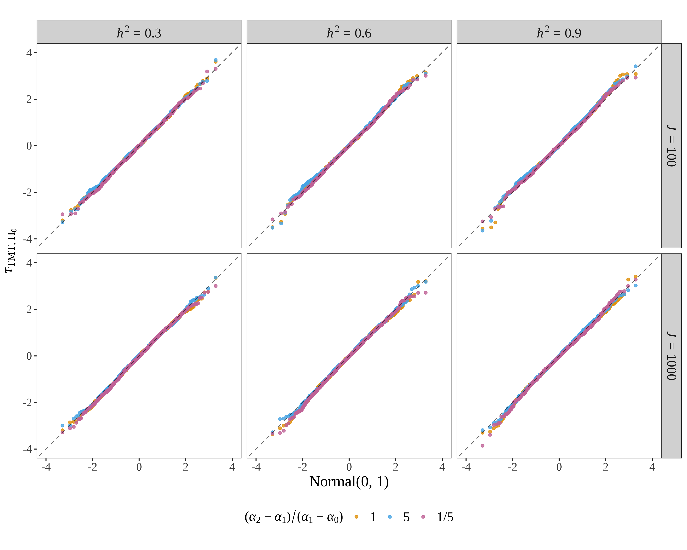

### Approach II: Shuffle Trait

```{r tautmt_null_gtm, eval=FALSE, echo=TRUE, message=FALSE, warning=FALSE}
k_pop <- 4
n_ind <- 1000
m_snp <- 100000
c_snp <- 100
n_fst <- 20
a <- 100
k0 <- 1
k1 <- 2
k2 <- 3
sigma_e_2 <- 1

s_seed <-123
# genome parameters  ############################################################
set.seed(s_seed)
# population structure parameters 
param_list <- sim_geno_param(m=m_snp, n=n_ind, k=k_pop, Fst=n_fst/100)
# direct causal loci for genetic background
causal_loci <- sample(seq(1,m_snp), c_snp)
# direct causal locus for test 
id_causal <- causal_loci[1]
# trio genotype ################################################################
# simulate maternal genotype
geno_m <- sim_geno(p_s=param_list$p_s, q=param_list$q)
# generate paternal genotype
geno_p <- sim_geno(p_s=param_list$p_s, q=param_list$q)
# simulate maternal allele
allele_m <- sim_allele(geno_m, fix_seed=TRUE, seed_start=s_seed)
# generate paternal allele
allele_p <- sim_allele(geno_p, fix_seed=TRUE, seed_start=s_seed)
# generate child genotype
geno_c <- allele_m + allele_p
# trio geno at target locus
trio_geno <- matrix(c(geno_m[id_causal,], geno_p[id_causal,], allele_m[id_causal,], allele_p[id_causal,]),
                      nrow=4, ncol=n_ind, byrow=TRUE)
# population-stratified environmental factors ##################################
# non-genetic effect tied to structure
R <- as.matrix(data.frame(R1 = rnorm(n=1, mean=1, sd=1),
                          R2 = rnorm(n=1, mean=2, sd=1),
                          R3 = rnorm(n=1, mean=3, sd=1),
                          R4 = rnorm(n=1, mean=4, sd=1)))
E <- as.vector(param_list$q %*% t(R))
# prepare for calculating coefficient beta
gc0 <- colSums(geno_c[causal_loci,]==0)
gc1 <- colSums(geno_c[causal_loci,]==1)
gc2 <- colSums(geno_c[causal_loci,]==2)
# causal loci except the target one
gc0_notc <- colSums(geno_c[setdiff(causal_loci, id_causal),]==0)
gc1_notc <- colSums(geno_c[setdiff(causal_loci, id_causal),]==1)
gc2_notc <- colSums(geno_c[setdiff(causal_loci, id_causal),]==2)
# parental heterozygous
id_het_m <- (geno_m[id_causal,]==1)
id_het_p <- (geno_p[id_causal,]==1)
id_N <- (id_het_m | id_het_p)
# allele info at the target locus
is_Gc_0 <- (geno_c[id_causal,]==0)
is_Gc_1 <- (geno_c[id_causal,]==1)
is_Gc_2 <- (geno_c[id_causal,]==2)
# dataframe for output
tautmt <- data.frame()
# various levels of heritability
for(h_sqr in c(0.3,0.6,0.9)){
  set.seed(s_seed)
  # causal gene effect sizes
  sigma_a_2 <- sigma_e_2 * h_sqr / (1-h_sqr)
  beta_tmt <- sqrt(sigma_a_2/var( k0 * gc0 + k1 * gc1 + k2 * gc2 ))
  # population-stratified environmental factors ##################################
  # coefficient of environmental factor
  beta_e <- beta_tmt
  # simulate residuals with sigma_e_2 ############################################
  epsilon <- rnorm(n_ind, mean=0, sd=sqrt(sigma_e_2))
  # calculate a0 a1 and a2 #######################################################
  a0 <- k0 * beta_tmt
  a1 <- k1 * beta_tmt
  a2 <- k2 * beta_tmt
  # calculate epsilon ########################################################
  zeta <- a0 * gc0_notc + a1 * gc1_notc + a2 * gc2_notc
  gamma_vec <- a + zeta + beta_e * E + epsilon
  # simulate the trait ###########################################################
  y <- (a0 * is_Gc_0 + a1 * is_Gc_1 + a2 * is_Gc_2  + gamma_vec)
  # var_dtmt #####################################################################
  varhat_causal <- calc_varhat_dtmt(y, trio_geno, is_phased=TRUE)
  ################################################################################
  # re-draw child's genotype to generate observed variance of dtmt ###############
  # seed list for each round of permutation
  seed_list <- sample(c(1:1000), size=1000)
  # tau distribution at the target locus under null ##############################
  tau_loop <- function(id_sim) {
    set.seed(seed_list[id_sim])
    # permute the trait value #############################################
    yi <- matrix(sample(y, size=n_ind), nrow=1)
    varhat_i <- calc_varhat_dtmt(yi, trio_geno, is_phased=TRUE)
    dtmt_i <- calc_dtmt(yi, trio_geno, is_phased=TRUE)
    # output the test statistic
    return(dtmt_i / sqrt(varhat_i))
  }
  tau_obs <- mclapply(c(1:1000), tau_loop, mc.cores=18)
  tau_obs <- unlist(tau_obs)
  # tidy output
  qq.out <- qqplot(x = qnorm(ppoints(length(tau_obs))), y = tau_obs, plot.it=FALSE)
  qq.out <- as.data.frame(qq.out)
  tautmt <- rbind(tautmt, data.frame(x=qq.out$x, y=qq.out$y, estimand='IR', hsqr=h_sqr))
}

file_out <- paste0('./data/dtmt/tau/taunull_k0_',k0,'_k1_',k1,'_k2_',k2,'_n',n_ind,'_m100000_c',c_snp,'_nfst',n_fst,'_a',a,'.RData')
save(tautmt, file=file_out)
```


```{r tautmt_null_gtm_plt, eval=TRUE, echo=TRUE, message=FALSE, warning=FALSE}
dat_plt <- data.frame()

for(J in c(100,1000)){
  load(paste0('./data/dtmt/tau/taunull_k0_1_k1_2_k2_3_n',J,'_m100000_c100_nfst20_a100.RData'))
  tautmt$a <- 100
  tautmt$fst <- 0.2
  tautmt$alpha_set <- 'A'
  tautmt$ssize <- J
  dat_plt <- rbind(dat_plt, tautmt)
  load(paste0('./data/dtmt/tau/taunull_k0_1_k1_2_k2_7_n',J,'_m100000_c100_nfst20_a100.RData'))
  tautmt$a <- 100
  tautmt$fst <- 0.2
  tautmt$alpha_set <- 'B'
  tautmt$ssize <- J
  dat_plt <- rbind(dat_plt, tautmt)
  load(paste0('./data/dtmt/tau/taunull_k0_1_k1_6_k2_7_n',J,'_m100000_c100_nfst20_a100.RData'))
  tautmt$a <- 100
  tautmt$fst <- 0.2
  tautmt$alpha_set <- 'C'
  tautmt$ssize <- J
  dat_plt <- rbind(dat_plt, tautmt)
}

dat_plt$alpha_set <- factor(dat_plt$alpha_set, levels=c('A','B','C'))
dat_plt$hsqr <- factor(dat_plt$hsqr, levels=c(0.3,0.6,0.9))
dat_plt$ssize <- factor(dat_plt$ssize, levels=c(100,1000))

appender_alpha <- function(string){TeX(paste0("(\\textit{$\\alpha_0,\\alpha_1,\\alpha_2$}) Set ", string))} 
appender_hsq <- function(string){TeX(paste0("\\textit{$h^2 = $}", string))}  
appender_ssize <- function(string){TeX(paste0("\\textit{$J = $}", string))}  
appender_fst <- function(string){TeX(paste0("\\textit{$F_{ST} = $}", string))}  
appender_a <- function(string){TeX(paste0("\\textit{$a = $}", string))} 

myFont1 <- 'serif'

g_taunull <- ggplot(dat_plt, aes(x= x, y = y, color=alpha_set)) + 
  geom_point(alpha=0.8, size=1.2) + 
  geom_abline(intercept=0, slope=1, col='black', linetype='dashed', alpha=0.6) +
  xlab(TeX("Normal($0,1$)")) + 
  ylab(TeX("\\textit{$\\tau$}$_{TMT,H_0}$")) +
  xlim(c(-4,4)) +
  ylim(c(-4,4)) +
  theme_bw() +
  theme(aspect.ratio=1,
        panel.grid.major = element_blank(),
        panel.grid.minor = element_blank(),
        text = element_text(family=myFont1),
        axis.text.x = element_text(size=12),
        axis.text.y = element_text(size=12),
        axis.title.x = element_text(size=14),
        axis.title.y = element_text(size=14),
        plot.title = element_blank(),
        legend.position='bottom',
        legend.title = element_blank(),
        legend.key.size = unit(1.2, 'cm'),
        legend.key.height = unit(0.3, 'cm'),
        legend.key.width = unit(0.6, 'cm'),
        legend.text = element_text(color = "black", size = 12)) +
  facet_grid(ssize ~ hsqr,
             labeller=labeller(ssize=as_labeller(appender_ssize, default=label_parsed),
                               hsqr=as_labeller(appender_hsq, default=label_parsed))) +
  theme(strip.text = element_text(size = 12, family=myFont1)) +
  scale_color_manual(values=c("#E69F00","#56B4E9","#CC79A7"),
                     labels=c('1','5','1/5')) +
  guides(color=guide_legend(title=TeX('(\\textit{$\\alpha_2-\\alpha_1$})$/$(\\textit{$\\alpha_1-\\alpha_0})'))) 

g_taunull
```


**Figure S5.2: The distribution of the TMT statistic under null hypothesis.**


## p-value

The p-value is calculated by $$p_{\tmt}=\mathbb{P}(|X|\geq |\tau_{\tmt}|)$$ where $X\sim \mathcal{N}(0,1)$

## FPR and ROC

Consider significant testing results for normal loci as false positives (FP), significant testing results for causal loci as true positives (TP), non-significant testing results for causal loci as false negative (FN), and non-significant testing results for normal loci as true negative (TN). Then calculate $$\text{FPR}=\frac{\text{FP}}{\text{FP}+\text{TN}},\,\,\,\,\,\,\,\,\,\,\text{FNR}=\frac{\text{FN}}{\text{FN}+\text{TP}},\,\,\,\,\,\,\,\,\,\,\text{TPR}=\frac{\text{TP}}{\text{TP}+\text{FN}}.$$ 


```{r tmt_fpr_roc_gpm, eval=FALSE, echo=TRUE, message=FALSE, warning=FALSE}
k_pop <- 4
n_ind <- 5000
m_snp <- 100000
c_snp <- 100
n_fst <- 20
a <- 100
k0 <- 1
k1 <- 6
k2 <- 7

sigma_e_2 <- 1
s_seed <- 123
s_seed <- as.numeric(s_seed)
path_out <- '.'

# genome parameters  ############################################################
set.seed(s_seed)
# population structure parameters 
param_list <- sim_geno_param(m=m_snp, n=n_ind, k=k_pop, Fst=n_fst/100)
# trio genotype ################################################################
# simulate maternal genotype
geno_m <- sim_geno(p_s=param_list$p_s, q=param_list$q)
# generate paternal genotype
geno_p <- sim_geno(p_s=param_list$p_s, q=param_list$q)
# simulate maternal allele
# allele_m <- sim_allele(geno_m, fix_seed=TRUE, seed_start=s_seed)
allele_m <- sim_allele(geno_m)
# generate paternal allele
# allele_p <- sim_allele(geno_p, fix_seed=TRUE, seed_start=s_seed)
allele_p <- sim_allele(geno_p)
# generate child genotype
geno_c <- allele_m + allele_p
# causal and null loci #########################################################
p_c <- rowMeans(geno_c) / 2
is_gc_all1 <- rowSums(geno_c==1)
snp_valid <- which( (p_c>0) & (p_c<1) & (is_gc_all1 < n_ind))
# filter snps with the same genotype values for all children
geno_m <- geno_m[snp_valid,]
geno_p <- geno_p[snp_valid,]
geno_c <- geno_c[snp_valid,]
allele_m <- allele_m[snp_valid,]
allele_p <- allele_p[snp_valid,]
m_snp <- nrow(geno_c)
# direct causal loci
causal_loci <- sample(c(1:m_snp), c_snp)
# null loci
ndc_loci <- setdiff(c(1:m_snp), causal_loci)
# population-stratified environmental factors ##################################
# non-genetic effect tied to structure
R <- as.matrix(data.frame(R1 = rnorm(n=1, mean=1, sd=1),
                          R2 = rnorm(n=1, mean=2, sd=1),
                          R3 = rnorm(n=1, mean=3, sd=1),
                          R4 = rnorm(n=1, mean=4, sd=1)))
E <- as.vector(param_list$q %*% t(R))
# prepare for calculating coefficient beta
gc0 <- colSums(geno_c[causal_loci,]==0)
gc1 <- colSums(geno_c[causal_loci,]==1)
gc2 <- colSums(geno_c[causal_loci,]==2)
# a list of significance level
alpha_list <- seq(0,1,0.01)
# data frame for output 
ftpn <- data.frame()
auc <- data.frame()
# various levels of heritability
for(h_sqr in c(0.3,0.6,0.9)){
  set.seed(s_seed)
  # causal gene effect sizes
  sigma_a_2 <- sigma_e_2 * h_sqr / (1-h_sqr)
  beta_tmt <- sqrt(sigma_a_2/var( k0 * gc0 + k1 * gc1 + k2 * gc2 ))
  # population-stratified environmental factors ##################################
  # coefficient of environmental factor
  beta_e <- beta_tmt
  # simulate residuals with sigma_e_2 ############################################
  epsilon <- rnorm(n_ind, mean=0, sd=sqrt(sigma_e_2))
  # calculate a0 a1 and a2 #######################################################
  a0 <- k0 * beta_tmt
  a1 <- k1 * beta_tmt
  a2 <- k2 * beta_tmt
  # simulate the trait #######################################################
  y_h1 <- matrix(a + a0 * gc0 + a1 * gc1 + a2 * gc2 + beta_e * E + epsilon, nrow=1)
  # tmt #########################################################################
  tmt_loop <- function(i){
    trio_geno_i <- matrix(c(geno_m[i,], geno_p[i,], allele_m[i,], allele_p[i,]),
                           nrow=4, ncol=n_ind, byrow=TRUE)
    p_tmt <- tm.test(y_h1, trio_geno_i, is_phased=TRUE, test='TMT')
    p_per <- tm.test(y_h1, trio_geno_i, is_phased=TRUE, test='Permutation', n_per=300)
    return(c(p_tmt, p_per))
  }
  ptmt <- mclapply(c(1:m_snp), tmt_loop, mc.cores=18)
  ptmt <- data.frame(matrix(unlist(ptmt), byrow=TRUE, ncol=2))
  colnames(ptmt) <- c('TMT', 'Permutation')
  # fpr and fnr ################################################################
  for(id_var in colnames(ptmt)){
    ptmt_i <- as.numeric(ptmt[,id_var])
    # test across all significance levels
    for(alpha in alpha_list){
      fp_tmt <- length(which(ptmt_i[ndc_loci] < alpha))
      fn_tmt <- length(which(ptmt_i[causal_loci] >= alpha))
      tp_tmt <- length(which(ptmt_i[causal_loci] < alpha))
      tn_tmt <- length(which(ptmt_i[ndc_loci] >= alpha))
      
      fpr_tmt <- fp_tmt / (fp_tmt + tn_tmt)
      fnr_tmt <- fn_tmt / (fn_tmt + tp_tmt)
      tpr_tmt <- tp_tmt / (tp_tmt + fn_tmt)
      # tidy output
      ftpn <- rbind(ftpn, data.frame(fpr=fpr_tmt, tpr=tpr_tmt, fnr=fnr_tmt, alpha=alpha,
                                     hsqr=h_sqr, estimand=id_var))
    }
    auroc <- calc_auroc_pvalues(ptmt_i, causal_loci)
    aucpr <- calc_auprc_pvalues(ptmt_i, causal_loci)
    auc <- rbind(auc, data.frame(roc=auroc, cpr=aucpr, hsqr=h_sqr, estimand=id_var))
  }
  print(paste0("one round of simulation completed with h2: ",h_sqr,"..."))
}
save(ftpn, auc, file=paste0('./data/dtmt/fpnr/single_gpm_k0_',k0,'_k1_',k1,'_k2_',k2,'_n',n_ind,'_m100000_c',c_snp,'_nfst',n_fst,'_a',a,'.RData'))
```

## Various parameters

### Figure 3

```{r figure3, eval=TRUE, echo=TRUE, message=FALSE, warning=FALSE}
showtext_auto()
myFont1 <- 'serif'

# data for 3A ##################################################################
dat_plt <- data.frame()
load('./data/dtmt/muc_dtmt/single_gpm_k0_1_k1_2_k2_3_n5000_m100000_c100_nfst20_a100.RData')
ddtmt$fst <- 0.20
ddtmt$a <- 100
ddtmt$alpha_set <- 'A'
dat_plt <- rbind(dat_plt, ddtmt)

dat_plt$alpha_set <- factor(dat_plt$alpha_set, levels=c('A','B','C'))
dat_plt <- dat_plt[dat_plt$hsqr %in% c('0.3','0.6','0.9'),]
dat_plt$hsqr <- factor(dat_plt$hsqr, levels=c('0.3','0.6','0.9'))
dat_plt <- dat_plt[dat_plt$estimand %in% c('dtmt'),]
dat_plt$estimand <- factor(dat_plt$estimand, levels=c('dtmt'))

appender_a <- function(string){TeX(paste0("\\textit{$a = $}", string))}  
appender_fst <- function(string){TeX(paste0("\\textit{$F_{ST} = $}", string))}  
appender_alpha <- function(string){TeX(paste0("(\\textit{$\\alpha_0,\\alpha_1,\\alpha_2$}) Set ", string))} 

g_dtmt <- ggplot(dat_plt, aes(x=hsqr, y=estimate-truevalue, colour=alpha_set)) +
  geom_hline(yintercept=0, linetype="dashed", color = "salmon", size=0.5) +
  geom_boxplot(fill="#999999", alpha=0.3, outlier.size=0.3, outlier.alpha=0.3, lwd=0.2, fatten=3) +
  stat_summary(
    fun = mean,
    geom = 'point', size = 1.2,
    aes(group = alpha_set, fill=alpha_set, shape = alpha_set),
    position = position_dodge(width = 0.75) #this has to be added
  ) +
  xlab(TeX('True \\textit{$h^2$}')) +
  ylab(TeX('\\textit{$d$}$_{TMT}$ $-$ \\textit{$\\delta$}$_{TMT}$')) +
  ylim(c(-0.43,0.43)) +
  theme_bw() +
  theme(aspect.ratio=1,
        panel.grid.major = element_blank(),
        panel.grid.minor = element_blank(),
        text = element_text(family=myFont1),
        axis.text.x = element_text(size=14),
        axis.text.y = element_text(size=14),
        axis.title.x = element_text(size=16),
        axis.title.y = element_text(size=16),
        legend.position='none',
        legend.direction='vertical',
        legend.key.size = unit(0.6, 'cm'),
        legend.key.height = unit(0.3, 'cm'),
        legend.key.width = unit(0.6, 'cm'),
        legend.title =  element_blank(),
        legend.text = element_blank()) +
  scale_fill_manual(values=c("#000000", "#0072B2","#E69F00","#009E73")) +
  scale_color_manual(values=c("#000000", "#0072B2", "#E69F00", "#009E73")) +
  scale_shape_manual(values=c(25,24,23,22)) +
  guides(colour=guide_legend(title=TeX('($\\alpha_2-\\alpha_1$)$/$($\\alpha_1-\\alpha_0$)')),
         fill=guide_legend(title=TeX('($\\alpha_2-\\alpha_1$)$/$($\\alpha_1-\\alpha_0$)')),
         shape=guide_legend(title=TeX('($\\alpha_2-\\alpha_1$)$/$($\\alpha_1-\\alpha_0$)')))

# data for 3B ##################################################################
dat_plt <- data.frame()
k0 <- 1
k1 <- 2
k2 <- 3
n_ind <- 5000
c_snp <- 100
n_fst <- 20
a <- 100
load(paste0('./data/dtmt/fpnr/single_gpm_k0_',k0,'_k1_',k1,'_k2_',k2,'_n',n_ind,'_m100000_c',c_snp,'_nfst',n_fst,'_a',a,'.RData'))
ftpn$a <- 100
ftpn$fst <- 0.2
dat_plt <- rbind(dat_plt, ftpn)

dat_plt$hsqr <- factor(dat_plt$hsqr, levels=c(0.3,0.6,0.9))
dat_plt$estimand <- ifelse(dat_plt$estimand=='TMT', 'Normal(0,1)', dat_plt$estimand)
dat_plt$estimand <- factor(dat_plt$estimand, levels=c('Normal(0,1)','Permutation'))

appender_tau <- function(string){TeX(paste0("\\textit{$\\tau_{", string,"}$}"))} 

g_fpr <- ggplot(dat_plt, aes(x=alpha, y=fpr, color=hsqr)) +
  geom_line(aes(linetype=estimand), alpha=0.8, size=0.8) +
  xlab(TeX('Significance Level $\\alpha$')) +
  ylab(TeX('Observed FPR')) +
  theme_bw() +
  theme(aspect.ratio=1,
        panel.grid.major=element_blank(),
        panel.grid.minor=element_blank(),
        text = element_text(family=myFont1),
        axis.text.x = element_text(size=14),
        axis.text.y = element_text(size=14),
        axis.title.x = element_text(size=16),
        axis.title.y = element_text(size=16),
        legend.margin=margin(t = 0, unit='cm'),
        legend.position=c(0.77,0.272),
        legend.key.size = unit(0.8, 'cm'),
        legend.key.height = unit(0.3, 'cm'),
        legend.key.width = unit(0.8, 'cm'),
        legend.title = element_text(color = "black", size = 13),
        legend.text = element_text(color = "black", size = 11)) +
  scale_color_manual(values=c("#009E73","#D55E00","#CC79A7")) +
  scale_linetype_manual(values=c("solid","dotted","dotted")) +
  guides(color=guide_legend(title=TeX('True \\textit{$h^2$}'), order=1),
         linetype=guide_legend(title=TeX('Null Distribution'), order=2)) 

# data for 3C ##################################################################
dat_plt <- data.frame()
k0 <- 1
k1 <- 2
k2 <- 3
n_ind <- 5000
c_snp <- 100
n_fst <- 20
a <- 100
load(paste0('./data/dtmt/fpnr/single_gpm_k0_',k0,'_k1_',k1,'_k2_',k2,'_n',n_ind,'_m100000_c',c_snp,'_nfst',n_fst,'_a',a,'.RData'))
ftpn$a <- 100
ftpn$fst <- 0.2
dat_plt <- rbind(dat_plt, ftpn)

dat_plt$hsqr <- factor(dat_plt$hsqr, levels=c(0.3,0.6,0.9))
dat_plt$estimand <- ifelse(dat_plt$estimand=='TMT', 'Normal(0,1)', dat_plt$estimand)
dat_plt$estimand <- factor(dat_plt$estimand, levels=c('Normal(0,1)','Permutation'))

appender_tau <- function(string){TeX(paste0("\\textit{$\\tau_{", string,"}$}"))} 

g_roc <- ggplot(dat_plt, aes(x=fpr, y=tpr, color=hsqr)) +
  geom_line(aes(linetype=estimand), alpha=0.8, size=0.8) +
  xlab(TeX('Observed FPR')) + 
  ylab(TeX('Observed TPR')) +
  theme_bw() +
  theme(aspect.ratio=1,
        panel.grid.major=element_blank(),
        panel.grid.minor=element_blank(),
        text = element_text(family=myFont1),
        axis.text.x = element_text(size=14),
        axis.text.y = element_text(size=14),
        axis.title.x = element_text(size=16),
        axis.title.y = element_text(size=16),
        legend.margin=margin(t = 0, unit='cm'),
        legend.position=c(0.77,0.272),
        legend.key.size = unit(0.8, 'cm'),
        legend.key.height = unit(0.3, 'cm'),
        legend.key.width = unit(0.8, 'cm'),
        legend.title = element_text(color = "black", size = 13),
        legend.text = element_text(color = "black", size = 11)) +
  scale_color_manual(values=c("#009E73","#D55E00","#CC79A7")) +
  scale_linetype_manual(values=c("solid","dotted","dotted")) +
  guides(color=guide_legend(title=TeX('True \\textit{$h^2$}'), order=1),
         linetype=guide_legend(title=TeX('Null Distribution'), order=2)) 


png(file='./manuscript/figures/figure3.png', units='in', width=12, height=4.5, res=450)
theme_set(theme_cowplot(font_size=12, font_family = "serif"))
plot_grid(g_dtmt, g_fpr, g_roc, labels=c('A','B','C'), align='hv', label_size=18, nrow=1, label_x=0, label_y=0.98)
showtext_auto(FALSE)
```


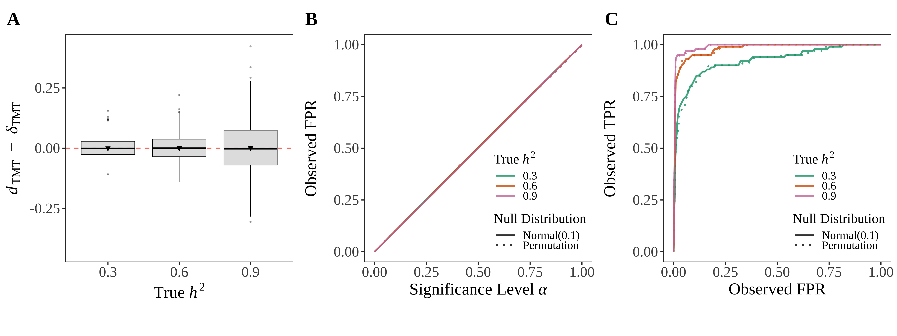


```{r figures4, eval=TRUE, echo=TRUE, message=FALSE, warning=FALSE}
showtext_auto()
myFont1 <- 'serif'

# data for A.1 ##################################################################
dat_plt <- data.frame()
load('./data/dtmt/muc_dtmt/single_gpm_k0_1_k1_2_k2_7_n5000_m100000_c100_nfst20_a100.RData')
ddtmt$fst <- 0.20
ddtmt$a <- 100
ddtmt$alpha_set <- '5'
dat_plt <- rbind(dat_plt, ddtmt)

dat_plt$alpha_set <- factor(dat_plt$alpha_set, levels=c('5'))
dat_plt <- dat_plt[dat_plt$hsqr %in% c('0.3','0.6','0.9'),]
dat_plt$hsqr <- factor(dat_plt$hsqr, levels=c('0.3','0.6','0.9'))
dat_plt <- dat_plt[dat_plt$estimand %in% c('dtmt'),]
dat_plt$estimand <- factor(dat_plt$estimand, levels=c('dtmt'))

appender_a <- function(string){TeX(paste0("\\textit{$a = $}", string))}  
appender_fst <- function(string){TeX(paste0("\\textit{$F_{ST} = $}", string))}  
appender_alpha <- function(string){TeX(paste0("(\\textit{$\\alpha_2-\\alpha_1$})$/$(\\textit{$\\alpha_1-\\alpha_0$})$=$", string))} 

g_dtmt_a <- ggplot(dat_plt, aes(x=hsqr, y=estimate-truevalue, colour=alpha_set)) +
  geom_hline(yintercept=0, linetype="dashed", color = "salmon", size=0.5) +
  geom_boxplot(fill="#999999", alpha=0.3, outlier.size=0.3, outlier.alpha=0.3, lwd=0.2, fatten=3) +
  stat_summary(
    fun = mean,
    geom = 'point', size = 1.2,
    aes(group = alpha_set, fill=alpha_set, shape = alpha_set),
    position = position_dodge(width = 0.75) #this has to be added
  ) +
  xlab(TeX('True \\textit{$h^2$}')) +
  ylab(TeX('\\textit{$d$}$_{TMT}$ $-$ \\textit{$\\delta$}$_{TMT}$')) +
  ylim(c(-0.4,0.4)) +
  theme_bw() +
  theme(aspect.ratio=1,
        panel.grid.major = element_blank(),
        panel.grid.minor = element_blank(),
        text = element_text(family=myFont1),
        axis.text.x = element_text(size=14),
        axis.text.y = element_text(size=14),
        axis.title.x = element_text(size=16),
        axis.title.y = element_text(size=16),
        legend.position='none',
        legend.direction='vertical',
        legend.key.size = unit(0.6, 'cm'),
        legend.key.height = unit(0.3, 'cm'),
        legend.key.width = unit(0.6, 'cm'),
        legend.title =  element_blank(),
        legend.text = element_blank()) +
  scale_fill_manual(values=c("#000000", "#0072B2","#E69F00","#009E73")) +
  scale_color_manual(values=c("#000000", "#0072B2", "#E69F00", "#009E73")) +
  scale_shape_manual(values=c(25,24,23,22)) +
  guides(colour=guide_legend(title=TeX('($\\alpha_2-\\alpha_1$)$/$($\\alpha_1-\\alpha_0$)')),
         fill=guide_legend(title=TeX('($\\alpha_2-\\alpha_1$)$/$($\\alpha_1-\\alpha_0$)')),
         shape=guide_legend(title=TeX('($\\alpha_2-\\alpha_1$)$/$($\\alpha_1-\\alpha_0$)'))) +
  facet_wrap(~ alpha_set,
             labeller=labeller(alpha_set=as_labeller(appender_alpha, default=label_parsed))) +
  theme(strip.text = element_text(size = 14, family=myFont1)) 

# data for A.2 ##################################################################
dat_plt <- data.frame()
k0 <- 1
k1 <- 2
k2 <- 7
n_ind <- 5000
c_snp <- 100
n_fst <- 20
a <- 100
load(paste0('./data/dtmt/fpnr/single_gpm_k0_',k0,'_k1_',k1,'_k2_',k2,'_n',n_ind,'_m100000_c',c_snp,'_nfst',n_fst,'_a',a,'.RData'))
ftpn$a <- 100
ftpn$fst <- 0.2
dat_plt <- rbind(dat_plt, ftpn)

dat_plt$alpha_set <- '5'
dat_plt$hsqr <- factor(dat_plt$hsqr, levels=c('0.3','0.6','0.9'))
dat_plt$estimand <- ifelse(dat_plt$estimand=='TMT', 'Normal(0,1)', dat_plt$estimand)
dat_plt$estimand <- factor(dat_plt$estimand, levels=c('Normal(0,1)','Permutation'))

appender_tau <- function(string){TeX(paste0("\\textit{$\\tau_{", string,"}$}"))} 

g_fpr_a <- ggplot(dat_plt, aes(x=alpha, y=fpr, color=hsqr)) +
  geom_line(aes(linetype=estimand), alpha=0.8, size=0.8) +
  xlab(TeX('Significance Level $\\alpha$')) +
  ylab(TeX('Observed FPR')) +
  theme_bw() +
  theme(aspect.ratio=1,
        panel.grid.major=element_blank(),
        panel.grid.minor=element_blank(),
        text = element_text(family=myFont1),
        axis.text.x = element_text(size=14),
        axis.text.y = element_text(size=14),
        axis.title.x = element_text(size=16),
        axis.title.y = element_text(size=16),
        legend.margin=margin(t = 0, unit='cm'),
        legend.position=c(0.77,0.272),
        legend.key.size = unit(0.8, 'cm'),
        legend.key.height = unit(0.3, 'cm'),
        legend.key.width = unit(0.8, 'cm'),
        legend.title = element_text(color = "black", size = 13),
        legend.text = element_text(color = "black", size = 11)) +
  scale_color_manual(values=c("#009E73","#D55E00","#CC79A7")) +
  scale_linetype_manual(values=c("solid","dotted","dotted")) +
  guides(color=guide_legend(title=TeX('True \\textit{$h^2$}'), order=1),
         linetype=guide_legend(title=TeX('Null Distribution'), order=2)) +
  facet_wrap(~ alpha_set,
             labeller=labeller(alpha_set=as_labeller(appender_alpha, default=label_parsed))) +
  theme(strip.text = element_text(size = 14, family=myFont1)) 

# data for A.3 ##################################################################
dat_plt <- data.frame()
k0 <- 1
k1 <- 2
k2 <- 7
n_ind <- 5000
c_snp <- 100
n_fst <- 20
a <- 100
load(paste0('./data/dtmt/fpnr/single_gpm_k0_',k0,'_k1_',k1,'_k2_',k2,'_n',n_ind,'_m100000_c',c_snp,'_nfst',n_fst,'_a',a,'.RData'))
ftpn$a <- 100
ftpn$fst <- 0.2
dat_plt <- rbind(dat_plt, ftpn)

dat_plt$alpha_set <- '5'
dat_plt$hsqr <- factor(dat_plt$hsqr, levels=c('0.3','0.6','0.9'))
dat_plt$estimand <- ifelse(dat_plt$estimand=='TMT', 'Normal(0,1)', dat_plt$estimand)
dat_plt$estimand <- factor(dat_plt$estimand, levels=c('Normal(0,1)','Permutation'))


appender_tau <- function(string){TeX(paste0("\\textit{$\\tau_{", string,"}$}"))} 

g_roc_a <- ggplot(dat_plt, aes(x=fpr, y=tpr, color=hsqr)) +
  geom_line(aes(linetype=estimand), alpha=0.8, size=0.8) +
  xlab(TeX('Observed FPR')) + 
  ylab(TeX('Observed TPR')) +
  theme_bw() +
  theme(aspect.ratio=1,
        panel.grid.major=element_blank(),
        panel.grid.minor=element_blank(),
        text = element_text(family=myFont1),
        axis.text.x = element_text(size=14),
        axis.text.y = element_text(size=14),
        axis.title.x = element_text(size=16),
        axis.title.y = element_text(size=16),
        legend.margin=margin(t = 0, unit='cm'),
        legend.position=c(0.77,0.272),
        legend.key.size = unit(0.8, 'cm'),
        legend.key.height = unit(0.3, 'cm'),
        legend.key.width = unit(0.8, 'cm'),
        legend.title = element_text(color = "black", size = 13),
        legend.text = element_text(color = "black", size = 11)) +
  scale_color_manual(values=c("#009E73","#D55E00","#CC79A7")) +
  scale_linetype_manual(values=c("solid","dotted","dotted")) +
  guides(color=guide_legend(title=TeX('True \\textit{$h^2$}'), order=1),
         linetype=guide_legend(title=TeX('Null Distribution'), order=2)) +
  facet_wrap(~ alpha_set,
             labeller=labeller(alpha_set=as_labeller(appender_alpha, default=label_parsed))) +
  theme(strip.text = element_text(size = 14, family=myFont1)) 


# data for B.1 ##################################################################
dat_plt <- data.frame()
load('./data/dtmt/muc_dtmt/single_gpm_k0_1_k1_6_k2_7_n5000_m100000_c100_nfst20_a100.RData')
ddtmt$fst <- 0.20
ddtmt$a <- 100
ddtmt$alpha_set <- '1/5'
dat_plt <- rbind(dat_plt, ddtmt)

dat_plt$alpha_set <- factor(dat_plt$alpha_set, levels=c('1/5'))
dat_plt <- dat_plt[dat_plt$hsqr %in% c('0.3','0.6','0.9'),]
dat_plt$hsqr <- factor(dat_plt$hsqr, levels=c('0.3','0.6','0.9'))
dat_plt <- dat_plt[dat_plt$estimand %in% c('dtmt'),]
dat_plt$estimand <- factor(dat_plt$estimand, levels=c('dtmt'))

appender_a <- function(string){TeX(paste0("\\textit{$a = $}", string))}  
appender_fst <- function(string){TeX(paste0("\\textit{$F_{ST} = $}", string))}  
appender_alpha <- function(string){TeX(paste0("(\\textit{$\\alpha_2-\\alpha_1$})$/$(\\textit{$\\alpha_1-\\alpha_0$})$=$", string))} 

g_dtmt_b <- ggplot(dat_plt, aes(x=hsqr, y=estimate-truevalue, colour=alpha_set)) +
  geom_hline(yintercept=0, linetype="dashed", color = "salmon", size=0.5) +
  geom_boxplot(fill="#999999", alpha=0.3, outlier.size=0.3, outlier.alpha=0.3, lwd=0.2, fatten=3) +
  stat_summary(
    fun = mean,
    geom = 'point', size = 1.2,
    aes(group = alpha_set, fill=alpha_set, shape = alpha_set),
    position = position_dodge(width = 0.75) #this has to be added
  ) +
  xlab(TeX('True \\textit{$h^2$}')) +
  ylab(TeX('\\textit{$d$}$_{TMT}$ $-$ \\textit{$\\delta$}$_{TMT}$')) +
  ylim(c(-0.4,0.4)) +
  theme_bw() +
  theme(aspect.ratio=1,
        panel.grid.major = element_blank(),
        panel.grid.minor = element_blank(),
        text = element_text(family=myFont1),
        axis.text.x = element_text(size=14),
        axis.text.y = element_text(size=14),
        axis.title.x = element_text(size=16),
        axis.title.y = element_text(size=16),
        legend.position='none',
        legend.direction='vertical',
        legend.key.size = unit(0.6, 'cm'),
        legend.key.height = unit(0.3, 'cm'),
        legend.key.width = unit(0.6, 'cm'),
        legend.title =  element_blank(),
        legend.text = element_blank()) +
  scale_fill_manual(values=c("#000000", "#0072B2","#E69F00","#009E73")) +
  scale_color_manual(values=c("#000000", "#0072B2", "#E69F00", "#009E73")) +
  scale_shape_manual(values=c(25,24,23,22)) +
  guides(colour=guide_legend(title=TeX('($\\alpha_2-\\alpha_1$)$/$($\\alpha_1-\\alpha_0$)')),
         fill=guide_legend(title=TeX('($\\alpha_2-\\alpha_1$)$/$($\\alpha_1-\\alpha_0$)')),
         shape=guide_legend(title=TeX('($\\alpha_2-\\alpha_1$)$/$($\\alpha_1-\\alpha_0$)'))) +
  facet_wrap(~ alpha_set,
             labeller=labeller(alpha_set=as_labeller(appender_alpha, default=label_parsed))) +
  theme(strip.text = element_text(size = 14, family=myFont1)) 

# data for B.2 ##################################################################
dat_plt <- data.frame()
k0 <- 1
k1 <- 6
k2 <- 7
n_ind <- 5000
c_snp <- 100
n_fst <- 20
a <- 100
load(paste0('./data/dtmt/fpnr/single_gpm_k0_',k0,'_k1_',k1,'_k2_',k2,'_n',n_ind,'_m100000_c',c_snp,'_nfst',n_fst,'_a',a,'.RData'))
ftpn$a <- 100
ftpn$fst <- 0.2
dat_plt <- rbind(dat_plt, ftpn)

dat_plt$alpha_set <- '1/5'
dat_plt$hsqr <- factor(dat_plt$hsqr, levels=c('0.3','0.6','0.9'))
dat_plt$estimand <- ifelse(dat_plt$estimand=='TMT', 'Normal(0,1)', dat_plt$estimand)
dat_plt$estimand <- factor(dat_plt$estimand, levels=c('Normal(0,1)','Permutation'))

appender_tau <- function(string){TeX(paste0("\\textit{$\\tau_{", string,"}$}"))} 

g_fpr_b <- ggplot(dat_plt, aes(x=alpha, y=fpr, color=hsqr)) +
  geom_line(aes(linetype=estimand), alpha=0.8, size=0.8) +
  xlab(TeX('Significance Level $\\alpha$')) +
  ylab(TeX('Observed FPR')) +
  theme_bw() +
  theme(aspect.ratio=1,
        panel.grid.major=element_blank(),
        panel.grid.minor=element_blank(),
        text = element_text(family=myFont1),
        axis.text.x = element_text(size=14),
        axis.text.y = element_text(size=14),
        axis.title.x = element_text(size=16),
        axis.title.y = element_text(size=16),
        legend.margin=margin(t = 0, unit='cm'),
        legend.position=c(0.77,0.272),
        legend.key.size = unit(0.8, 'cm'),
        legend.key.height = unit(0.3, 'cm'),
        legend.key.width = unit(0.8, 'cm'),
        legend.title = element_text(color = "black", size = 13),
        legend.text = element_text(color = "black", size = 11)) +
  scale_color_manual(values=c("#009E73","#D55E00","#CC79A7")) +
  scale_linetype_manual(values=c("solid","dotted","dotted")) +
  guides(color=guide_legend(title=TeX('True \\textit{$h^2$}'), order=1),
         linetype=guide_legend(title=TeX('Null Distribution'), order=2)) +
  facet_wrap(~ alpha_set,
             labeller=labeller(alpha_set=as_labeller(appender_alpha, default=label_parsed))) +
  theme(strip.text = element_text(size = 14, family=myFont1)) 

# data for B.3 ##################################################################
dat_plt <- data.frame()
k0 <- 1
k1 <- 6
k2 <- 7
n_ind <- 5000
c_snp <- 100
n_fst <- 20
a <- 100
load(paste0('./data/dtmt/fpnr/single_gpm_k0_',k0,'_k1_',k1,'_k2_',k2,'_n',n_ind,'_m100000_c',c_snp,'_nfst',n_fst,'_a',a,'.RData'))
ftpn$a <- 100
ftpn$fst <- 0.2
dat_plt <- rbind(dat_plt, ftpn)

dat_plt$alpha_set <- '1/5'
dat_plt$hsqr <- factor(dat_plt$hsqr, levels=c('0.3','0.6','0.9'))
dat_plt$estimand <- ifelse(dat_plt$estimand=='TMT', 'Normal(0,1)', dat_plt$estimand)
dat_plt$estimand <- factor(dat_plt$estimand, levels=c('Normal(0,1)','Permutation'))

appender_tau <- function(string){TeX(paste0("\\textit{$\\tau_{", string,"}$}"))} 

g_roc_b <- ggplot(dat_plt, aes(x=fpr, y=tpr, color=hsqr)) +
  geom_line(aes(linetype=estimand), alpha=0.8, size=0.8) +
  xlab(TeX('Observed FPR')) + 
  ylab(TeX('Observed TPR')) +
  theme_bw() +
  theme(aspect.ratio=1,
        panel.grid.major=element_blank(),
        panel.grid.minor=element_blank(),
        text = element_text(family=myFont1),
        axis.text.x = element_text(size=14),
        axis.text.y = element_text(size=14),
        axis.title.x = element_text(size=16),
        axis.title.y = element_text(size=16),
        legend.margin=margin(t = 0, unit='cm'),
        legend.position=c(0.77,0.272),
        legend.key.size = unit(0.8, 'cm'),
        legend.key.height = unit(0.3, 'cm'),
        legend.key.width = unit(0.8, 'cm'),
        legend.title = element_text(color = "black", size = 13),
        legend.text = element_text(color = "black", size = 11)) +
  scale_color_manual(values=c("#009E73","#D55E00","#CC79A7")) +
  scale_linetype_manual(values=c("solid","dotted","dotted")) +
  guides(color=guide_legend(title=TeX('True \\textit{$h^2$}'), order=1),
         linetype=guide_legend(title=TeX('Null Distribution'), order=2)) +
  facet_wrap(~ alpha_set,
             labeller=labeller(alpha_set=as_labeller(appender_alpha, default=label_parsed))) +
  theme(strip.text = element_text(size = 14, family=myFont1)) 


png(file='./manuscript/figures/figures4.png', units='in', width=12, height=9, res=350)
theme_set(theme_cowplot(font_size=12, font_family = "serif"))
plot_grid(g_dtmt_a, g_fpr_a, g_roc_a, 
          g_dtmt_b, g_fpr_b, g_roc_b,
          labels=c('A','','','B','',''), 
          align='hv', label_size=18, nrow=2, label_x=0, label_y=0.98)
showtext_auto(FALSE)
```


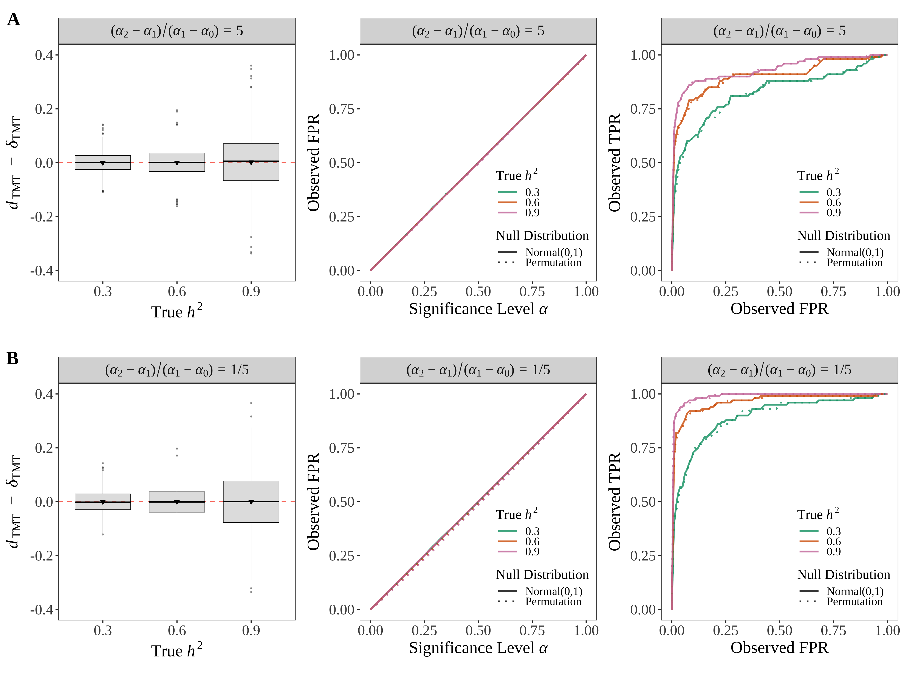


# 8 TDT Estimand

## True ACE

Under the TDT setting, we showed that: $$\delta_{\tdt} = \E[Y(2A^m-1)|Z^m=1,N] + \E[Y(2A^p-1)|Z^p=1,N].$$

## Binary trait

Let $\indicator(\cdot)$ be the indicator function. The child's trait $Y$ is modeled as: $$\begin{align*}
L &= \alpha_0\indicator(A^m+A^p=0) + \alpha_1\indicator(A^m+A^p=1) + \alpha_2\indicator(A^m+A^p=2)+\gamma \\
&= \alpha_0\indicator(G=0) + \alpha_1\indicator(G=1) + \alpha_2\indicator(G=2) + \gamma,
\end{align*}$$ and convert to binary by: $$Y_j = \indicator(L_j\geq \text{Median}(\boldsymbol{L})).$$ 

Simulate parental genotype matrices once and keep them fixed. Randomly choose 100 causal loci. Among these causal loci, randomly choose one as the target causal locus. Calculate ACE at the target locus. Repeatedly generate parental transmitted alleles at the target locus to derive $d_{\tdt}$.

## Performance

### Unbiasedness

```{r simulate_dtdt_gpm, echo=TRUE, eval=FALSE, warning=FALSE, message=FALSE}
k_pop <- 4
n_ind <- 10000
m_snp <- 100000
c_snp <- 100
n_fst <- 20
a <- 100
k0 <- 1
k1 <- 2
k2 <- 3
p_eta <- 0.5

sigma_e_2 <- 1
s_seed <- 11
s_seed <- as.numeric(s_seed)
path_out <- '.'

# genome parameters  ############################################################
set.seed(s_seed)
# population structure parameters 
param_list <- sim_geno_param(m=m_snp, n=n_ind, k=k_pop, Fst=n_fst/100)
# trio genotype ################################################################
# simulate maternal genotype
geno_m <- sim_geno(p_s=param_list$p_s, q=param_list$q)
# generate paternal genotype
geno_p <- sim_geno(p_s=param_list$p_s, q=param_list$q)
# simulate maternal allele
allele_m <- sim_allele(geno_m, fix_seed=TRUE, seed_start=s_seed)
# generate paternal allele
allele_p <- sim_allele(geno_p, fix_seed=TRUE, seed_start=s_seed)
# generate child genotype
geno_c <- allele_m + allele_p
# direct causal loci
causal_loci <- sample(c(1:m_snp), c_snp)
# null loci
ndc_loci <- setdiff(c(1:m_snp), causal_loci)
# direct causal locus for test 
id_causal <- causal_loci[1]
# population-stratified environmental factors ##################################
# non-genetic effect tied to structure
R <- as.matrix(data.frame(R1 = rnorm(n=1, mean=1, sd=1),
                          R2 = rnorm(n=1, mean=2, sd=1),
                          R3 = rnorm(n=1, mean=3, sd=1),
                          R4 = rnorm(n=1, mean=4, sd=1)))
E <- as.vector(param_list$q %*% t(R))
# prepare for calculating coefficient beta
gc0 <- colSums(geno_c[causal_loci,]==0)
gc1 <- colSums(geno_c[causal_loci,]==1)
gc2 <- colSums(geno_c[causal_loci,]==2)
# causal loci except the target one
gc0_notc <- colSums(geno_c[setdiff(causal_loci, id_causal),]==0)
gc1_notc <- colSums(geno_c[setdiff(causal_loci, id_causal),]==1)
gc2_notc <- colSums(geno_c[setdiff(causal_loci, id_causal),]==2)
# parental heterozygous
id_het_m <- (geno_m[id_causal,]==1)
id_het_p <- (geno_p[id_causal,]==1)
# data frame for output 
d_dtdt <- data.frame()
# various levels of heritability
for(h_sqr in c(0.3,0.6,0.9)){
  set.seed(s_seed)
  # seed list for each round of simulations
  # causal gene effect sizes
  sigma_a_2 <- sigma_e_2 * h_sqr / (1-h_sqr)
  beta_tmt <- sqrt(sigma_a_2/var( k0 * gc0 + k1 * gc1 + k2 * gc2 ))
  # population-stratified environmental factors ##################################
  # simulate residuals with sigma_e_2 ############################################
  epsilon <- rnorm(n_ind, mean=0, sd=sqrt(sigma_e_2))
  # coefficient of environmental factor
  beta_e <- beta_tmt
  # calculate a0 a1 and a2 #######################################################
  a0 <- k0 * beta_tmt
  a1 <- k1 * beta_tmt
  a2 <- k2 * beta_tmt
  # calculate epsilon ########################################################
  zeta <- a0 * gc0_notc + a1 * gc1_notc + a2 * gc2_notc
  gamma_vec <- a + zeta + beta_e * E + epsilon
  # dtmt distribution #########################################################
  # re-draw child's genotype to generate dtmt distribution #############
  seed_list <- sample(c(1:10000), size=1000)
  dtdt_loop <- function(id_sim) {
    # re-simulate parental alleles at the target locus
    set.seed(seed_list[id_sim])
    allele_m_i <- sim_allele_row(geno_m[id_causal,])
    allele_p_i <- sim_allele_row(geno_p[id_causal,])
    geno_c_i <- allele_m_i + allele_p_i
    is_Gc_0_i <- (geno_c_i==0)
    is_Gc_1_i <- (geno_c_i==1)
    is_Gc_2_i <- (geno_c_i==2)
    trio_geno_i <- matrix(c(geno_m[id_causal,], geno_p[id_causal,], allele_m_i, allele_p_i),
                          nrow=4, ncol=n_ind, byrow=TRUE)
    # simulate the trait #######################################################
    y_h1 <- matrix(a0 * is_Gc_0_i + a1 * is_Gc_1_i + a2 * is_Gc_2_i  + gamma_vec, nrow=1)
    y_h1_binary <- ifelse(y_h1 > as.numeric(quantile(y_h1, probs=seq(0,1,0.01))[paste0((1-p_eta)*100,'%')]), 1, 0)
    # true ace #################################################################
    y1m_y0m_h1 <- y_h1_binary * (2*allele_m_i - 1)
    y1p_y0p_h1 <- y_h1_binary * (2*allele_p_i - 1)
    ace_h1 <- mean(y1m_y0m_h1[id_het_m]) + mean(y1p_y0p_h1[id_het_p])
    
    # dtdt #####################################################################
    dtdt_h1 <- calc_dtdt(y_h1_binary, trio_geno_i, is_phased=TRUE)
    dtmtnc_h1 <- calc_dtmt_nc(y_h1_binary, trio_geno_i, is_phased=TRUE)
    dtmt_h1 <- calc_dtmt(y_h1_binary, trio_geno_i, is_phased=TRUE)
    return(c(dtdt_h1, dtmtnc_h1, dtmt_h1, ace_h1))
  }
  ace_obs <- mclapply(c(1:1000), dtdt_loop, mc.cores=18)
  ace_obs <- data.frame(matrix(unlist(ace_obs), byrow=TRUE, ncol=4))
  colnames(ace_obs) <- c('dtdt_h1','dtmtnc_h1','dtmt_h1','ace_h1')
  # tidy output ##############################################################
  d_dtdt <- rbind(d_dtdt, data.frame(dstat=ace_obs$dtdt_h1, ace=ace_obs$ace_h1, 
                                     hsqr=h_sqr, estimand='dtdt', snp='Causal'))
  d_dtdt <- rbind(d_dtdt, data.frame(dstat=ace_obs$dtmtnc_h1, ace=ace_obs$ace_h1, 
                                     hsqr=h_sqr, estimand='dtmtnc', snp='Causal'))
  d_dtdt <- rbind(d_dtdt, data.frame(dstat=ace_obs$dtmt_h1, ace=ace_obs$ace_h1, 
                                     hsqr=h_sqr, estimand='dtmt', snp='Causal'))
}

file_out <- paste0('./data/dtdt/single_gpm_k0_',k0,'_k1_',k1,'_k2_',k2,
                   '_n5000_m100000_c',c_snp,'_nfst',n_fst,'_a',a,'_peta',p_eta*10,'.RData')
save(d_dtdt, file=file_out)
```


### FPR and ROC

```{r tdt_tmt_fpnr, eval=FALSE, echo=TRUE, message=FALSE, warning=FALSE}
k_pop <- 4
n_ind <- 5000
m_snp <- 100000
c_snp <- 100
n_fst <- 20
a <- 100
k0 <- 1
k1 <- 2
k2 <- 3
p_eta <- 0.5

sigma_e_2 <- 1
s_seed <- 11
path_out <- '.'

set.seed(s_seed)
# direct causal loci
causal_loci <- sample(c(1:m_snp), c_snp)
# null loci
ndc_loci <- setdiff(c(1:m_snp), causal_loci)
# a list of significance level
alpha_list <- seq(0,1,0.01)
# data frame for output 
ftpn <- data.frame()
auc <- data.frame()

# TDT ###########################################################################
# total number of cases: n_ind
# total number of controls: n_ind
# genome parameters  ############################################################
set.seed(s_seed)
# population structure parameters 
param_list <- sim_geno_param(m=m_snp, n=2*n_ind, k=k_pop, Fst=n_fst/100)
# trio genotype ################################################################
# simulate maternal genotype
geno_m <- sim_geno(p_s=param_list$p_s, q=param_list$q)
# generate paternal genotype
geno_p <- sim_geno(p_s=param_list$p_s, q=param_list$q)
# simulate maternal allele
# allele_m <- sim_allele(geno_m, fix_seed=TRUE, seed_start=s_seed)
allele_m <- sim_allele(geno_m)
# generate paternal allele
# allele_p <- sim_allele(geno_p, fix_seed=TRUE, seed_start=s_seed)
allele_p <- sim_allele(geno_p)
# generate child genotype
geno_c <- allele_m + allele_p
# population-stratified environmental factors ##################################
# non-genetic effect tied to structure
R <- as.matrix(data.frame(R1 = rnorm(n=1, mean=1, sd=1),
                          R2 = rnorm(n=1, mean=2, sd=1),
                          R3 = rnorm(n=1, mean=3, sd=1),
                          R4 = rnorm(n=1, mean=4, sd=1)))
E <- as.vector(param_list$q %*% t(R))
# prepare for calculating coefficient beta
gc0 <- colSums(geno_c[causal_loci,]==0)
gc1 <- colSums(geno_c[causal_loci,]==1)
gc2 <- colSums(geno_c[causal_loci,]==2)
# various levels of heritability
for(h_sqr in c(0.3,0.6,0.9)){
  set.seed(s_seed)
  # causal gene effect sizes
  sigma_a_2 <- sigma_e_2 * h_sqr / (1-h_sqr)
  beta_tmt <- sqrt(sigma_a_2/var( k0 * gc0 + k1 * gc1 + k2 * gc2 ))
  # population-stratified environmental factors ##################################
  # coefficient of environmental factor
  beta_e <- beta_tmt
  # simulate residuals with sigma_e_2 ############################################
  epsilon <- rnorm(2*n_ind, mean=0, sd=sqrt(sigma_e_2))
  # calculate a0 a1 and a2 #######################################################
  a0 <- k0 * beta_tmt
  a1 <- k1 * beta_tmt
  a2 <- k2 * beta_tmt
  # simulate the trait #######################################################
  y_h1 <- matrix(a + a0 * gc0 + a1 * gc1 + a2 * gc2 + beta_e * E + epsilon, nrow=1)
  y_h1_binary <- ifelse(y_h1 > as.numeric(quantile(y_h1, probs=seq(0,1,0.01))[paste0((1-p_eta)*100,'%')]), 1, 0)
  # tmt #########################################################################
  tdt_loop <- function(i){
    trio_geno_i <- matrix(c(geno_m[i,], geno_p[i,], allele_m[i,], allele_p[i,]),
                           nrow=4, ncol=2*n_ind, byrow=TRUE)
    tdt_out <- td.test(y_h1_binary, trio_geno_i, is_phased=TRUE)
    return(tdt_out$p)
  }
  ptdt <- mclapply(c(1:m_snp), tdt_loop, mc.cores=18)
  ptdt <- unlist(ptdt)
  # TMT #########################################################################
  # randomly sample half individuals for TMT
  id_cases <- which(y_h1_binary==1)
  id_control <- which(y_h1_binary==0)
  set.seed(s_seed-1)
  id_tmt <- c(sample(id_cases, n_ind/2), sample(id_control, n_ind/2))
  geno_m_sub <- geno_m[,id_tmt]
  geno_p_sub <- geno_p[,id_tmt]
  allele_m_sub <- allele_m[,id_tmt]
  allele_p_sub <- allele_p[,id_tmt]
  y_h1_binary_sub <- y_h1_binary[,id_tmt]
  # the test 
  tmt_loop <- function(i){
    trio_geno_i <- matrix(c(geno_m_sub[i,], geno_p_sub[i,], 
                            allele_m_sub[i,], allele_p_sub[i,]),
                           nrow=4, ncol=n_ind, byrow=TRUE)
    p_tmt <- tm.test(y_h1_binary_sub, trio_geno_i, is_phased=TRUE, test='TMT')
    return(p_tmt)
  }
  ptmt <- mclapply(c(1:m_snp), tmt_loop, mc.cores=18)
  ptmt <- unlist(ptmt)
  # FPR and FNR ################################################################
  for(alpha in alpha_list){
    # TDT FPR ###############################################################
    fp_tdt <- length(which(ptdt[ndc_loci] < alpha))
    fn_tdt <- length(which(ptdt[causal_loci] >= alpha))
    tp_tdt <- length(which(ptdt[causal_loci] < alpha))
    tn_tdt <- length(which(ptdt[ndc_loci] >= alpha))
    fpr_tdt <- fp_tdt / (fp_tdt + tn_tdt)
    fnr_tdt <- fn_tdt / (fn_tdt + tp_tdt)
    tpr_tdt <- tp_tdt / (tp_tdt + fn_tdt)
    ftpn <- rbind(ftpn, data.frame(fpr=fpr_tdt, tpr=tpr_tdt, fnr=fnr_tdt, alpha=alpha,
                                   hsqr=h_sqr, estimand='TDT'))
    # TMT FPR ###############################################################
    fp_tmt <- length(which(ptmt[ndc_loci] < alpha))
    fn_tmt <- length(which(ptmt[causal_loci] >= alpha))
    tp_tmt <- length(which(ptmt[causal_loci] < alpha))
    tn_tmt <- length(which(ptmt[ndc_loci] >= alpha))
    fpr_tmt <- fp_tmt / (fp_tmt + tn_tmt)
    fnr_tmt <- fn_tmt / (fn_tmt + tp_tmt)
    tpr_tmt <- tp_tmt / (tp_tmt + fn_tmt)
    ftpn <- rbind(ftpn, data.frame(fpr=fpr_tmt, tpr=tpr_tmt, fnr=fnr_tmt, alpha=alpha,
                                    hsqr=h_sqr, estimand='TMT'))
  }
  # TDT ROC #################################################################
  auroc_tdt <- calc_auroc_pvalues(ptdt, causal_loci)
  aucpr_tdt <- calc_auprc_pvalues(ptdt, causal_loci)
  auc <- rbind(auc, data.frame(roc=auroc_tdt, cpr=aucpr_tdt, hsqr=h_sqr, estimand='TDT'))
  # TMT ROC #################################################################
  auroc_tmt <- calc_auroc_pvalues(ptmt, causal_loci)
  aucpr_tmt <- calc_auprc_pvalues(ptmt, causal_loci)
  auc <- rbind(auc, data.frame(roc=auroc_tmt, cpr=aucpr_tmt, hsqr=h_sqr, estimand='TMT'))
  print(paste0("one round of simulation completed with h2: ",h_sqr,"..."))
}

save(ftpn, auc, file=paste0('./data/dtdt/fpnr/single_gpm_k0_',k0,'_k1_',k1,'_k2_',k2,'_n',n_ind,'_m100000_c',c_snp,'_nfst',n_fst,'_a',a,'.RData'))
```

### Figure 4

```{r figure4, eval=TRUE, echo=TRUE, message=FALSE, warning=FALSE}
showtext_auto()
myFont1 <- 'serif'

# data for 4A ##################################################################
dat_plt <- data.frame()
load('./data/dtdt/single_gpm_k0_1_k1_2_k2_3_n5000_m100000_c100_nfst20_a100_peta5.RData')
d_dtdt$fst <- 0.20
d_dtdt$a <- 100
d_dtdt$alpha_set <- 'A'
dat_plt <- rbind(dat_plt, d_dtdt)

dat_plt$alpha_set <- factor(dat_plt$alpha_set, levels=c('A','B','C'))
dat_plt$hsqr <- factor(dat_plt$hsqr, levels=c(0.3,0.6,0.9))
dat_plt <- dat_plt[dat_plt$estimand %in% c('dtdt'),]
dat_plt$estimand <- factor(dat_plt$estimand, levels=c('dtdt'))

appender_a <- function(string){TeX(paste0("\\textit{$a = $}", string))}  
appender_fst <- function(string){TeX(paste0("\\textit{$F_{ST} = $}", string))}  
appender_alpha <- function(string){TeX(paste0("(\\textit{$\\alpha_0,\\alpha_1,\\alpha_2$}) Set ", string))} 

g_dtdt <- ggplot(dat_plt, aes(x=hsqr, y=dstat-ace, colour=alpha_set)) +
  geom_hline(yintercept=0, linetype="dashed", color = "salmon", size=0.5) +
  geom_boxplot(fill="#999999", alpha=0.3, outlier.size=0.3, outlier.alpha=0.3, lwd=0.2, fatten=3) +
  stat_summary(
    fun = mean,
    geom = 'point', size = 1.2,
    aes(group = alpha_set, fill=alpha_set, shape = alpha_set),
    position = position_dodge(width = 0.75) #this has to be added
  ) +
  xlab(TeX('True \\textit{$h^2$}')) +
  ylab(TeX('\\textit{$d$}$_{TDT}$ $-$ \\textit{$\\delta$}$_{TDT}$')) +
  theme_bw() +
  theme(aspect.ratio=1,
        panel.grid.major = element_blank(),
        panel.grid.minor = element_blank(),
        text = element_text(family=myFont1),
        axis.text.x = element_text(size=14),
        axis.text.y = element_text(size=14),
        axis.title.x = element_text(size=16),
        axis.title.y = element_text(size=16),
        legend.position='none',
        legend.direction='vertical',
        legend.key.size = unit(0.6, 'cm'),
        legend.key.height = unit(0.3, 'cm'),
        legend.key.width = unit(0.6, 'cm'),
        legend.title =  element_blank(),
        legend.text = element_blank()) +
  scale_fill_manual(values=c("#000000", "#0072B2","#E69F00","#009E73"),
                    labels=c('1','6','1/6')) +
  scale_color_manual(values=c("#000000", "#0072B2", "#E69F00", "#009E73"),
                     labels=c('1','6','1/6')) +
  scale_shape_manual(values=c(25,24,23,22),
                     labels=c('1','6','1/6')) +
  guides(colour=guide_legend(title=TeX('($\\alpha_2-\\alpha_1$)$/$($\\alpha_1-\\alpha_0$)')),
         fill=guide_legend(title=TeX('($\\alpha_2-\\alpha_1$)$/$($\\alpha_1-\\alpha_0$)')),
         shape=guide_legend(title=TeX('($\\alpha_2-\\alpha_1$)$/$($\\alpha_1-\\alpha_0$)')))

# data for 4B ##################################################################
dat_plt <- data.frame()
k0 <- 1
k1 <- 2
k2 <- 3
n_ind <- 5000
c_snp <- 100
n_fst <- 20
a <- 100
load(paste0('./data/dtdt/fpnr/single_gpm_k0_',k0,'_k1_',k1,'_k2_',k2,'_n',n_ind,'_m100000_c',c_snp,'_nfst',n_fst,'_a',a,'.RData'))
ftpn$a <- 100
ftpn$fst <- 0.2
dat_plt <- rbind(dat_plt, ftpn)

dat_plt$hsqr <- factor(dat_plt$hsqr, levels=c(0.3,0.6,0.9))
dat_plt$estimand <- factor(dat_plt$estimand, levels=c('TDT','TMT'))

appender_tau <- function(string){TeX(paste0("\\textit{$\\tau_{", string,"}$}"))} 

g_fpr <- ggplot(dat_plt, aes(x=alpha, y=fpr, color=hsqr)) +
  geom_line(aes(linetype=estimand), alpha=0.8, size=0.8) +
  xlab(TeX('Significance Level $\\alpha$')) +
  ylab(TeX('Observed FPR')) +
  theme_bw() +
  theme(aspect.ratio=1,
        panel.grid.major=element_blank(),
        panel.grid.minor=element_blank(),
        text = element_text(family=myFont1),
        axis.text.x = element_text(size=14),
        axis.text.y = element_text(size=14),
        axis.title.x = element_text(size=16),
        axis.title.y = element_text(size=16),
        legend.position=c(0.76,0.3),
        legend.key.size = unit(0.8, 'cm'),
        legend.key.height = unit(0.3, 'cm'),
        legend.key.width = unit(0.8, 'cm'),
        legend.title = element_text(color = "black", size = 13),
        legend.text = element_text(color = "black", size = 11)) +
  scale_color_manual(values=c("#009E73","#D55E00","#CC79A7")) +
  scale_linetype_manual(values=c("solid","dotted","dotted")) +
  guides(color=guide_legend(title=TeX('True \\textit{$h^2$}'), order=1),
         linetype=guide_legend(title=TeX('Method'), order=2)) 

# data for 4C ##################################################################
dat_plt <- data.frame()
k0 <- 1
k1 <- 2
k2 <- 3
n_ind <- 5000
c_snp <- 100
n_fst <- 20
a <- 100
load(paste0('./data/dtdt/fpnr/single_gpm_k0_',k0,'_k1_',k1,'_k2_',k2,'_n',n_ind,'_m100000_c',c_snp,'_nfst',n_fst,'_a',a,'.RData'))
ftpn$a <- 100
ftpn$fst <- 0.2
dat_plt <- rbind(dat_plt, ftpn)

dat_plt$hsqr <- factor(dat_plt$hsqr, levels=c(0.3,0.6,0.9))
dat_plt$estimand <- factor(dat_plt$estimand, levels=c('TDT','TMT'))

appender_tau <- function(string){TeX(paste0("\\textit{$\\tau_{", string,"}$}"))} 

g_roc <- ggplot(dat_plt, aes(x=fpr, y=tpr, color=hsqr)) +
  geom_line(aes(linetype=estimand), alpha=0.8, size=0.8) +
  xlab(TeX('Observed FPR')) + 
  ylab(TeX('Observed TPR')) +
  theme_bw() +
  theme(aspect.ratio=1,
        panel.grid.major=element_blank(),
        panel.grid.minor=element_blank(),
        text = element_text(family=myFont1),
        axis.text.x = element_text(size=14),
        axis.text.y = element_text(size=14),
        axis.title.x = element_text(size=16),
        axis.title.y = element_text(size=16),
        legend.position=c(0.76,0.3),
        legend.key.size = unit(0.8, 'cm'),
        legend.key.height = unit(0.3, 'cm'),
        legend.key.width = unit(0.8, 'cm'),
        legend.title = element_text(color = "black", size = 13),
        legend.text = element_text(color = "black", size = 11)) +
  scale_color_manual(values=c("#009E73","#D55E00","#CC79A7")) +
  scale_linetype_manual(values=c("solid","dotted","dotted")) +
  guides(color=guide_legend(title=TeX('True \\textit{$h^2$}'), order=1),
         linetype=guide_legend(title=TeX('Method'), order=2)) 


png(file='./manuscript/figures/figure4.png', units='in', width=12, height=4.5, res=350)
theme_set(theme_cowplot(font_size=12, font_family = "serif"))
plot_grid(g_dtdt, g_fpr, g_roc, labels=c('A','B','C'), align='hv', label_size=18, nrow=1, label_x=0, label_y=0.98)
showtext_auto(FALSE)
```

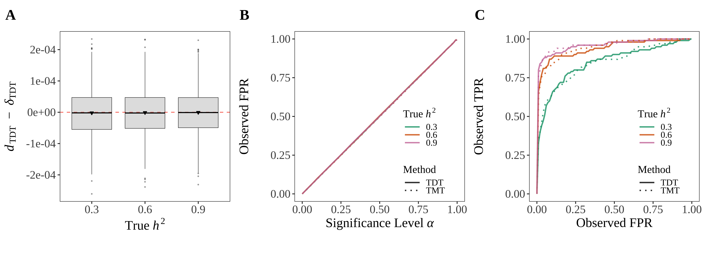


# 9 Causal Linkage

We validate performances of the TMT and the TDT when existing causal linkage, based on simulations via `msprime`.

## Admixed Americans {.tabset .tabset-fade .tabset-pills}

We followed an established pipeline ([Browning *et al*. 2018](https://doi.org/10.1371/journal.pgen.1007385)) to simulate three continental populations -- Africa, Europe, and Asia -- with recent admixture. We list critical events and parameters for `msprime` as below. The numbers in <span style='color:blue'>blue</span> are inputs for `msprime`.

*** 

* Before Out-of-Africa:
     + The initial population size in Africa (ancestral equilibrium, `ANC`): <span style='color:blue'>7310</span>
     + Anatomically modern modern humans `AMH` split from `ANC`:
          -  Split time: <span style='color:blue'>5920</span> generations ago
          -  Initial size of `AMH`: <span style='color:blue'>14474</span>
     + The Africa (`AFR`) population size remain the same as `AMH`: <span style='color:blue'>14474</span>

*** 
    
* Out-of-Africa `OOA`:
     + Time: <span style='color:blue'>2040</span> generations ago
     + `OOA` population size (the bottleneck out-of-Africa): <span style='color:blue'>1861</span>
     + The migration rate between `AFR` and `OOA`: <span style='color:blue'>$1.5\times 10^{-4}$</span>

***
     
* European and East Asian split from `OOA`:
     + Split time: <span style='color:blue'>920</span> generations ago
     + The European population :
          -  At the split time: size 1032, growth rate <span style='color:blue'>$3.8\times 10^{-3}$</span> per generation
          -  Size after growth (initial size of `EUR`): $1032/\exp(-3.8\times 10^{-3}\times 920)=$<span style='color:blue'>34039</span>
     + The East Asian population `EAS`:
          -  At the split time: size 554, growth rate <span style='color:blue'>$4.8\times 10^{-3}$</span> per generation
          -  Size after growth (initial size of `EAS`): $554/\exp(-4.8\times 10^{-3}\times 920)=$<span style='color:blue'>45852</span> 
     + Migration rates between:
          -  Africa and Europe: <span style='color:blue'>$2.5\times 10^{-5}$</span>
          - Africa and Asia: <span style='color:blue'>$7.8\times 10^{-6}$</span>
          - Europe and Asia: <span style='color:blue'>$3.11\times 10^{-5}$</span>

***
          
* The Admixture for Americans `AMA`:
     + Time: <span style='color:blue'>12</span> generations ago
     + Proportions: <span style='color:blue'>1/6</span> `AFR`, <span style='color:blue'>1/3</span> `EUR`, <span style='color:blue'>1/2</span> `EAS`
     + At the time of admixture: size 30000, growth rate <span style='color:blue'>0.05</span> per generation
     + Size after growth for 12 generations (initial size of `AMA`): $30000/\exp(-0.05\times 12)=$<span style='color:blue'>54664</span> 

*** 
     
Wrap up the above parameters into `python` and run the following code in terminal to obtain the schematic tree of the coalescent model. First, activate a virtual environment for `msprime`.

```{bash msprime_install, eval=FALSE, warning=FALSE, message=FALSE, echo=TRUE}
cd ~/Desktop/causal-trio/work/linkage/admixed_americans
conda activate msprime-env
python3
```

Run the `python` code below to derive a coalescent tree as the output. Take a screenshot and save as `.png` file.

```{bash msprime_admixed_americans_tree, eval=FALSE, warning=FALSE, message=FALSE, echo=TRUE}
import msprime

T_OOA = 920
n_ind = 5000
demography = msprime.Demography()
demography.add_population(name="AFR", description="African",    initial_size=14474)
demography.add_population(name="EUR", description="European",   initial_size=34039, growth_rate=0.0038)
demography.add_population(name="EAS", description="East Asian", initial_size=45852, growth_rate=0.0048)
demography.add_population(name="AMA", description="Admixed America", initial_size=54664, growth_rate=0.05)
demography.add_population(name="OOA", description="Bottleneck out-of-Africa", initial_size=1861)
demography.add_population(name="AMH", description="Anatomically modern humans", initial_size=14474)
demography.add_population(name="ANC", description="Ancestral equilibrium", initial_size=7310)
demography.set_symmetric_migration_rate(["AFR", "EUR"], 2.5e-5)
demography.set_symmetric_migration_rate(["AFR", "EAS"], 0.78e-5)
demography.set_symmetric_migration_rate(["EUR", "EAS"], 3.11e-5)
demography.add_admixture(12, derived="AMA", ancestral=["AFR", "EUR", "EAS"], proportions=[1 / 6, 2 / 6, 3 / 6])
demography.add_population_split(T_OOA, derived=["EUR", "EAS"], ancestral="OOA")
demography.add_symmetric_migration_rate_change(time=T_OOA, populations=["AFR", "OOA"], rate=15e-5)
demography.add_population_split(2040, derived=["OOA", "AFR"], ancestral="AMH")
demography.add_population_split(5920, derived=["AMH"], ancestral="ANC")
demography.debug()
sample_list = {"AMA": n_ind*2}
ts = msprime.sim_ancestry(samples=sample_list, demography=demography, sequence_length=m_snp, random_seed=no_chr+1)
mts = msprime.sim_mutations(ts, rate=1e-4, random_seed=no_chr+1, model='binary')
geno = np.array([var.genotypes for var in mts.variants()])
```

## Trio genotypes

**Simulate parental genotype.** We simulate $J=5,000$ trios. Among each trio, we simulated maternal and paternal genotypes with 100,000 loci, each as a combination of 22 pairs of chromosomes, with the simulated chromosome length proportional to the corresponding chromosome length in [Human Genome Assembly GRCh38.p14](https://www.ncbi.nlm.nih.gov/grc/human/data). 

```{bash msprime_admixed_americans_afr_eur_eas_parent_geno, eval=FALSE, warning=FALSE, message=FALSE, echo=TRUE}
cd ~/Desktop/PoLife/StoreyLab/CausalTrio/work/linkage/admixed_americans_n5000
conda activate msprime-env
python3 ../../../code/linkage/msprime_admixed_americans.py 5000 100000
# remove intermediate data
rm -f geno_parent_admixed_americans_chr*
```

**Simulate child's genotype.** To generate the child's genotype, for each one of the 22 chromosomes, we randomly draw one out of the maternal chromosome pairs and another one out of the paternal chromosome pairs to be transmitted to their child. 

```{r msprime_admixed_americans_afr_eur_eas_child_geno, eval=FALSE, warning=FALSE, message=FALSE, echo=TRUE}
n_ind <- 5000
m_snp <- 100000
# import parental haplotype from msprime output
np <- reticulate::import('numpy')
hap_parent <- np$load('./data/linkage/admixed_americans_n5000_ld_medium/geno_parent.npy')
# parental genotype indices
id_m <- seq(1,4*n_ind-1,4) # maternal genotype indices
id_p <- id_m + 2 # paternal genotype indices
# assemble genotypes
Zm <- hap_parent[,id_m] + hap_parent[,id_m+1]
Zp <- hap_parent[,id_p] + hap_parent[,id_p+1]
# randomly transmit one maternal haplotype to the child
set.seed(888)
id_mtoc <- rbinom(n_ind, size=1, prob=0.5) + id_m
# randomly transmit one paternal haplotype to the child
set.seed(222)
id_ptoc <- rbinom(n_ind, size=1, prob=0.5) + id_p
# maternal allele
Am <- hap_parent[,id_mtoc]
# paternal allele
Ap <- hap_parent[,id_ptoc]
# child genotypes
G <- Am + Ap
save(Zm, Zp, G, Am, Ap, file='./data/linkage/admixed_americans_n5000_ld_medium/trio_geno.RData')
```


## TMT profile

Let $\mathcal{C}$ be the index set of all direct causal loci. We simulate child trait $\boldsymbol{Y}=\{Y_j\}$ by $$Y_j = \iota + \sum_{i \in \mathcal{C}}\beta_i G_{ij} + \epsilon_j,\,\,\,\,\,\,\epsilon_j\sim N(0,\sigma_e^2)$$ where we set $\iota=0$ and $\sigma_e^2=1$. We set the heritability $h^2=0.5$ and calculate $\beta$ for $i \in \mathcal{C}$ such that $$\mathbb{V}\left(\sum_{i\in \mathcal{C}} \beta_i G_{ij}\right):\sigma^2_e=1:1.$$

```{r shuffle_geno_no_ld, eval=FALSE, warning=FALSE, message=FALSE, echo=TRUE}
load('./data/linkage/admixed_americans_n5000_ld_medium/trio_geno.RData')
n_ind <- ncol(G)
m_snp <- nrow(G)
shuffle_id <- function(i){
  set.seed(i)
  return(sample(1:n_ind, size=n_ind))
}
id_nld <- parallel::mclapply(1:m_snp, shuffle_id, mc.cores=18)
id_nld <- matrix(unlist(id_nld), nrow=m_snp, byrow=TRUE)
G_nld <- G
Zm_nld <- Zm
Zp_nld <- Zp
Am_nld <- Am
Ap_nld <- Ap
for(i in 1:m_snp){
  G_nld[i,] <- G[i, id_nld[i,]]
  Zm_nld[i,] <- Zm[i, id_nld[i,]]
  Zp_nld[i,] <- Zp[i, id_nld[i,]]
  Am_nld[i,] <- Am[i, id_nld[i,]]
  Ap_nld[i,] <- Ap[i, id_nld[i,]]
}
save(G_nld, Zm_nld, Zp_nld, Am_nld, Ap_nld, file='./data/linkage/admixed_americans_n5000_ld_medium/trio_geno_gza_nld.RData')
```

```{r tmt_profile_trait, eval=FALSE, warning=FALSE, message=FALSE, echo=TRUE}
# local packages ###############################################################
in_path_package = "../R/geneticTMT"
in_path_utility = "../R/utilities"
sapply(list.files(pattern="[.]R$", path=in_path_package, full.names=TRUE), source)
sapply(list.files(pattern="[.]R$", path=in_path_utility, full.names=TRUE), source)
# msprime output ###############################################################
load('./data/linkage/admixed_americans_n5000_ld_medium/trio_geno.RData')
load('./data/linkage/admixed_americans_n5000_ld_medium/trio_geno_gza_nld.RData')
snp_chr <- RcppCNPy::npyLoad('./data/linkage/admixed_americans_n5000_ld_medium/snp_chr.npy','integer')
snpid_chr <- rep(c(1:22), snp_chr)
n_ind <- ncol(G)
m_snp <- nrow(G)
iota <- 100
sigma_e_2 <- 1
# allele frequencies close to a half
p_af <- rowMeans(G)/2
snp_cand <- which(p_af > 0.45 & p_af < 0.55)
for(s in c(1:10)){
  print(paste0('running round ',s))
  set.seed(s)
  # 10 direct causal loci
  c_loci <- sort(sample(snp_cand,10))
  # simulate trait ################################################################
  # heritability
  h_sqr <- 0.5
  # genetic and non-genetic effect size
  sigma_a_2 <- sigma_e_2 * h_sqr / (1-h_sqr)
  true_ace <- bi <- sqrt( sigma_a_2/var(colSums(G[c_loci,])) )
  # individual noise
  theta_j <- rnorm(n_ind, mean=0, sd=sqrt(sigma_e_2))
  # child trait 
  y_h1 <- iota + bi * colSums(G[c_loci,]) + theta_j
  y_h0 <- iota + bi * colSums(G_nld[c_loci,]) + theta_j
  # tmt statistic ################################################################
  tmt_loop <- function(i){
    # ld genome 
    trio_geno <- matrix(c(Zm[i,], Zp[i,], G[i,]),
                        nrow=3, ncol=n_ind, byrow=TRUE)
    dtmt <- calc_dtmt(y_h1, trio_geno)
    ptmt <- tmtest(y_h1, trio_geno, test='TMT')
    # nld genome 
    trio_geno_nld <- matrix(c(Zm_nld[i,], Zp_nld[i,], G_nld[i,]),
                            nrow=3, ncol=n_ind, byrow=TRUE)
    dtmt_nld <- calc_dtmt(y_h0, trio_geno_nld)
    ptmt_nld <- tmtest(y_h0, trio_geno_nld, test='TMT')
    return(c(dtmt, ptmt, dtmt_nld, ptmt_nld))
  }
  dptmt <- parallel::mclapply(c(1:m_snp), tmt_loop, mc.cores=18)
  dptmt <- data.frame(matrix(unlist(dptmt), byrow=TRUE, ncol=4))
  colnames(dptmt) <- c('dtmt','pvalue', 'dtmt_nld', 'pvalue_nld')
  dptmt$id_chr <- snpid_chr
  save(dptmt, true_ace, c_loci,
       file=paste0('./data/linkage/admixed_americans_n5000_ld_medium/hsqr5/tmt_profile_seed',s,'.RData'))
}
```


**Pairwise $r^2$ between adjacent SNPs**

```{r ld_admixed_americans, eval=FALSE, echo=FALSE, warning=FALSE, message=FALSE}
# local packages ###############################################################
in_path_utility = "../R/utilities"
sapply(list.files(pattern="[.]R$", path=in_path_utility, full.names=TRUE), source)
load('./data/linkage/admixed_americans_n5000_ld_medium/trio_geno.RData')
load('./data/linkage/admixed_americans_n5000_ld_medium/trio_geno_gza_nld.RData')
# pairwise linkage between adjacent SNPs #######################################
# Dprime between adjacent SNPs
Dprime_ld  <- calc_Dprime_adjacent(Am, Ap)
Dprime_nld <- calc_Dprime_adjacent(Am_nld, Ap_nld)
# r2 between adjacent SNPs
r2_ld  <- calc_r2_adjacent(Am, Ap)
r2_nld <- calc_r2_adjacent(Am_nld, Ap_nld)
# output
save(Dprime_ld, Dprime_nld, r2_ld, r2_nld, 
     file='./data/linkage/admixed_americans_n5000_ld_medium/Dprime_r2.RData')
```

```{r ld_admixed_americans_dprime_plot, eval=TRUE, echo=TRUE, warning=FALSE, message=FALSE, results='hide'}
library(ggplot2)       # for generating plots
library(plyr)          # for highlighting categories
library(latex2exp)     # for plot text latex
library(cowplot)       # for merging plots
library(gridExtra)     # for griding plots
library(grid)          # for griding plots
library(showtext)      # for changing fonts
myFont1 = 'serif'
# snp breaks ###################################################################
# plot histogram ###############################################################
snp_chr <- RcppCNPy::npyLoad('./data/linkage/admixed_americans_n5000_ld_medium/snp_chr.npy','integer')
chr_sep <- c(snp_chr[1])
for(i in c(2:21)){
  chr_sep <- c(chr_sep, chr_sep[i-1]+snp_chr[i])
}
load('./data/linkage/admixed_americans_n5000_ld_medium/Dprime_r2.RData')
samechr <- setdiff(c(1:length(r2_ld)), chr_sep)
dat_ld  <- rbind(data.frame(Dprime=abs(Dprime_ld[samechr]),  r2=r2_ld[samechr],  type='LD', label='Linkage Disequilibrium'),
                 data.frame(Dprime=abs(Dprime_nld[samechr]), r2=r2_nld[samechr], type='LE', label='Linkage Equilibrium'))
g_r2 <-ggplot(dat_ld, aes(x=type)) +
  geom_boxplot(aes(y=r2, color=label)) + 
  ggtitle(TeX('')) +
  ylab(TeX("\\textit{$r^2$}")) +
  xlab(TeX("")) +
  ylim(0,0.6) +
  theme_bw() +
  theme(aspect.ratio=1,
        panel.grid.major = element_blank(),
        panel.grid.minor = element_blank(),
        text = element_text(family=myFont1),
        axis.title.x = element_text(size=15),
        axis.title.y = element_text(size=15),
        axis.text.x = element_text(size=15),
        axis.text.y = element_text(size=12),
        legend.position = 'none',
        legend.title = element_blank(),
        strip.text.x = element_text(size = 14))
g_Dprime <-ggplot(dat_ld, aes(x=type)) +
  geom_boxplot(aes(y=Dprime, color=label)) + 
  ggtitle(TeX('')) +
  ylab(TeX("|\\textit{$D'$}|")) +
  xlab(TeX("")) +
  ylim(0,0.8) +
  theme_bw() +
  theme(aspect.ratio=1,
        panel.grid.major = element_blank(),
        panel.grid.minor = element_blank(),
        text = element_text(family=myFont1),
        axis.title.x = element_text(size=15),
        axis.title.y = element_text(size=15),
        axis.text.x = element_text(size=15),
        axis.text.y = element_text(size=12),
        legend.position = 'none',
        legend.title = element_blank(),
        strip.text.x = element_text(size = 14))

showtext_auto()
png(file='./manuscript/figures/figures6.png', units='in', width=6, height=6, res=350)
theme_set(theme_cowplot(font_size=12, font_family = "serif"))
g_r2
dev.off()

showtext_auto(FALSE)
```

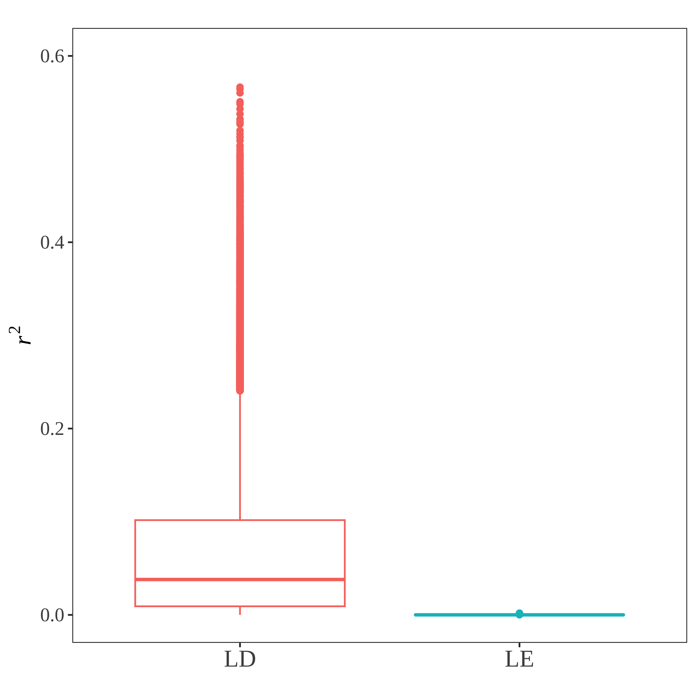{width=50%}

### Figure 5

```{r tmt_profile_points, eval=TRUE, echo=TRUE, warning=FALSE, message=FALSE, results='hide'}
library(ggplot2)       # for generating plots
library(plyr)          # for highlighting categories
library(latex2exp)     # for plot text latex
library(cowplot)       # for merging plots
library(gridExtra)     # for griding plots
library(grid)          # for griding plots
library(showtext)      # for changing fonts
myFont1 = 'serif'
# snp breaks ###################################################################
snp_chr <- RcppCNPy::npyLoad('./data/linkage/admixed_americans_n5000_ld_medium/snp_chr.npy','integer')
chr_cen <- c(snp_chr[1]/2)
for(i in c(2:22)){
  chr_cen <- c(chr_cen, sum(snp_chr[1:(i-1)])+snp_chr[i]/2 )
}
chr_cen[21] <- chr_cen[21]+100
chr_cen[22] <- chr_cen[22]+600
# TMT profile ##################################################################
# seed: 1
load('./data/linkage/admixed_americans_n5000_ld_medium/hsqr5/tmt_profile.RData')
m_snp <- nrow(dptmt)
# last layer for causal loci
dptmt$dtmtc <- dptmt$dtmt
dptmt$dtmtc_nld <- dptmt$dtmt_nld
dptmt$pvaluec <- dptmt$pvalue
dptmt$pvaluec_nld <- dptmt$pvalue_nld
dptmt[setdiff(1:m_snp, c_loci),]$dtmtc <- NaN
dptmt[setdiff(1:m_snp, c_loci),]$dtmtc_nld <- NaN
dptmt[setdiff(1:m_snp, c_loci),]$pvaluec <- NaN
dptmt[setdiff(1:m_snp, c_loci),]$pvaluec_nld <- NaN
dptmt[c_loci,]$dtmt <- NaN
dptmt[c_loci,]$dtmt_nld <- NaN
dptmt[c_loci,]$pvalue <- NaN
dptmt[c_loci,]$pvalue_nld <- NaN
# odd or even chromosome
dptmt$isodd_chr <- ifelse( dptmt$id_chr%%2==1, 1, 0)
dptmt$isodd_chr <- factor(dptmt$isodd_chr, levels=c(1,0))
################################################################################
dptmt$id_snp <- c(1:nrow(dptmt))
dptmt$snp <- 'Non-causal'
dptmt[c_loci,]$snp <- 'Causal'
dptmt$snp <- factor(dptmt$snp, levels=c('Causal','Non-causal'))
g_tmt_ld <- ggplot(dptmt, aes(x=id_snp)) +
  geom_hline(yintercept=true_ace, linetype="dashed", color = "red", size=0.15) +
  geom_point(aes(y=dtmt, color=isodd_chr), size=0.5, alpha=0.6) +
  geom_point(aes(y=dtmtc),color="orangered2", size=1.2, alpha=0.6) +
  geom_hline(yintercept=0, linetype="dashed", color = "black", size=0.15) +
  ggtitle(TeX('')) +
  scale_x_continuous(label=c(1:22), breaks=chr_cen) +
  xlab(TeX('Chromosome')) +
  ylab(TeX('\\textit{d}$_{TMT}$')) +
  ylim(-0.3,0.54) +
  theme_bw() +
  theme(aspect.ratio=1/3,
        panel.grid.major = element_blank(),
        panel.grid.minor = element_blank(),
        text = element_text(family=myFont1),
        axis.text.x = element_text(size=10, angle = 90, vjust = 0.5, hjust=1),
        axis.ticks.x = element_blank(),
        axis.title.x = element_blank(),
        axis.title.y = element_text(size=20),
        axis.text.y = element_text(size=12),
        legend.position = 'none',
        legend.title = element_blank()) +
  #theme(plot.margin = unit(c(0,0,-2,0.5), "cm")) + # t r b l
  scale_fill_manual(values=c("#0072B2","#56B4E9")) +
  scale_color_manual(values=c("#0072B2","#56B4E9"))

g_tmt_nld <- ggplot(dptmt, aes(x=id_snp, label=id_chr)) +
  geom_hline(yintercept=true_ace, linetype="dashed", color = "red", size=0.15) +
  geom_point(aes(y=dtmt_nld, color=isodd_chr), size=0.5, alpha=0.6) +
  geom_point(aes(y=dtmtc_nld),color="orangered2", size=1.2, alpha=0.6) +
  geom_hline(yintercept=0, linetype="dashed", color = "black", size=0.15) +
  ggtitle(TeX('')) +
  scale_x_continuous(label=c(1:22), breaks=chr_cen) +
  xlab(TeX('Chromosome')) +
  ylab(TeX('\\textit{d}$_{TMT}$')) +
  ylim(-0.3,0.54) +
  theme_bw() +
  theme(aspect.ratio=1/3,
        panel.grid.major = element_blank(),
        panel.grid.minor = element_blank(),
        text = element_text(family=myFont1),
        axis.text.x = element_text(size=10, angle = 90, vjust = 0.5, hjust=1),
        axis.ticks.x = element_blank(),
        axis.title.x = element_blank(),
        axis.title.y = element_text(size=20),
        axis.text.y = element_text(size=12),
        legend.position = 'none',
        legend.title = element_blank()) +
  #theme(plot.margin = unit(c(0,0,-2,0.5), "cm")) + # t r b l
  scale_fill_manual(values=c("#0072B2","#56B4E9")) +
  scale_color_manual(values=c("#0072B2","#56B4E9"))

# negative log10(p) ############################################################
g_nlogp_ld <- ggplot(dptmt, aes(x=id_snp, label=id_chr)) +
  # geom_point(aes(y=-log10(pvalue), color=snp, fill=snp, shape=snp), size=1.8) +
  geom_point(aes(y=-log10(pvalue), color=isodd_chr), alpha=0.6, size=0.5) +
  geom_point(aes(y=-log10(pvaluec)),color="orangered2",size=1.2, alpha=0.6) +
  # geom_hline(yintercept=0, linetype="dashed", color = "black", size=0.15) +
  geom_hline(yintercept=-log10(5e-8), linetype="dashed", color = "gray36", size=0.2) +
  ggtitle(TeX('')) +
  scale_x_continuous(label=c(1:22), breaks=chr_cen) +
  xlab(TeX('Chromosome')) +
  ylab(TeX('$-\\log_{10}$(\\textit{p})')) +
  ylim(0,40) +
  theme_bw() +
  theme(aspect.ratio=1/3,
        panel.grid.major = element_blank(),
        panel.grid.minor = element_blank(),
        text = element_text(family=myFont1),
        axis.text.x = element_text(size=10, angle = 90, vjust = 0.5, hjust=1),
        axis.ticks.x = element_blank(),
        axis.title.x = element_text(size=20),
        axis.title.y = element_text(size=20),
        axis.text.y = element_text(size=12),
        legend.position = 'none',
        legend.title = element_blank()) +
  #theme(plot.margin = unit(c(-2,0,0,0.5), "cm")) + # t r b l
  scale_fill_manual(values=c("#0072B2","#56B4E9")) +
  scale_color_manual(values=c("#0072B2","#56B4E9"))

g_nlogp_nld <- ggplot(dptmt, aes(x=id_snp, label=id_chr)) +
  #geom_point(aes(y=-log10(pvalue), color=snp, shape=snp), size=1.8) +
  geom_point(aes(y=-log10(pvalue_nld), color=isodd_chr), size=0.5, alpha=0.6) +
  geom_point(aes(y=-log10(pvaluec_nld)),color="orangered2", size=1.2, alpha=0.6) +
  # geom_hline(yintercept=0, linetype="dashed", color = "black", size=0.15) +
  geom_hline(yintercept=-log10(5e-8), linetype="dashed", color = "gray36", size=0.2) +
  ggtitle(TeX('')) +
  scale_x_continuous(label=c(1:22), breaks=chr_cen) +
  xlab(TeX('Chromosome')) +
  ylab(TeX('$-\\log_{10}$(\\textit{p})')) +
  ylim(0,40) +
  theme_bw() +
  theme(aspect.ratio=1/3,
        panel.grid.major = element_blank(),
        panel.grid.minor = element_blank(),
        text = element_text(family=myFont1),
        axis.text.x = element_text(size=10, angle = 90, vjust = 0.5, hjust=1),
        axis.ticks.x = element_blank(),
        axis.title.x = element_text(size=20),
        axis.title.y = element_text(size=20),
        axis.text.y = element_text(size=12),
        legend.position = 'none',
        legend.title = element_blank()) +
  #theme(plot.margin = unit(c(-2,0,0,0.5), "cm")) + # t r b l
  scale_fill_manual(values=c("#0072B2","#56B4E9")) +
  scale_color_manual(values=c("#0072B2","#56B4E9"))

# legend panel #################################################################
get_legend <- function(p){
  tmp <- ggplot_gtable(ggplot_build(p))
  leg <- which(sapply(tmp$grobs, function(x) x$name) == "guide-box")
  legend <- tmp$grobs[[leg]]
  legend
}
dat_eg <- data.frame(id_snp=1:m_snp, pvalue=0.0001, snp='Causal')
g_null <- ggplot(dat_eg, aes(x=id_snp)) +
  geom_point(aes(y=-log10(pvalue), color=snp), alpha=0.6) +
  ggtitle(TeX('')) +
  theme_bw() +
  theme(aspect.ratio=1/3,
        panel.grid.major = element_blank(),
        panel.grid.minor = element_blank(),
        text = element_text(family=myFont1),
        axis.text.x = element_blank(), 
        axis.ticks.x = element_blank(),
        axis.title.x = element_text(size=20),
        axis.title.y = element_text(size=20),
        axis.text.y = element_text(size=14),
        legend.position = 'right',
        legend.text = element_text(color = "black", size = 18),
        legend.title = element_blank()) +
  scale_fill_manual(values=c("orangered2", "gray50","#E69F00","#009E73"),
                    labels=c('Causal')) +
  scale_color_manual(values=c("orangered2", "gray50", "#E69F00", "#009E73"),
                     labels=c('Causal'))

g_leg <- get_legend(g_null)

g_a <- plot_grid(g_tmt_ld, NULL, g_nlogp_ld,  ncol=1, align='hv', rel_heights=c(9,-3.5,9))
g_b <- plot_grid(g_tmt_nld, NULL, g_nlogp_nld, ncol=1, align='hv',rel_heights=c(9,-3.5,9))


showtext_auto()
png(file='./manuscript/figures/figure5.png', units='in', width=14, height=6, res=350)
theme_set(theme_cowplot(font_size=12, font_family = "serif"))
plot_grid(g_a, g_b, g_leg, rel_widths=c(6,6,1),
          labels=c('A','B'), label_y=0.95, ncol=3, label_size=22, align='hv')
dev.off()

showtext_auto(FALSE)
```


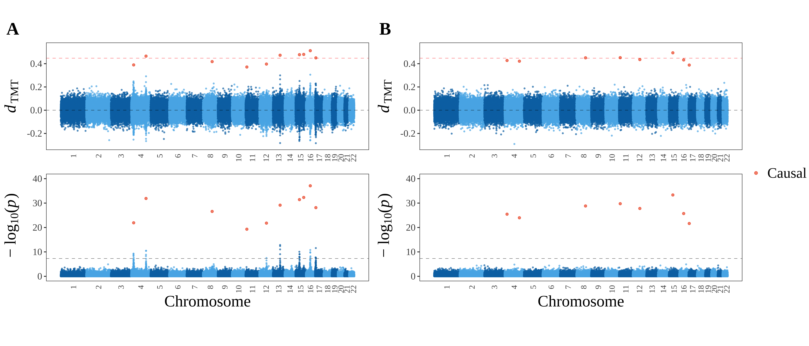


## TDT profile

```{r tdt_profile_trait, eval=FALSE, warning=FALSE, message=FALSE, echo=TRUE}
# local packages ###############################################################
in_path_package = "../R/geneticTMT"
in_path_utility = "../R/utilities"
sapply(list.files(pattern="[.]R$", path=in_path_package, full.names=TRUE), source)
sapply(list.files(pattern="[.]R$", path=in_path_utility, full.names=TRUE), source)
# msprime output ###############################################################
load('./data/linkage/admixed_americans_n5000_ld_medium/trio_geno.RData')
load('./data/linkage/admixed_americans_n5000_ld_medium/trio_geno_gza_nld.RData')
snp_chr <- RcppCNPy::npyLoad('./data/linkage/admixed_americans_n5000_ld_medium/snp_chr.npy','integer')
snpid_chr <- rep(c(1:22), snp_chr)
n_ind <- ncol(G)
m_snp <- nrow(G)
iota <- 100
sigma_e_2 <- 1
# allele frequencies close to a half
p_af <- rowMeans(G)/2
snp_cand <- which(p_af > 0.45 & p_af < 0.55)
# assign snp types ##############################################################
for(s in c(1:10)){
  print(paste0('running round ',s))
  set.seed(s)
  # 10 direct causal loci
  c_loci <- sort(sample(snp_cand,10))
  # simulate trait ################################################################
  # heritability
  h_sqr <- 0.5
  # genetic and non-genetic effect size
  sigma_a_2 <- sigma_e_2 * h_sqr / (1-h_sqr)
  true_ace <- bi <- sqrt( sigma_a_2/var(colSums(G[c_loci,])) )
  # individual noise
  theta_j <- rnorm(n_ind, mean=0, sd=sqrt(sigma_e_2))
  # child trait 
  y_h1 <- iota + bi * colSums(G[c_loci,]) + theta_j
  y_h0 <- iota + bi * colSums(G_nld[c_loci,]) + theta_j
  y_h1_binary <- ifelse(y_h1>median(y_h1), 1, 0)
  y_h0_binary <- ifelse(y_h0>median(y_h0), 1, 0)
  # tmt statistic ################################################################
  tdt_loop <- function(i){
    # ld genome 
    trio_geno <- matrix(c(Zm[i,], Zp[i,], G[i,]),
                        nrow=3, ncol=n_ind, byrow=TRUE)
    dtdt <- calc_dtdt(y_h1_binary, trio_geno)
    ptdt <- tdtest(y_h1_binary, trio_geno)$p
    ptmt <- tmtest(y_h1_binary, trio_geno, test='TMT')
    # nld genome 
    trio_geno_nld <- matrix(c(Zm_nld[i,], Zp_nld[i,], G_nld[i,]),
                            nrow=3, ncol=n_ind, byrow=TRUE)
    dtdt_nld <- calc_dtdt(y_h0_binary, trio_geno_nld)
    ptdt_nld <- tdtest(y_h0_binary, trio_geno_nld)$p
    ptmt_nld <- tmtest(y_h0_binary, trio_geno_nld, test='TMT')
    return(c(dtdt, ptdt, ptmt, dtdt_nld, ptdt_nld, ptmt_nld))
  }
  dptdt <- parallel::mclapply(c(1:m_snp), tdt_loop, mc.cores=18)
  dptdt <- data.frame(matrix(unlist(dptdt), byrow=TRUE, ncol=6))
  colnames(dptdt) <- c('dtdt','ptdt','ptmt','dtdt_nld','ptdt_nld','ptmt_nld')
  dptdt$id_chr <- snpid_chr
  save(dptdt, true_ace, c_loci,
       file=paste0('./data/linkage/admixed_americans_n5000_ld_medium/hsqr5/tdt_profile_seed',s,'.RData'))
}
```


```{r tdt_profile_points, eval=TRUE, echo=TRUE, warning=FALSE, message=FALSE, results='hide'}
library(ggplot2)       # for generating plots
library(plyr)          # for highlighting categories
library(latex2exp)     # for plot text latex
library(cowplot)       # for merging plots
library(gridExtra)     # for griding plots
library(grid)          # for griding plots
library(showtext)      # for changing fonts
myFont1 = 'serif'
# snp breaks ###################################################################
snp_chr <- RcppCNPy::npyLoad('./data/linkage/admixed_americans_n5000_ld_medium/snp_chr.npy','integer')
chr_cen <- c(snp_chr[1]/2)
for(i in c(2:22)){
  chr_cen <- c(chr_cen, sum(snp_chr[1:(i-1)])+snp_chr[i]/2 )
}
chr_cen[21] <- chr_cen[21]+100
chr_cen[22] <- chr_cen[22]+600
# TDT profile ##################################################################
# seed: 6
load('./data/linkage/admixed_americans_n5000_ld_medium/hsqr5/tdt_profile.RData')
m_snp <- nrow(dptdt)
# last layer for causal loci
dptdt$dtdtc <- dptdt$dtdt
dptdt$dtdtc_nld <- dptdt$dtdt_nld
dptdt$ptdtc <- dptdt$ptdt
dptdt$ptdtc_nld <- dptdt$ptdt_nld
dptdt$ptmtc <- dptdt$ptmt
dptdt$ptmtc_nld <- dptdt$ptmt_nld
dptdt[setdiff(1:m_snp, c_loci),]$dtdtc <- NaN
dptdt[setdiff(1:m_snp, c_loci),]$dtdtc_nld <- NaN
dptdt[setdiff(1:m_snp, c_loci),]$ptdtc <- NaN
dptdt[setdiff(1:m_snp, c_loci),]$ptdtc_nld <- NaN
dptdt[setdiff(1:m_snp, c_loci),]$ptmtc <- NaN
dptdt[setdiff(1:m_snp, c_loci),]$ptmtc_nld <- NaN
dptdt[c_loci,]$dtdt <- NaN
dptdt[c_loci,]$dtdt_nld <- NaN
dptdt[c_loci,]$ptdt <- NaN
dptdt[c_loci,]$ptdt_nld <- NaN
dptdt[c_loci,]$ptmt <- NaN
dptdt[c_loci,]$ptmt_nld <- NaN
# odd or even chromosome
dptdt$isodd_chr <- ifelse( dptdt$id_chr%%2==1, 1, 0)
dptdt$isodd_chr <- factor(dptdt$isodd_chr, levels=c(1,0))
################################################################################
dptdt$id_snp <- c(1:nrow(dptdt))
dptdt$snp <- 'Non-causal'
dptdt[c_loci,]$snp <- 'Causal'
dptdt$snp <- factor(dptdt$snp, levels=c('Causal','Non-causal'))
g_tdt_ld <- ggplot(dptdt, aes(x=id_snp)) +
  geom_hline(yintercept=true_ace, linetype="dashed", color = "red", size=0.15) +
  geom_point(aes(y=dtdt, color=isodd_chr), size=0.5, alpha=0.6) +
  geom_point(aes(y=dtdtc),color="orangered2", size=1.2, alpha=0.6) +
  geom_hline(yintercept=0, linetype="dashed", color = "black", size=0.15) +
  ggtitle(TeX('')) +
  scale_x_continuous(label=c(1:22), breaks=chr_cen) +
  xlab(TeX('Chromosome')) +
  ylab(TeX('\\textit{d}$_{TDT}$')) +
  ylim(-0.15,0.2) +
  theme_bw() +
  theme(aspect.ratio=1/3,
        panel.grid.major = element_blank(),
        panel.grid.minor = element_blank(),
        text = element_text(family=myFont1),
        axis.text.x = element_text(size=10, angle = 90, vjust = 0.5, hjust=1),
        axis.ticks.x = element_blank(),
        axis.title.x = element_blank(),
        axis.title.y = element_text(size=20),
        axis.text.y = element_text(size=12),
        legend.position = 'none',
        legend.title = element_blank()) +
  #theme(plot.margin = unit(c(0,0,-2,0.5), "cm")) + # t r b l
  scale_fill_manual(values=c("#0072B2","#56B4E9")) +
  scale_color_manual(values=c("#0072B2","#56B4E9"))

g_tdt_nld <- ggplot(dptdt, aes(x=id_snp, label=id_chr)) +
  geom_hline(yintercept=true_ace, linetype="dashed", color = "red", size=0.15) +
  geom_point(aes(y=dtdt_nld, color=isodd_chr), size=0.5, alpha=0.6) +
  geom_point(aes(y=dtdtc_nld),color="orangered2", size=1.2, alpha=0.6) +
  geom_hline(yintercept=0, linetype="dashed", color = "black", size=0.15) +
  ggtitle(TeX('')) +
  scale_x_continuous(label=c(1:22), breaks=chr_cen) +
  xlab(TeX('Chromosome')) +
  ylab(TeX('\\textit{d}$_{TDT}$')) +
  ylim(-0.15,0.2) +
  theme_bw() +
  theme(aspect.ratio=1/3,
        panel.grid.major = element_blank(),
        panel.grid.minor = element_blank(),
        text = element_text(family=myFont1),
        axis.text.x = element_text(size=10, angle = 90, vjust = 0.5, hjust=1),
        axis.ticks.x = element_blank(),
        axis.title.x = element_blank(),
        axis.title.y = element_text(size=20),
        axis.text.y = element_text(size=12),
        legend.position = 'none',
        legend.title = element_blank()) +
  #theme(plot.margin = unit(c(0,0,-2,0.5), "cm")) + # t r b l
  scale_fill_manual(values=c("#0072B2","#56B4E9")) +
  scale_color_manual(values=c("#0072B2","#56B4E9"))

# negative log10(p) ############################################################
g_nlogp_ld <- ggplot(dptdt, aes(x=id_snp, label=id_chr)) +
  # geom_point(aes(y=-log10(pvalue), color=snp, fill=snp, shape=snp), size=1.8) +
  geom_point(aes(y=-log10(ptdt), color=isodd_chr), alpha=0.6, size=0.5) +
  geom_point(aes(y=-log10(ptdtc)),color="orangered2",size=1.2, alpha=0.6) +
  # geom_hline(yintercept=0, linetype="dashed", color = "black", size=0.15) +
  geom_hline(yintercept=-log10(5e-8), linetype="dashed", color = "gray36", size=0.2) +
  ggtitle(TeX('')) +
  scale_x_continuous(label=c(1:22), breaks=chr_cen) +
  xlab(TeX('Chromosome')) +
  ylab(TeX('$-\\log_{10}$(\\textit{p})')) +
  ylim(0,16) +
  theme_bw() +
  theme(aspect.ratio=1/3,
        panel.grid.major = element_blank(),
        panel.grid.minor = element_blank(),
        text = element_text(family=myFont1),
        axis.text.x = element_text(size=10, angle = 90, vjust = 0.5, hjust=1),
        axis.ticks.x = element_blank(),
        axis.title.x = element_text(size=20),
        axis.title.y = element_text(size=20),
        axis.text.y = element_text(size=12),
        legend.position = 'none',
        legend.title = element_blank()) +
  #theme(plot.margin = unit(c(-2,0,0,0.5), "cm")) + # t r b l
  scale_fill_manual(values=c("#0072B2","#56B4E9")) +
  scale_color_manual(values=c("#0072B2","#56B4E9"))

g_nlogp_nld <- ggplot(dptdt, aes(x=id_snp, label=id_chr)) +
  #geom_point(aes(y=-log10(pvalue), color=snp, shape=snp), size=1.8) +
  geom_point(aes(y=-log10(ptdt_nld), color=isodd_chr), size=0.5, alpha=0.6) +
  geom_point(aes(y=-log10(ptdtc_nld)),color="orangered2", size=1.2, alpha=0.6) +
  # geom_hline(yintercept=0, linetype="dashed", color = "black", size=0.15) +
  geom_hline(yintercept=-log10(5e-8), linetype="dashed", color = "gray36", size=0.2) +
  ggtitle(TeX('')) +
  scale_x_continuous(label=c(1:22), breaks=chr_cen) +
  xlab(TeX('Chromosome')) +
  ylab(TeX('$-\\log_{10}$(\\textit{p})')) +
  ylim(0,16) +
  theme_bw() +
  theme(aspect.ratio=1/3,
        panel.grid.major = element_blank(),
        panel.grid.minor = element_blank(),
        text = element_text(family=myFont1),
        axis.text.x = element_text(size=10, angle = 90, vjust = 0.5, hjust=1),
        axis.ticks.x = element_blank(),
        axis.title.x = element_text(size=20),
        axis.title.y = element_text(size=20),
        axis.text.y = element_text(size=12),
        legend.position = 'none',
        legend.title = element_blank()) +
  #theme(plot.margin = unit(c(-2,0,0,0.5), "cm")) + # t r b l
  scale_fill_manual(values=c("#0072B2","#56B4E9")) +
  scale_color_manual(values=c("#0072B2","#56B4E9"))

# negative log10(p) via TMT ####################################################
g_nlogptmt_ld <- ggplot(dptdt, aes(x=id_snp, label=id_chr)) +
  # geom_point(aes(y=-log10(pvalue), color=snp, fill=snp, shape=snp), size=1.8) +
  geom_point(aes(y=-log10(ptmt), color=isodd_chr), alpha=0.6, size=0.5) +
  geom_point(aes(y=-log10(ptmtc)),color="orangered2",size=1.2, alpha=0.6) +
  # geom_hline(yintercept=0, linetype="dashed", color = "black", size=0.15) +
  geom_hline(yintercept=-log10(5e-8), linetype="dashed", color = "#009E73", size=0.2) +
  ggtitle(TeX('')) +
  scale_x_continuous(label=c(1:22), breaks=chr_cen) +
  xlab(TeX('Chromosome')) +
  ylab(TeX('$-\\log_{10}$(\\textit{p})')) +
  ylim(0,20) +
  theme_bw() +
  theme(aspect.ratio=1/3,
        panel.grid.major = element_blank(),
        panel.grid.minor = element_blank(),
        text = element_text(family=myFont1),
        axis.text.x = element_text(size=10, angle = 90, vjust = 0.5, hjust=1),
        axis.ticks.x = element_blank(),
        axis.title.x = element_text(size=20),
        axis.title.y = element_text(size=20),
        axis.text.y = element_text(size=12),
        legend.position = 'none',
        legend.title = element_blank()) +
  #theme(plot.margin = unit(c(-2,0,0,0.5), "cm")) + # t r b l
  scale_fill_manual(values=c("#0072B2","#56B4E9")) +
  scale_color_manual(values=c("#0072B2","#56B4E9"))

g_nlogptmt_nld <- ggplot(dptdt, aes(x=id_snp, label=id_chr)) +
  #geom_point(aes(y=-log10(pvalue), color=snp, shape=snp), size=1.8) +
  geom_point(aes(y=-log10(ptmt_nld), color=isodd_chr), size=0.5, alpha=0.6) +
  geom_point(aes(y=-log10(ptmtc_nld)),color="orangered2", size=1.2, alpha=0.6) +
  # geom_hline(yintercept=0, linetype="dashed", color = "black", size=0.15) +
  geom_hline(yintercept=-log10(5e-8), linetype="dashed", color = "#009E73", size=0.2) +
  ggtitle(TeX('')) +
  scale_x_continuous(label=c(1:22), breaks=chr_cen) +
  xlab(TeX('Chromosome')) +
  ylab(TeX('$-\\log_{10}$(\\textit{p})')) +
  ylim(0,20) +
  theme_bw() +
  theme(aspect.ratio=1/3,
        panel.grid.major = element_blank(),
        panel.grid.minor = element_blank(),
        text = element_text(family=myFont1),
        axis.text.x = element_text(size=10, angle = 90, vjust = 0.5, hjust=1),
        axis.ticks.x = element_blank(),
        axis.title.x = element_text(size=20),
        axis.title.y = element_text(size=20),
        axis.text.y = element_text(size=12),
        legend.position = 'none',
        legend.title = element_blank()) +
  #theme(plot.margin = unit(c(-2,0,0,0.5), "cm")) + # t r b l
  scale_fill_manual(values=c("#0072B2","#56B4E9")) +
  scale_color_manual(values=c("#0072B2","#56B4E9"))

# legend panel #################################################################
get_legend <- function(p){
  tmp <- ggplot_gtable(ggplot_build(p))
  leg <- which(sapply(tmp$grobs, function(x) x$name) == "guide-box")
  legend <- tmp$grobs[[leg]]
  legend
}
dat_eg <- data.frame(id_snp=1:m_snp, pvalue=0.0001, snp='Causal')
g_null <- ggplot(dat_eg, aes(x=id_snp)) +
  geom_point(aes(y=-log10(pvalue), color=snp), alpha=0.6) +
  ggtitle(TeX('')) +
  theme_bw() +
  theme(aspect.ratio=1/3,
        panel.grid.major = element_blank(),
        panel.grid.minor = element_blank(),
        text = element_text(family=myFont1),
        axis.text.x = element_blank(), 
        axis.ticks.x = element_blank(),
        axis.title.x = element_text(size=20),
        axis.title.y = element_text(size=20),
        axis.text.y = element_text(size=14),
        legend.position = 'right',
        legend.text = element_text(color = "black", size = 18),
        legend.title = element_blank()) +
  scale_fill_manual(values=c("orangered2", "gray50","#E69F00","#009E73"),
                    labels=c('Causal')) +
  scale_color_manual(values=c("orangered2", "gray50", "#E69F00", "#009E73"),
                     labels=c('Causal'))

g_leg <- get_legend(g_null)

g_a <- plot_grid(g_tdt_ld, NULL, g_nlogp_ld,  ncol=1, align='hv', rel_heights=c(9,-3.5,9))
g_b <- plot_grid(g_tdt_nld, NULL, g_nlogp_nld, ncol=1, align='hv',rel_heights=c(9,-3.5,9))


showtext_auto()
png(file='./manuscript/figures/figures7.png', units='in', width=14, height=6, res=350)
theme_set(theme_cowplot(font_size=12, font_family = "serif"))
plot_grid(g_a, g_b, g_leg, rel_widths=c(6,6,1),
          labels=c('A','B'), label_y=0.95, ncol=3, label_size=22, align='hv')
dev.off()

showtext_auto(FALSE)
```


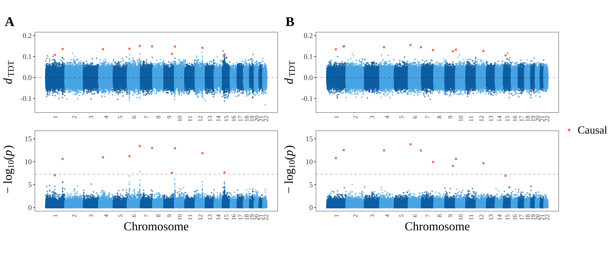


# 10 TMT and LMM

In the $j$th family, ($Z^m_{ij},Z^p_{ij}$) are parental genotypes at the $i$th locus and $G_{ij}$ the child's genotype at the $i$th locus. Let $\mathcal{C}$ be the set of causal loci. Let $\mathcal{K}$ be the loci set of non-causal SNPs that are confounders. We model the child trait as 
$$Y_j = \iota + \sum_{i\in \mathcal{C}}b G_{ij}+\sum_{i\in\mathcal{K}}v (Z^m_{ij}+Z^p_{ij})+\epsilon_j,\,\,\,\epsilon_j \sim \mathcal{N}(0,\sigma^2_e),$$
where $\iota=100$ and $\sigma^2_e=1$. We select $\beta$ and $w$ such that $$\mathbb{V}\left(\sum_{i\in \mathcal{C}}b G_{ij}\right):\mathbb{V}\left(\sum_{i\in \mathcal{K}}v(Z^m_{ij}+Z^p_{ij})\right):\sigma^2_e=3:3:4.$$


## False positives {.tabset .tabset-fade .tabset-pills}

### $F_{ST}=0$ 

```{r tmt_lmm_fst0, eval=FALSE, echo=TRUE, message=FALSE, warning=FALSE}
# load packages ################################################################
in_path_package = "../R/geneticTMT"
in_path_utility = "../R/utilities"
sapply(list.files(pattern="[.]R$", path=in_path_package, full.names=TRUE), source)
sapply(list.files(pattern="[.]R$", path=in_path_utility, full.names=TRUE), source)
# main #########################################################################
n_ind <- n_fam <- 5000
m_snp <- 100000
n_fst <- 0

iota <- 100

sigma_e_2 <- 1

set.seed(12)
# parental genotypes ###########################################################
# allele frequency
pi <- runif(m_snp, min=0.05, max=0.95)
# parental genotypes
geno_j_hwe <- function(j){return(stats::rbinom(m_snp, 2, pi))}
Zm <- lapply(1:n_ind, geno_j_hwe)
Zp <- lapply(1:n_ind, geno_j_hwe)
# tidy as genotype matrices
Zm <- matrix(unlist(Zm), ncol=n_ind, byrow=FALSE)
Zp <- matrix(unlist(Zp), ncol=n_ind, byrow=FALSE)
# child genotypes ##############################################################
# maternal allele
Am <- sim_allele(Zm)
# paternal allele
Ap <- sim_allele(Zp)
# child genotypes
G <- Am + Ap
# export child geno as plink format
individual <- paste0("id", 1:ncol(G))
bim <- genio::make_bim(n=m_snp)
fam <- genio::make_fam(n=n_ind)
fam$fam <- 0
fam$id <- individual
colnames(G) <- individual
rownames(G) <- c(1:m_snp)
# child kinship ################################################################
# kin_c <- diag(0.5, nrow=n_fam, ncol=n_fam)
kin_c <- popkin::popkin(G)
rownames(kin_c) <- colnames(kin_c) <- individual
# different K ##################################################################
for(k_snp in c(10,50,100,200)){
  # intermediate data
  c_snp <- k_snp
  path_out <- paste0('./data/tmt_lmm_slr/FST',n_fst,'/n',n_ind,'_m100000_csnp',c_snp,'_ksnp',k_snp)
  genio::write_bim(paste0(path_out,'/geno_c'), bim)
  genio::write_fam(paste0(path_out,'/geno_c'), fam)
  genio::write_bed(paste0(path_out,'/geno_c'), G)
  write.table(kin_c, file=paste0(path_out,'/kin_c.txt'), sep='\t',row.names=FALSE, col.names=FALSE)
  # snp types ####################################################################
  # select k null
  k_loci <- which( pi>0.49 & pi<0.51)
  k_loci <- sample(k_loci, size=k_snp)
  # select c causal loci
  c_loci <- sample(setdiff(c(1:m_snp), k_loci), size=c_snp)
  # all null loci
  nc_loci <- setdiff(c(1:m_snp), c_loci)
  # save snp types for lmm later
  print(paste0('Writing: ', path_out, '/snp_types.RData'))
  save(c_loci, k_loci, nc_loci, file=paste0(path_out, '/snp_types.RData'))
  # child trait ##################################################################
  # genetic and non-genetic effect size
  sigma_a_2 <- sigma_b_2 <- sigma_e_2 / 0.4 * 0.3
  bi <- sqrt( sigma_a_2/var(colSums(G[c_loci,])) )
  wi <- sqrt( sigma_b_2/var(colSums(Zm[k_loci,] + Zp[k_loci,])) )
  # individual noise
  theta_j <- rnorm(n_ind, mean=0, sd=sqrt(sigma_e_2))
  # gamma as function of parental genotypes and noise
  gamma_j <- wi * (colSums(Zm[k_loci,])+colSums(Zp[k_loci,])) + theta_j
  # child trait 
  y_h1 <- iota + bi * colSums(G[c_loci,]) + gamma_j
  # intermediate file for lmm via gcta 
  y_out <- data.frame(fid=rep(0, n_fam), iid=paste0('id',1:n_fam), trait=y_h1)
  file_out <- paste0(path_out, '/y.pheno')
  print(paste0('Writing: ', path_out, '/y.pheno'))
  write.table(y_out, file=file_out, sep='\t', row.names=FALSE, col.names=FALSE, quote=FALSE)
  # tmt and slr ##################################################################
  tmt_loop <- function(i){
    trio_geno_i <- matrix(c(Zm[i,], Zp[i,], G[i,]), nrow=3, ncol=n_ind, byrow=TRUE)
    p_tmt <- tmtest(y_h1, trio_geno_i, test='TMT')
    return(p_tmt)
    }
  slr_loop <- function(i){
    if(sd(G[i,])==0){p_slr <- NaN} else {
      df_lm <- data.frame(x = G[i,], y = y_h1)
      p_slr <- summary(lm(y ~ x + 1, data = df_lm))$coefficients[2, 4]
    }
  return(p_slr)
  }
  p_tmt <- parallel::mclapply(c(1:m_snp), tmt_loop, mc.cores=18)
  p_slr <- parallel::mclapply(c(1:m_snp), slr_loop, mc.cores=18)
  p_tmt <- unlist(p_tmt)
  p_slr <- unlist(p_slr)
  print(paste0('Writing: ', path_out, '/p_tmt_slr.RData'))
  save(p_tmt, p_slr, file=paste0(path_out, '/p_tmt_slr.RData'))
}

```

```{bash gcta_lmm_fst0, eval=FALSE, echo=TRUE, message=FALSE, warning=FALSE}
# in terminal change path to the intermediate data
cd /Users/yushitang/Desktop/causal-trio/work/tmt_lmm_slr/FST0/n5000_m100000_csnp1000_ksnp1000
# convert kinship to pre-gcta format, may take several minutes
python3 ~/Desktop/causal-trio/code/tmt_lmm_slr/code_gcta_tidy_kinship.py 5000 100000
# path to gcta software
in_gcta=~/Desktop/software/gcta-1.94.1-MacOS-x86_64 
# convert kinship to gcta format, may take several minutes
$in_gcta/gcta-1.94.1 --grm-gz ./kin_c --make-grm --out kin_c
# lmm and gwas for various levels of heritability, each line below make take hours depending on number of trios and snps
$in_gcta/gcta-1.94.1 --mlma --bfile geno_c --grm kin_c --pheno y.pheno --out hsq --thread-num 18
```

```{r pvalues_tmt_lmm_slr_fst0, eval=FALSE, echo=TRUE, message=FALSE, warning=FALSE}
# load packages ################################################################
in_path_utility = "../R/utilities"
sapply(list.files(pattern="[.]R$", path=in_path_utility, full.names=TRUE), source)
################################################################################
n_ind <- 5000
n_fst <- 20
# various k ####################################################################
for(k_snp in c(10,50,100,200)){
  c_snp <- k_snp
  path_in <- paste0('./data/tmt_lmm_slr/FST',n_fst,'/n',n_ind,'_m100000_csnp',c_snp,'_ksnp',k_snp)
  # p value distribution #########################################################
  # pvalues from lmm
  mlma_in <- paste0(path_in, '/hsq.mlma')
  dat <- read.table(mlma_in, header=TRUE)
  p_lmm <- dat$p
  # pvalues from tmt and slr
  pval_in <- paste0(path_in, '/p_tmt_slr.RData')
  load(pval_in)
  # snp types causal or not
  snpt_in <- paste0(path_in, '/snp_types.RData')
  load(snpt_in)
  # FPR and FNR ##################################################################
  ftpn_lmm <- data.frame()
  ftpn_slr <- data.frame()
  ftpn_tmt <- data.frame()
  # theoretical fpr
  alpha_list <- seq(0,1,0.01)
  for(alpha in alpha_list){
    # tidy slr results #########################################################
    fp_lmm <- length(which(p_lmm[nc_loci] < alpha))
    fn_lmm <- length(which(p_lmm[c_loci] >= alpha))
    tp_lmm <- length(which(p_lmm[c_loci] < alpha))
    tn_lmm <- length(which(p_lmm[nc_loci] >= alpha))
    fpr_lmm <- fp_lmm / (fp_lmm + tn_lmm)
    fnr_lmm <- fn_lmm / (fn_lmm + tp_lmm)
    tpr_lmm <- tp_lmm / (tp_lmm + fn_lmm)      
    ftpn_lmm <- rbind(ftpn_lmm, data.frame(fpr=fpr_lmm, tpr=tpr_lmm,
                                           fnr=fnr_lmm, alpha=alpha))
    # tidy slr results #########################################################
    fp_slr <- length(which(p_slr[nc_loci] < alpha))
    fn_slr <- length(which(p_slr[c_loci] >= alpha))
    tp_slr <- length(which(p_slr[c_loci] < alpha))
    tn_slr <- length(which(p_slr[nc_loci] >= alpha))
    fpr_slr <- fp_slr / (fp_slr + tn_slr)
    fnr_slr <- fn_slr / (fn_slr + tp_slr)
    tpr_slr <- tp_slr / (tp_slr + fn_slr)
    ftpn_slr <- rbind(ftpn_slr, data.frame(fpr=fpr_slr, tpr=tpr_slr,
                                           fnr=fnr_slr, alpha=alpha))
  # tidy tmt results #########################################################
  fp_tmt <- length(which(p_tmt[nc_loci] < alpha))
  fn_tmt <- length(which(p_tmt[c_loci] >= alpha))
  tp_tmt <- length(which(p_tmt[c_loci] < alpha))
  tn_tmt <- length(which(p_tmt[nc_loci] >= alpha))
  fpr_tmt <- fp_tmt / (fp_tmt + tn_tmt)
  fnr_tmt <- fn_tmt / (fn_tmt + tp_tmt)
  tpr_tmt <- tp_tmt / (tp_tmt + fn_tmt)
  ftpn_tmt <- rbind(ftpn_tmt, data.frame(fpr=fpr_tmt, tpr=tpr_tmt,
                                         fnr=fnr_tmt, alpha=alpha))
}
# area under the roc curve #####################################################
auroc_lmm <- calc_auroc_pvalues(p_tmt, c_loci)
auroc_slr <- calc_auroc_pvalues(p_slr, c_loci)
auroc_tmt <- calc_auroc_pvalues(p_tmt, c_loci)
# output restuls ###############################################################
save(p_tmt, p_slr, p_lmm, 
     ftpn_tmt, ftpn_slr, ftpn_lmm, 
     auroc_lmm, auroc_slr, auroc_tmt, 
     c_loci, k_loci, nc_loci, file=paste0(path_in, '/p_fpnr_auroc.RData'))
}
```

### $F_{ST}=0.01,0.05,0.2$ 

```{r tmt_lmm_fst1, eval=FALSE, echo=TRUE, message=FALSE, warning=FALSE}
# load packages ################################################################
in_path_package = "../R/geneticTMT"
in_path_utility = "../R/utilities"
sapply(list.files(pattern="[.]R$", path=in_path_package, full.names=TRUE), source)
sapply(list.files(pattern="[.]R$", path=in_path_utility, full.names=TRUE), source)
# main #########################################################################
n_ind <- n_fam <- 5000
m_snp <- 100000
n_fst <- 20

iota <- 100

sigma_e_2 <- 1

set.seed(12)
# parental genotypes ###########################################################
param_list <- sim_geno_param(m=m_snp, n=n_fam, k=4, Fst=n_fst/100)
# parental genotypes
Zm <- sim_geno(p_s=param_list$p_s, q=param_list$q)
Zp <- sim_geno(p_s=param_list$p_s, q=param_list$q)
# child genotypes ##############################################################
# maternal allele
Am <- sim_allele(Zm)
# paternal allele
Ap <- sim_allele(Zp)
# child genotypes
G <- Am + Ap
# allele frequency
pi <- rowMeans(G)/2
# export child geno as plink format
individual <- paste0("id", 1:ncol(G))
bim <- genio::make_bim(n=m_snp)
fam <- genio::make_fam(n=n_ind)
fam$fam <- 0
fam$id <- individual
colnames(G) <- individual
rownames(G) <- c(1:m_snp)
# child kinship ################################################################
# kin_c <- diag(0.5, nrow=n_fam, ncol=n_fam)
kin_c <- popkin::popkin(G)
rownames(kin_c) <- colnames(kin_c) <- individual
# various k ####################################################################
for(k_snp in c(10,50,100,200)){
  c_snp <- k_snp
  path_out <- paste0('./data/tmt_lmm_slr/FST',n_fst,'/n',n_ind,'_m100000_csnp',c_snp,'_ksnp',k_snp)
  # output intermediate data
  genio::write_bim(paste0(path_out,'/geno_c'), bim)
  genio::write_fam(paste0(path_out,'/geno_c'), fam)
  genio::write_bed(paste0(path_out,'/geno_c'), G)
  write.table(kin_c, file=paste0(path_out,'/kin_c.txt'), sep='\t',row.names=FALSE, col.names=FALSE)
  # snp types ####################################################################
  # select k null
  k_loci <- which( pi>0.49 & pi<0.51)
  k_loci <- sample(k_loci, size=k_snp)
  # select c causal loci
  c_loci <- sample(setdiff(c(1:m_snp), k_loci), size=c_snp)
  # all null loci
  nc_loci <- setdiff(c(1:m_snp), c_loci)
  # save snp types for lmm later
  print(paste0('Writing: ', path_out, '/snp_types.RData'))
  save(c_loci, k_loci, nc_loci, file=paste0(path_out, '/snp_types.RData'))
  # child trait ##################################################################
  # genetic and non-genetic effect size
  sigma_a_2 <- sigma_b_2 <- sigma_e_2 / 0.4 * 0.3
  bi <- sqrt( sigma_a_2/var(colSums(G[c_loci,])) )
  wi <- sqrt( sigma_b_2/var(colSums(Zm[k_loci,] + Zp[k_loci,])) )
  # individual noise
  theta_j <- rnorm(n_ind, mean=0, sd=sqrt(sigma_e_2))
  # gamma as function of parental genotypes and noise
  gamma_j <- wi * (colSums(Zm[k_loci,])+colSums(Zp[k_loci,])) + theta_j
  # child trait 
  y_h1 <- iota + bi * colSums(G[c_loci,]) + gamma_j
  # intermediate file for lmm via gcta 
  y_out <- data.frame(fid=rep(0, n_fam), iid=paste0('id',1:n_fam), trait=y_h1)
  file_out <- paste0(path_out, '/y.pheno')
  print(paste0('Writing: ', path_out, '/y.pheno'))
  write.table(y_out, file=file_out, sep='\t', row.names=FALSE, col.names=FALSE, quote=FALSE)
  # tmt and slr ##################################################################
  tmt_loop <- function(i){
    trio_geno_i <- matrix(c(Zm[i,], Zp[i,], G[i,]), nrow=3, ncol=n_ind, byrow=TRUE)
    p_tmt <- tmtest(y_h1, trio_geno_i, test='TMT')
    return(p_tmt)
  }
  slr_loop <- function(i){
    if(sd(G[i,])==0){p_slr <- NaN} else {
      df_lm <- data.frame(x = G[i,], y = y_h1)
      p_slr <- summary(lm(y ~ x + 1, data = df_lm))$coefficients[2, 4]
    }
    return(p_slr)
  }
  p_tmt <- parallel::mclapply(c(1:m_snp), tmt_loop, mc.cores=18)
  p_slr <- parallel::mclapply(c(1:m_snp), slr_loop, mc.cores=18)
  p_tmt <- unlist(p_tmt)
  p_slr <- unlist(p_slr)
  print(paste0('Writing: ', path_out, '/p_tmt_slr.RData'))
  save(p_tmt, p_slr, file=paste0(path_out, '/p_tmt_slr.RData'))
}
```

```{bash gcta_lmm_fst1, eval=FALSE, echo=TRUE, message=FALSE, warning=FALSE}
# in terminal change path to the intermediate data
cd /Users/yushitang/Desktop/causal-trio/work/tmt_lmm_slr/FST1/n5000_m100000_csnp1000_ksnp1000
# convert kinship to pre-gcta format, may take several minutes
python3 ~/Desktop/causal-trio/code/tmt_lmm_slr/code_gcta_tidy_kinship.py 5000 100000
# path to gcta software
in_gcta=~/Desktop/software/gcta-1.94.1-MacOS-x86_64 
# convert kinship to gcta format, may take several minutes
$in_gcta/gcta-1.94.1 --grm-gz ./kin_c --make-grm --out kin_c
# lmm and gwas for various levels of heritability, each line below make take hours depending on number of trios and snps
$in_gcta/gcta-1.94.1 --mlma --bfile geno_c --grm kin_c --pheno y.pheno --out hsq --thread-num 18
```

```{r pvalues_tmt_lmm_slr_fst1, eval=FALSE, echo=TRUE, message=FALSE, warning=FALSE}
# load packages ################################################################
in_path_utility = "../R/utilities"
sapply(list.files(pattern="[.]R$", path=in_path_utility, full.names=TRUE), source)
################################################################################
n_ind <- 5000
c_snp <- 1000
k_snp <- 1000
path_in <- paste0('./data/tmt_lmm_slr/FST1/n',n_ind,'_m100000_csnp',c_snp,'_ksnp',k_snp)
# p value distribution #########################################################
# pvalues from lmm
mlma_in <- paste0(path_in, '/hsq.mlma')
dat <- read.table(mlma_in, header=TRUE)
p_lmm <- dat$p
# pvalues from tmt and slr
pval_in <- paste0(path_in, '/p_tmt_slr.RData')
load(pval_in)
# snp types causal or not
snpt_in <- paste0(path_in, '/snp_types.RData')
load(snpt_in)
# FPR and FNR ##################################################################
ftpn_lmm <- data.frame()
ftpn_slr <- data.frame()
ftpn_tmt <- data.frame()
# theoretical fpr
alpha_list <- seq(0,1,0.01)
for(alpha in alpha_list){
  # tidy slr results #########################################################
  fp_lmm <- length(which(p_lmm[nc_loci] < alpha))
  fn_lmm <- length(which(p_lmm[c_loci] >= alpha))
  tp_lmm <- length(which(p_lmm[c_loci] < alpha))
  tn_lmm <- length(which(p_lmm[nc_loci] >= alpha))
  fpr_lmm <- fp_lmm / (fp_lmm + tn_lmm)
  fnr_lmm <- fn_lmm / (fn_lmm + tp_lmm)
  tpr_lmm <- tp_lmm / (tp_lmm + fn_lmm)      
  ftpn_lmm <- rbind(ftpn_lmm, data.frame(fpr=fpr_lmm, tpr=tpr_lmm,
                                         fnr=fnr_lmm, alpha=alpha))
  # tidy slr results #########################################################
  fp_slr <- length(which(p_slr[nc_loci] < alpha))
  fn_slr <- length(which(p_slr[c_loci] >= alpha))
  tp_slr <- length(which(p_slr[c_loci] < alpha))
  tn_slr <- length(which(p_slr[nc_loci] >= alpha))
  fpr_slr <- fp_slr / (fp_slr + tn_slr)
  fnr_slr <- fn_slr / (fn_slr + tp_slr)
  tpr_slr <- tp_slr / (tp_slr + fn_slr)
  ftpn_slr <- rbind(ftpn_slr, data.frame(fpr=fpr_slr, tpr=tpr_slr,
                                         fnr=fnr_slr, alpha=alpha))
  # tidy tmt results #########################################################
  fp_tmt <- length(which(p_tmt[nc_loci] < alpha))
  fn_tmt <- length(which(p_tmt[c_loci] >= alpha))
  tp_tmt <- length(which(p_tmt[c_loci] < alpha))
  tn_tmt <- length(which(p_tmt[nc_loci] >= alpha))
  fpr_tmt <- fp_tmt / (fp_tmt + tn_tmt)
  fnr_tmt <- fn_tmt / (fn_tmt + tp_tmt)
  tpr_tmt <- tp_tmt / (tp_tmt + fn_tmt)
  ftpn_tmt <- rbind(ftpn_tmt, data.frame(fpr=fpr_tmt, tpr=tpr_tmt,
                                         fnr=fnr_tmt, alpha=alpha))
}
# area under the roc curve #####################################################
auroc_lmm <- calc_auroc_pvalues(p_tmt, c_loci)
auroc_slr <- calc_auroc_pvalues(p_slr, c_loci)
auroc_tmt <- calc_auroc_pvalues(p_tmt, c_loci)
# output restuls ###############################################################
save(p_tmt, p_slr, p_lmm, 
     ftpn_tmt, ftpn_slr, ftpn_lmm, 
     auroc_lmm, auroc_slr, auroc_tmt, 
     c_loci, k_loci, nc_loci, file=paste0(path_in, '/p_fpnr_auroc.RData'))
```

## QQ plot

### Figure 6 {.tabset .tabset-fade .tabset-pills}

#### Confounders + random non-causal and non-confounder loci

```{r plot_tmt_lmm_slr_kc100_fig, eval=TRUE, echo=TRUE, message=FALSE, warning=FALSE}
# quantile quantile plot #######################################################
library(ggplot2)       # for generating plots
library(latex2exp)     # for plot text latex
library(showtext)      # for changing fonts
library(cowplot)       # for changing fonts
myFont1 <- 'serif'
n_ind <- 5000
################################################################################
# Figure A #####################################################################
# load data
dat_plt <- data.frame()
for(c_snp in c(100,50)){
  k_snp <- c_snp
  for(n_fst in c(1,5)){
    path_in <- paste0('./data/tmt_lmm_slr/FST',n_fst,'/n',n_ind,'_m100000_csnp',c_snp,'_ksnp',k_snp)
    load(paste0(path_in,'/p_fpnr_auroc.RData'))
    # comparing to negative log p with p from uniform between 0 and 1 ##############
    set.seed(12)
    snp_plot <- c(k_loci, sample(setdiff(nc_loci, k_loci), size=9*k_snp))
    p_uniform <- ppoints(length(snp_plot))
    nlogp_unifm <- -log10(p_uniform)
    nlogp_tmt_k <- -log10(p_tmt[snp_plot])
    nlogp_slr_k <- -log10(p_slr[snp_plot])
    nlogp_lmm_k <- -log10(p_lmm[snp_plot])
    qq_tmt <- as.data.frame(qqplot(x = nlogp_unifm, y = nlogp_tmt_k, plot.it=FALSE))
    qq_slr <- as.data.frame(qqplot(x = nlogp_unifm, y = nlogp_slr_k, plot.it=FALSE))
    qq_lmm <- as.data.frame(qqplot(x = nlogp_unifm, y = nlogp_lmm_k, plot.it=FALSE))
    qq_tmt$Method <- 'TMT'
    qq_slr$Method <- 'SLR'
    qq_lmm$Method <- 'LMM'
    qq_tmt$FST <- qq_slr$FST <- qq_lmm$FST <- n_fst/100
    qq_tmt$csnp <- qq_slr$csnp <- qq_lmm$csnp <- c_snp
    qq_tmt$ksnp <- qq_slr$ksnp <- qq_lmm$ksnp <- k_snp
    dat_tmp <- rbind(qq_tmt, qq_slr, qq_lmm)
    dat_plt <- rbind(dat_plt, dat_tmp)
  }
}
# plot #########################################################################
dat_plt$FST <-  factor(dat_plt$FST, levels=c(0.01,0.05))
dat_plt$csnp <- factor(dat_plt$csnp, levels=c(100,50))
dat_plt$ksnp <- factor(dat_plt$ksnp, levels=c(100,50))
dat_plt$Method <- factor(dat_plt$Method, levels=c('SLR', 'LMM', 'TMT'))
appender_fst <- function(string){TeX(paste0("\\textit{$F$}$_{ST}=$", string))} 
appender_c <- function(string){TeX(paste0("\\textit{$C$}$=$\\textit{$U$}$=$", string))} 

g_fst <- ggplot(dat_plt, aes(x= x, y = y, color=Method)) + 
  geom_point(alpha=0.6, size=1.2) + 
  geom_abline(intercept=0, slope=1, col='black', linetype='dashed', alpha=0.6) +
  xlab(TeX("Expected $-\\log_{10}$(\\textit{p})")) + 
  ylab(TeX("Non-causal Loci $-\\log_{10}$(\\textit{p})")) +
  theme_bw() +
  theme(aspect.ratio=1,
        panel.grid.major = element_blank(),
        panel.grid.minor = element_blank(),
        text = element_text(family=myFont1),
        axis.text.x = element_text(size=12),
        axis.text.y = element_text(size=12),
        axis.title.x = element_text(size=16),
        axis.title.y = element_text(size=16),
        plot.title = element_blank(),
        legend.position='right',
        legend.direction='vertical',
        legend.title = element_text(color = "black", size = 16),
        legend.key.size = unit(1.2, 'cm'),
        legend.key.height = unit(0.6, 'cm'),
        legend.key.width = unit(0.6, 'cm'),
        legend.text = element_text(color = "black", size = 14)) +
  facet_wrap(csnp ~ FST, scales='free', ncol=2,
             labeller=labeller(FST=as_labeller(appender_fst, default=label_parsed),
                               csnp=as_labeller(appender_c, default=label_parsed))) +
  theme(strip.text = element_text(size = 12, family=myFont1)) +
  scale_color_manual(values=c("#E69F00","gray36","firebrick","#0072B2","#56B4E9","#CC79A7","#009E73"),
                     labels=c('OLS','LMM','TMT')) +
  guides(color=guide_legend(title=TeX('Method')))

showtext_auto()
png(file='./manuscript/figures/figure6.png', units='in', width=10, height=9, res=350)
theme_set(theme_cowplot(font_size=12, font_family = "serif"))
g_fst
showtext_auto(FALSE)
```


```{r plot_tmt_lmm_slr_kc100_figa, eval=FALSE, echo=FALSE, message=FALSE, warning=FALSE}
# quantile quantile plot #######################################################
library(ggplot2)       # for generating plots
library(latex2exp)     # for plot text latex
library(showtext)      # for changing fonts
library(cowplot)       # for changing fonts
myFont1 <- 'serif'
n_ind <- 5000
################################################################################
# Figure A #####################################################################
# load data
dat_plt <- data.frame()
for(c_snp in c(200,100)){
  k_snp <- c_snp
  for(n_fst in c(0,1,5,20)){
    path_in <- paste0('./data/tmt_lmm_slr/FST',n_fst,'/n',n_ind,'_m100000_csnp',c_snp,'_ksnp',k_snp)
    load(paste0(path_in,'/p_fpnr_auroc.RData'))
    # comparing to negative log p with p from uniform between 0 and 1 ##############
    set.seed(12)
    snp_plot <- c(k_loci, sample(setdiff(nc_loci, k_loci), size=9*k_snp))
    p_uniform <- ppoints(length(snp_plot))
    nlogp_unifm <- -log10(p_uniform)
    nlogp_tmt_k <- -log10(p_tmt[snp_plot])
    nlogp_slr_k <- -log10(p_slr[snp_plot])
    nlogp_lmm_k <- -log10(p_lmm[snp_plot])
    qq_tmt <- as.data.frame(qqplot(x = nlogp_unifm, y = nlogp_tmt_k, plot.it=FALSE))
    qq_slr <- as.data.frame(qqplot(x = nlogp_unifm, y = nlogp_slr_k, plot.it=FALSE))
    qq_lmm <- as.data.frame(qqplot(x = nlogp_unifm, y = nlogp_lmm_k, plot.it=FALSE))
    qq_tmt$Method <- 'TMT'
    qq_slr$Method <- 'SLR'
    qq_lmm$Method <- 'LMM'
    qq_tmt$FST <- qq_slr$FST <- qq_lmm$FST <- n_fst/100
    qq_tmt$csnp <- qq_slr$csnp <- qq_lmm$csnp <- c_snp
    qq_tmt$ksnp <- qq_slr$ksnp <- qq_lmm$ksnp <- k_snp
    dat_tmp <- rbind(qq_tmt, qq_slr, qq_lmm)
    dat_plt <- rbind(dat_plt, dat_tmp)
  }
}
# plot #########################################################################
dat_plt$FST <-  factor(dat_plt$FST, levels=c(0,0.01,0.05,0.2))
dat_plt$csnp <- factor(dat_plt$csnp, levels=c(200,100))
dat_plt$ksnp <- factor(dat_plt$ksnp, levels=c(200,100))
dat_plt$Method <- factor(dat_plt$Method, levels=c('SLR', 'LMM', 'TMT'))
appender_fst <- function(string){TeX(paste0("\\textit{$F$}$_{ST}=$", string))} 
appender_c <- function(string){TeX(paste0("\\textit{$C$}$=$\\textit{$K$}$=$", string))} 

g_fst <- ggplot(dat_plt, aes(x= x, y = y, color=Method)) + 
  geom_point(alpha=0.6, size=1.2) + 
  geom_abline(intercept=0, slope=1, col='black', linetype='dashed', alpha=0.6) +
  xlab(TeX("Expected $-\\log_{10}$(\\textit{p})")) + 
  ylab(TeX("Non-causal Loci $-\\log_{10}$(\\textit{p})")) +
  theme_bw() +
  theme(aspect.ratio=1,
        panel.grid.major = element_blank(),
        panel.grid.minor = element_blank(),
        text = element_text(family=myFont1),
        axis.text.x = element_text(size=14),
        axis.text.y = element_text(size=14),
        axis.title.x = element_text(size=16),
        axis.title.y = element_text(size=16),
        plot.title = element_blank(),
        legend.position='right',
        legend.direction='vertical',
        legend.title = element_text(color = "black", size = 14),
        legend.key.size = unit(1.2, 'cm'),
        legend.key.height = unit(0.6, 'cm'),
        legend.key.width = unit(0.6, 'cm'),
        legend.text = element_text(color = "black", size = 14)) +
  facet_wrap(csnp ~ FST, scales='free', ncol=4,
             labeller=labeller(FST=as_labeller(appender_fst, default=label_parsed),
                               csnp=as_labeller(appender_c, default=label_parsed))) +
  theme(strip.text = element_text(size = 12, family=myFont1)) +
  scale_color_manual(values=c("#E69F00","gray36","firebrick","#0072B2","#56B4E9","#CC79A7","#009E73"),
                     labels=c('SLR','LMM','TMT')) +
  guides(color=guide_legend(title=TeX('Method')))

showtext_auto()
png(file='./manuscript/figures/figuress_a.png', units='in', width=9, height=5, res=360)
theme_set(theme_cowplot(font_size=12, font_family = "serif"))
g_fst
showtext_auto(FALSE)
```

```{r plot_tmt_lmm_slr_kc100_figb, eval=FALSE, echo=FALSE, message=FALSE, warning=FALSE}
# quantile quantile plot #######################################################
library(ggplot2)       # for generating plots
library(latex2exp)     # for plot text latex
library(showtext)      # for changing fonts
library(cowplot)       # for changing fonts
myFont1 <- 'serif'
n_ind <- 5000
################################################################################
# Figure B #####################################################################
# load data
dat_plt <- data.frame()
for(c_snp in c(50,10)){
  k_snp <- c_snp
  for(n_fst in c(0,1,5,20)){
    path_in <- paste0('./data/tmt_lmm_slr/FST',n_fst,'/n',n_ind,'_m100000_csnp',c_snp,'_ksnp',k_snp)
    load(paste0(path_in,'/p_fpnr_auroc.RData'))
    # comparing to negative log p with p from uniform between 0 and 1 ##############
    set.seed(12)
    snp_plot <- c(k_loci, sample(setdiff(nc_loci, k_loci), size=9*k_snp))
    p_uniform <- ppoints(length(snp_plot))
    nlogp_unifm <- -log10(p_uniform)
    nlogp_tmt_k <- -log10(p_tmt[snp_plot])
    nlogp_slr_k <- -log10(p_slr[snp_plot])
    nlogp_lmm_k <- -log10(p_lmm[snp_plot])
    qq_tmt <- as.data.frame(qqplot(x = nlogp_unifm, y = nlogp_tmt_k, plot.it=FALSE))
    qq_slr <- as.data.frame(qqplot(x = nlogp_unifm, y = nlogp_slr_k, plot.it=FALSE))
    qq_lmm <- as.data.frame(qqplot(x = nlogp_unifm, y = nlogp_lmm_k, plot.it=FALSE))
    qq_tmt$Method <- 'TMT'
    qq_slr$Method <- 'SLR'
    qq_lmm$Method <- 'LMM'
    qq_tmt$FST <- qq_slr$FST <- qq_lmm$FST <- n_fst/100
    qq_tmt$csnp <- qq_slr$csnp <- qq_lmm$csnp <- c_snp
    qq_tmt$ksnp <- qq_slr$ksnp <- qq_lmm$ksnp <- k_snp
    dat_tmp <- rbind(qq_tmt, qq_slr, qq_lmm)
    dat_plt <- rbind(dat_plt, dat_tmp)
  }
}
# plot #########################################################################
dat_plt$FST <-  factor(dat_plt$FST, levels=c(0,0.01,0.05,0.2))
dat_plt$csnp <- factor(dat_plt$csnp, levels=c(50,10))
dat_plt$ksnp <- factor(dat_plt$ksnp, levels=c(50,10))
dat_plt$Method <- factor(dat_plt$Method, levels=c('SLR', 'LMM', 'TMT'))
appender_fst <- function(string){TeX(paste0("\\textit{$F$}$_{ST}=$", string))} 
appender_c <- function(string){TeX(paste0("\\textit{$C$}$=$\\textit{$K$}$=$", string))} 

g_fst <- ggplot(dat_plt, aes(x= x, y = y, color=Method)) + 
  geom_point(alpha=0.6, size=1.2) + 
  geom_abline(intercept=0, slope=1, col='black', linetype='dashed', alpha=0.6) +
  xlab(TeX("Expected $-\\log_{10}$(\\textit{p})")) + 
  ylab(TeX("Non-causal Loci $-\\log_{10}$(\\textit{p})")) +
  theme_bw() +
  theme(aspect.ratio=1,
        panel.grid.major = element_blank(),
        panel.grid.minor = element_blank(),
        text = element_text(family=myFont1),
        axis.text.x = element_text(size=14),
        axis.text.y = element_text(size=14),
        axis.title.x = element_text(size=16),
        axis.title.y = element_text(size=16),
        plot.title = element_blank(),
        legend.position='right',
        legend.direction='vertical',
        legend.title = element_text(color = "black", size = 14),
        legend.key.size = unit(1.2, 'cm'),
        legend.key.height = unit(0.6, 'cm'),
        legend.key.width = unit(0.6, 'cm'),
        legend.text = element_text(color = "black", size = 14)) +
  facet_wrap(csnp ~ FST, scales='free', ncol=4,
             labeller=labeller(FST=as_labeller(appender_fst, default=label_parsed),
                               csnp=as_labeller(appender_c, default=label_parsed))) +
  theme(strip.text = element_text(size = 12, family=myFont1)) +
  scale_color_manual(values=c("#E69F00","gray36","firebrick","#0072B2","#56B4E9","#CC79A7","#009E73"),
                     labels=c('SLR','LMM','TMT')) +
  guides(color=guide_legend(title=TeX('Method')))

showtext_auto()
png(file='./manuscript/figures/figuress_b.png', units='in', width=9, height=5, res=360)
theme_set(theme_cowplot(font_size=12, font_family = "serif"))
g_fst
showtext_auto(FALSE)
```


# Session Info

```{r sessionInformation}
sessionInfo()
```

